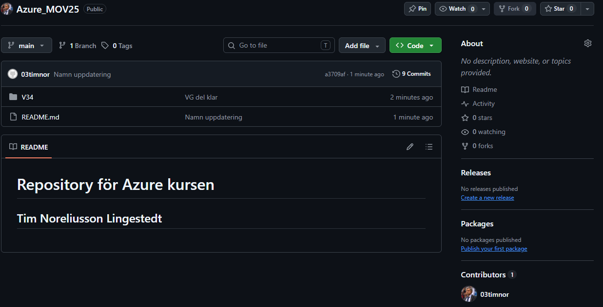
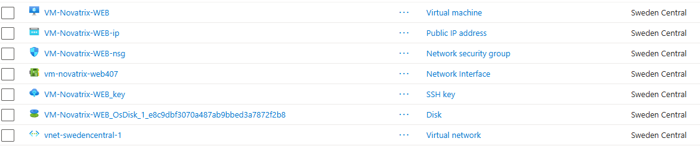
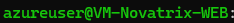
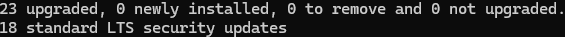
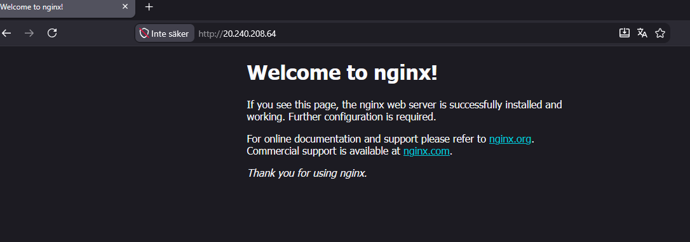
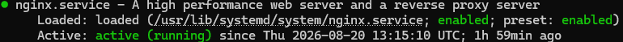
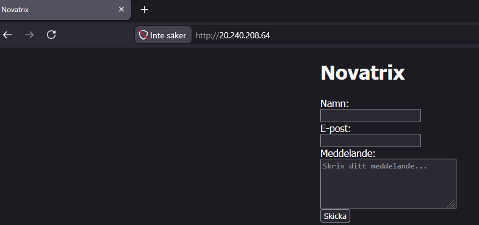
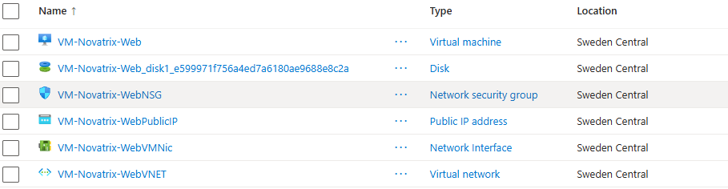
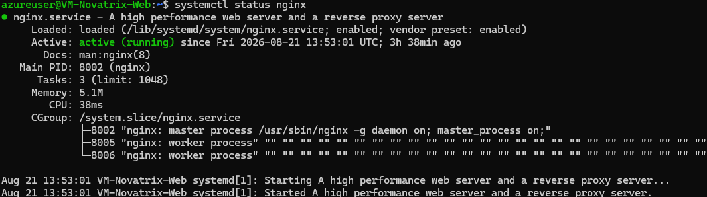
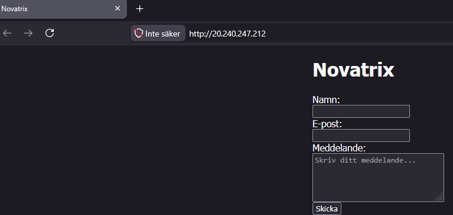

# __Novatrix, driftsättning av webbserver i Azure (Godkänt)__

__Repository:__ https://github.com/03timnor/Azure_MOV25

_Tim Noreliusson Lingestedt, 2026-08-20_

### *__1. Skapa GitHub Repository__*

GitHub Repository `Azure_MOV25` skapat. Kommer att användas under hela Azure kursen.

GitHub Repository `Azure_MOV25` kommer husera all kod och versionshantering under Azure Kursen.



### *__2. Resursgrupp och VM__*

Skapat Resource Group `rg-novatrix-V34` via Azure Portalen.

Skapat VM i Azure Portalen, VM finns i Resource Group `rg-novatrix-V34` och VM heter `VM-Novatrix-WEB`

VM har OS `Ubuntu Server LTS 24.04 - x64 Gen2`.

Storlek på VM är `B2ats_v2`.

Portar `80 (HTTP)` och `22 (SSH)` är öppna för inkommande trafik.

__*Resultat:*__



### *__3. SSH__*

SSH nyckel genererad, SSH nyckel nerladdad. Behörighet till nycklen gavs via Terminal.

Loggade in på servern.

```
icacls .\vm-novatrix-web_key.pem /inheritance:r
 ```

```
icacls .\vm-novatrix-web_key.pem /grant:r "$($env:USERNAME):R"
```

```
ssh -i .\vm-novatrix-web_key.pem azureuser@20.240.208.64
```

__*Resultat:*__



### *__4. Serverkonfiguration__*

Uppdaterade operativsystemet.

Uppdaterade operativsystem innbär bättre säkerhet.

```
sudo apt update
```
```
sudo apt upgrade -y
```

__*Resultat:*__



### *__5. Nginx__*

Installerade Nginx.

Nginx är webbservern som hemsidan hostas på.

```bash
sudo apt install nginx
```
```bash
systemctl status nginx
```

__*Resultat:*__





### *__4. Driftsättning__*

Konfigurerade webbsidan via html fil.

```
cd /var/www/html/
```

```
sudo nano index.nginx-debian.html
```

```html
<!DOCTYPE html>
<html>
<head>
<title>Novatrix</title>
<style>
html { color-scheme: light dark; }
body { width: 35em; margin: 0 auto;
font-family: Tahoma, Verdana, Arial, sans-serif; }
</style>
</head>
<body>
<h1>Novatrix</h1>
<form action="skicka.php" method="POST">
  <div>
    <label for="namn">Namn:</label><br>
    <input type="text" id="namn" name="namn" required>
  </div>

  <div>
    <label for="epost">E-post:</label><br>
    <input type="email" id="epost" name="epost" required>
  </div>

  <div>
    <label for="meddelande">Meddelande:</label><br>
    <textarea id="meddelande" name="meddelande" rows="5" cols="30" placeholder="Skriv ditt meddelande..." required></textarea>
  </div>

  <button type="submit">Skicka</button>
</form>

</body>
</html>
```

__*Resultat:*__



### *__6. Verifiering__*

Novatrix hemsida visas när man surfar till den lokala IP adressen.

Skärmbild på detta hittas i föregående steg (*__4. Driftsättning__*).

# __Novatrix, driftsättning av webbserver i Azure (Väl Godkänt)__

Uppgiften som skall lösas är att automatisera lösningen för Godkänt delen med `Azure CLI` script eller `cloud-init` fil.

Nedan lösning använder sig av båda för en helt automatiserad process.

### *__1. Cloud-init fil__*

Skapade `cloud-init.yaml`.

`cloud-init.yaml` finns i GitHub Repository.

`cloud-init.yaml` används för att konfigurera Ubuntu Server.

`cloud-init.yaml` består av följande kod:

```
#cloud-config
package_update: true
package_upgrade: true

packages:
  - nginx

write_files:
  - path: /var/www/html/index.html
    owner: root:root
    permissions: '0644'
    content: |
      <!DOCTYPE html>
      <html>
      <head>
      <title>Novatrix</title>
      <style>
      html { color-scheme: light dark; }
      body { width: 35em; margin: 0 auto; font-family: Tahoma, Verdana, Arial, sans-serif; }
      </style>
      </head>
      <body>
      <h1>Novatrix</h1>
      <form action="skicka.php" method="POST">
        <div>
          <label for="namn">Namn:</label><br>
          <input type="text" id="namn" name="namn" required>
        </div>
      
        <div>
          <label for="epost">E-post:</label><br>
          <input type="email" id="epost" name="epost" required>
        </div>
      
        <div>
          <label for="meddelande">Meddelande:</label><br>
          <textarea id="meddelande" name="meddelande" rows="5" cols="30" placeholder="Skriv ditt meddelande..." required></textarea>
        </div>
      
        <button type="submit">Skicka</button>
      </form>
      </body>
      </html>

runcmd:
  - systemctl enable --now nginx
```

### *__2. Deploy script__*

Tog fram script `deploy.sh` som skapar resursgrupp, VM och använder `cloud-init.yaml` för att konfigurera Ubuntu Server.

`deploy.sh` finns i GitHub Repository.

Script körs via bash terminal i Visual Studio Code. Terminalen är ansluten mot Azure miljön.

Script exekveras genom kommando:

```
bash deploy.sh
```

`deploy.sh` består av följande kod:

```
# Automatiserad konfigurering av Novatrix kundtjänst webbserver

set -e

RESOURCE_GROUP="rg-novatrix-V34"
LOCATION="swedencentral"
VM_NAME="VM-Novatrix-Web"
VM_SIZE="Standard_B2ats_v2"

echo "Skapar resursgrupp..."
az group create --name "$RESOURCE_GROUP" --location "$LOCATION"

echo "Skapar virtuell maskin med cloud-init..."
az vm create \
  --resource-group "$RESOURCE_GROUP" \
  --name "$VM_NAME" \
  --image Ubuntu2204 \
  --size "$VM_SIZE" \
  --admin-username azureuser \
  --generate-ssh-keys \
  --custom-data cloud-init.yaml \
  --public-ip-sku Standard

echo "Öppnar port 80 för HTTP..."
az vm open-port \
  --resource-group "$RESOURCE_GROUP" \
  --name "$VM_NAME" \
  --port 80 \
  --priority 900

echo "Klart! Publik IP:"
az vm show -d \
  --resource-group "$RESOURCE_GROUP" \
  --name "$VM_NAME" \
  --query publicIps -o tsv
```

### *__3. Verifiering__*

Sidan kan nås via publik IP och har den korrekta html konfigurationen.



