# __IAM och identitet (Godkänt)__

__Repository:__ https://github.com/03timnor/Azure_MOV25

*Tim Noreliusson Lingestedt, 2026-08-20*

Denna veckans uppgift går ut på att hantera identiter och åtkomst (*__IAM__*) i en *__Azure__* miljö enligt "*__Least privilege__*" principen. Utöver detta skall vi förbereda en identitet till en applikation som skall användas senare i kursen.

### *__1. Skapa identiteter__*

Två användare och två säkerhetsgrupper har skapats i *__Entra__* via portalen.

Ett *__Developer__* (utvecklare) konto och ett *__Operations__* (drift) konto har skapats.


En *__azure_developer__* (utvecklare) säkerhetsgrupp och en *__azure_operations__* (drift) säkerhetsgrupp har skapats.

*__Developer__* kontot är med i *__azure_developer__* (utvecklare) säkerhetsgruppen och *__Operations__* kontot är med i *__azure_operations__* säkerhetsgruppen. Tilldelingen gjordes manuellt via portalen.

*__Resultat:__*
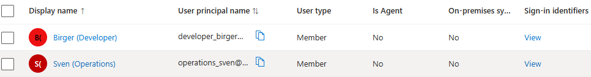
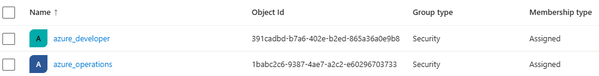
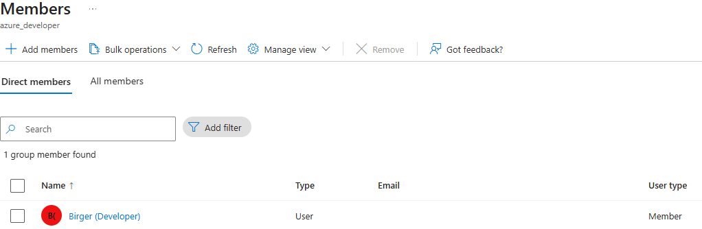
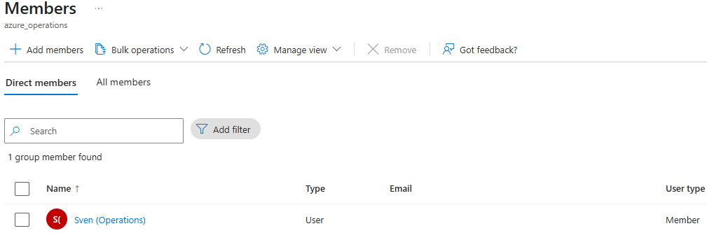

### *__2. Tilldela behörigheter (RBAC)__*

Behörigheter till resursgrupp *__rg_novatrix_V35__* styrs via  *__Role-based access control (RBAC)__* som hanteras via säkerhetsgrupperna som skapades tidigare.

Medlemmar i *__azure_developer__* har rollen *__Reader__* och 
medlemmar i *__azure_operations__* har rollen *__Contributor__*. Tilldelningen gjordes via portalen. 

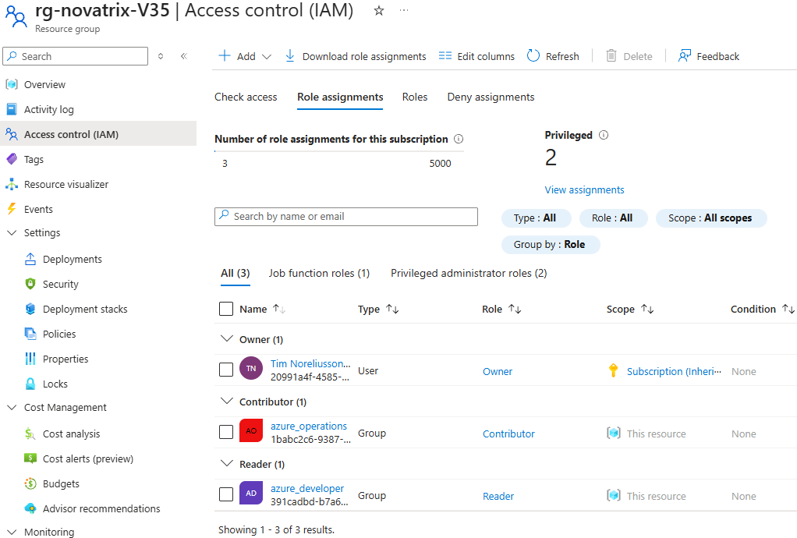
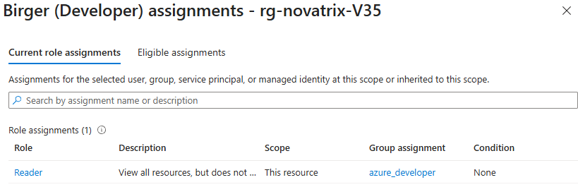
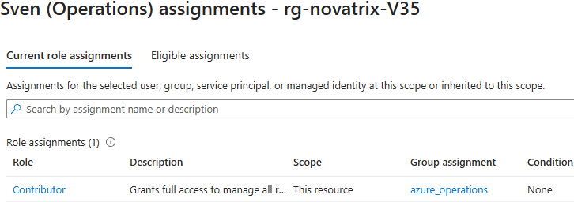

### *__3. Förbered en identitet för appen__*

Skapade en *__Managed identity__* via portalen.

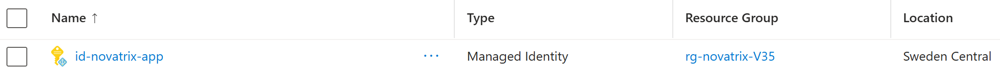

### *__4. Dokumentation__*

Lösningen bygger på "*__Least privilege__*" principen.
Användarkonton skall inte ha mer behörigheter än de som är nödvändiga för att utföra arbetsuppgifterna.

Birger och Sven använder specifika användarkonton när de arbetar med olika saker i *__Azure__* vilket leder till en minskad "*__Blast Radius__*" ifall ett konto skulle hackat / stulet.

### Säkerhetsgrupper som används till *__Role-based access control (RBAC)__* och anledningen av tilldelningen av specifika roller:

Säkerhetsgrupp *__azure_developer__* - Får rollen *__Reader__* för att de inte har behov av att utföra några ändringar i skarp miljö, men de behöver ha möjlighet att se den.

Säkerhetsgrupp *__azure_operations__* - Får rollen *__Contributor__* då de behöver kunna ändra i resursgruppen för att utföra sitt arbete. De behöver till exempel kunna starta om en VM i skarp miljö. De behöver dock inte tilldela roller i *__Azure RBAC__* då *__IAM__* avdelningen sköter detta arbete.

Säkerhetsgrupper används som standard för *__Role-based access control (RBAC)__* då det möjliggör för bättre skalbarhet, säkerhet och spårbarhet än att ge enskilda användarkonton roller eller behörigheter.

### *__5. Verifiering__*

Ett konto som är medlem i *__azure_developer__* har rollen *__Reader__* och skall endast kunna se *__rg_novatrix_V35__* och dess innehåll. Inte kunna ändra något.

Om ett konto som är medlem i *__azure_developer__* försöker stänga av VM i resursgrupp "*__rg_novatrix_V35__* så får man följande meddelande:
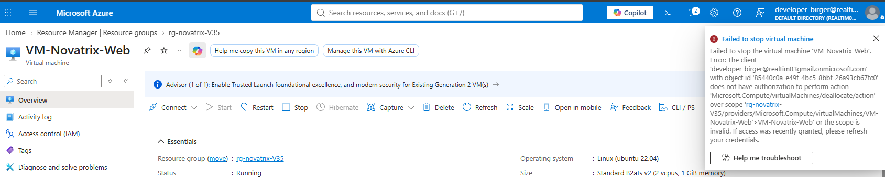

Ett konto som är medlem i *__azure_operations__* har rollen *__Contributor__* och skall kunna se och ändra innehåll i  *__rg_novatrix_V35__*. Men rollen *__Contributor__* ger inte rättigheter att tilldela roller i *__Azure RBAC__*.

Ett konto som är medlem i *__azure_operations__* kan stänga av och starta VM i resursgrupp *__rg_novatrix_V35__*
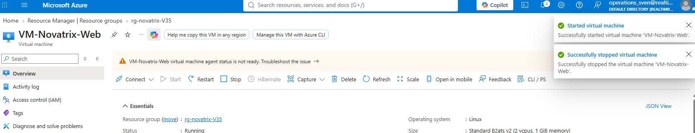

Försöker ett konto som är medlem i *__azure_operations__* tilldela roller i *__Azure RBAC__* så är den funktionen inaktiverad.
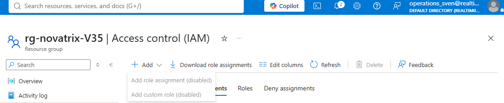

# __IAM och identitet (Väl Godkänt)__

Uppgiften som skall lösas är att automatisera behörighetsuppsättningen med *__Azure CLI__* samt att designa en genomtänkt "*__Least privilege__*" modell.

### *__1. Skapa custom roller__*

Två mer restriktiva versioner av rollerna *__Reader__* och *__Contributor__* skpas via *__JSON__* kod och ett script som körs via bash terminalen.

Kod för rollen *__reader-restricted__*:

```json
{
  "Name": "reader-restricted",
  "IsCustom": true,
  "Description": "Allows users to view the resource Overview page and metadata, but blocks sub-settings, deep configurations, and IAM.",
  "Actions": [
    "Microsoft.Resources/subscriptions/resourceGroups/read",
    "Microsoft.Resources/subscriptions/resources/read"
  ],
  "NotActions": [
    "Microsoft.Authorization/*",
    "Microsoft.Insights/*"
  ],
  "DataActions": [],
  "NotDataActions": [],
  "AssignableScopes": [
    "/subscriptions/SUBSCRIPTION-ID/resourceGroups/RESOURCE-GROUP"
  ]
}
```

Kod för rollen *__contributor-deny_delete_and_iam__*:

```json
{
  "Name": "contributor-deny_delete_and_iam",
  "IsCustom": true,
  "Description": "Allows creation and modification of resources, but completely blocks IAM/RBAC access and resource deletion.",
  "Actions": [
    "*"
  ],
  "NotActions": [
    "*/delete",
    "Microsoft.Authorization/*",
    "Microsoft.Resources/subscriptions/resourceGroups/delete"
  ],
  "DataActions": [],
  "NotDataActions": [],
  "AssignableScopes": [
    "/subscriptions/SUBSCRIPTION-ID/resourceGroups/RESOURCE-GROUP"
  ]
}
```
Script (*__custom_role_deploy.sh__*) för att skapa rollerna i resursgruppen i *__Azure__* är följande:

```bash
#!/bin/bash
export MSYS_NO_PATHCONV=1

# Exit immediately if any command fails
set -e

# 1. Define your local file name and target Resource Group
JSON_FILE="placeholder.json"
RG_NAME="placeholder"
ROLE_NAME="placeholder"

# Check if the JSON file actually exists locally
if [ ! -f "$JSON_FILE" ]; then
    echo "Error: Local file $JSON_FILE not found in the current directory."
    exit 1
fi

# 2. Fetch the active Azure Subscription ID automatically
echo "Fetching active Azure Subscription ID..."
SUBSCRIPTION_ID=$(az account show --query id --output tsv 2>/dev/null || true)

if [ -z "$SUBSCRIPTION_ID" ]; then
    echo "Error: Not logged into Azure. Please run 'az login' first."
    exit 1
fi
az account set --subscription "$SUBSCRIPTION_ID"

# 3. Use jq to dynamically inject the correct scope into the JSON file
echo "Updating AssignableScopes inside $JSON_FILE..."
TARGET_SCOPE="/subscriptions/$SUBSCRIPTION_ID/resourceGroups/$RG_NAME"

# This updates the JSON in-place with the correct subscription and resource group path
jq --arg scope "$TARGET_SCOPE" '.AssignableScopes = [$scope]' "$JSON_FILE" > temp.json && mv temp.json "$JSON_FILE"

# 4. Check if the role already exists in Azure to determine Create vs Update
echo "Checking if role '$ROLE_NAME' already exists in your tenant..."
ROLE_EXISTS=$(az role definition list --name "$ROLE_NAME" --query "[0].name" --output tsv)

if [ "$ROLE_EXISTS" == "$ROLE_NAME" ]; then
    echo "Role already exists. Executing update..."
    az role definition update --role-definition "@$JSON_FILE"
    echo "Successfully updated custom RBAC role!"
else
    echo "Role does not exist. Executing creation..."
    az role definition create --role-definition "@$JSON_FILE"
    echo "Successfully created custom RBAC role!"
fi
```
Scriptet (*__custom_role_deploy.sh__*) körs via *__bash__* terminalen via *__Visual Studio Code__* som är kopplat till *__Azure__* miljön.
Scriptet använder sig av *__jq__* för att kunna ändra i *__JSON__* datan och addera dynamiskt innehåll som till exempel *__Subscription-ID__* och namnet på resursgruppen.
Man behöver ändra alla "*placeholder*" värden på steg 1 till sin egen data för att köra scriptet korrekt.

För att detta skulle fungera var man tvungen att installera *__jq__* så *__bash__* terminalen via *__Visual Studio Code__* kunde hantera *__jq__* kommandon.

Alla försök nedan gjordes i *__bash__* terminalen via *__Visual Studio Code__*.

Första installationsförsöket av *__jq__* var via kommando  `curl -L -o /mingw64/bin/jq.exe https://github.com` i *__bash__* terminalen via *__Visual Studio Code__*. Detta fungerade dock inte då man fick felmeddelande `/mingw64/bin/jq: line 9: syntax error near unexpected token newline
/mingw64/bin/jq: line 9: <!DOCTYPE html>` när man försökte köra scriptet.

Efter detta togs *__jq__* bort via kommandon: `rm -f /mingw64/bin/jq`, `rm -f /mingw64/bin/jq.exe` och `hash -r`.

Andra försöket att installera *__jq__* gjordes med kommando: `powershell -Command "Invoke-WebRequest -Uri 'https://github.com' -OutFile 'C:\Program Files\Git\mingw64\bin\jq.exe'"`. Detta resulterade i samma felmeddelande som tidigare och *__jq__* togs bort på samma sätt som tidigare.

Tredje försöket att installera *__jq__* gjordes med kommando: `winget install jqlang.jq`. *__jq__* installerades nu korrekt och hade full funktionalitet efter en omstart av *__Visual Studio Code__*. Scriptet (*__custom_role_deploy.sh__*) kunde nu köras utan fel och rollerna skapades i resursgruppen.

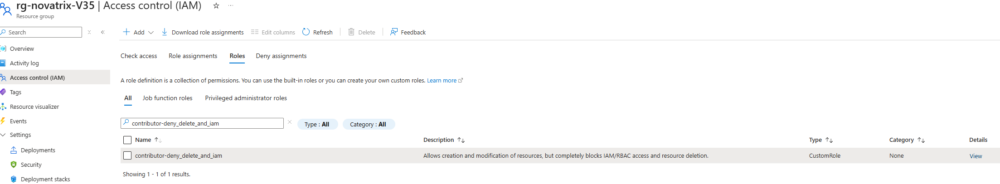
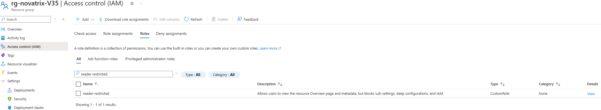

### *__2. Skapa säkerhetsgrupper__*

Script (*__create_security_group.sh__*) för att skapa säkerhetsgrupper i *__Entra__* är följande:

```bash
# 1. Define your group properties
GROUP_DISPLAY_NAME="placeholder"
GROUP_MAIL_NICKNAME="placeholder"

echo "Creating security group '$GROUP_DISPLAY_NAME' with mail nickname '$GROUP_MAIL_NICKNAME'..."

# 2. Create the security group
az ad group create \
  --display-name "$GROUP_DISPLAY_NAME" \
  --mail-nickname "$GROUP_MAIL_NICKNAME"
```

Script (*__create_security_group.sh__*) körs i *__bash__* terminalen via *__Visual Studio Code__*. Man behöver ändra alla "*placeholder*" värden på steg 1 till sin egen data för att köra scriptet korrekt.

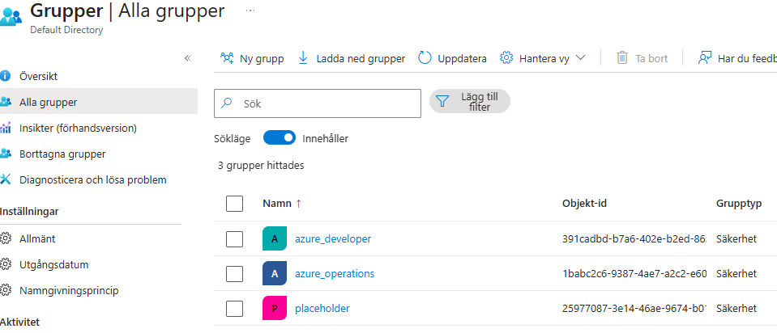

"*placeholder*" gruppen är till för att visa att detta script fungerade, de andra grupperna var redan skapade sedan tidigare.

### *__3. Tilldela medlemskap i säkerhetsgrupperna__*

Script (*__add_group_member.sh__*) för att tilldela medlemskap i säkerhetsgrupperna är följande:

```bash
# 1. Define group and array of user emails
GROUP_NAME="placeholder"
USER_EMAILS=("placeholder")

# 2. Get Group ID
GROUP_ID=$(az ad group show --group "$GROUP_NAME" --query id --output tsv)

# 3. Loop through and add each user
for email in "${USER_EMAILS[@]}"; do
    echo "Processing $email..."
    
    # Get the user's Object ID based on the email address
    USER_ID=$(az ad user show --id "$email" --query id --output tsv 2>/dev/null)
    
    if [ -n "$USER_ID" ]; then
        echo "Adding user ID $USER_ID to group..."
        az ad group member add --group "$GROUP_ID" --member-id "$USER_ID"
    else
        echo "Error: Could not find user with email $email"
    fi
done

echo "All users successfully processed!"
```
Script (*__add_group_member.sh__*) körs i *__bash__* terminalen via *__Visual Studio Code__*. Man behöver ändra alla "*placeholder*" värden på steg 1 till sin egen data för att köra scriptet korrekt.

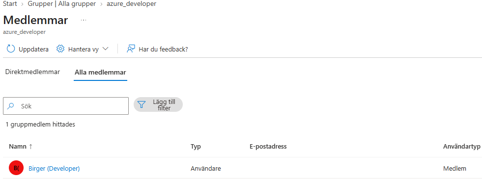
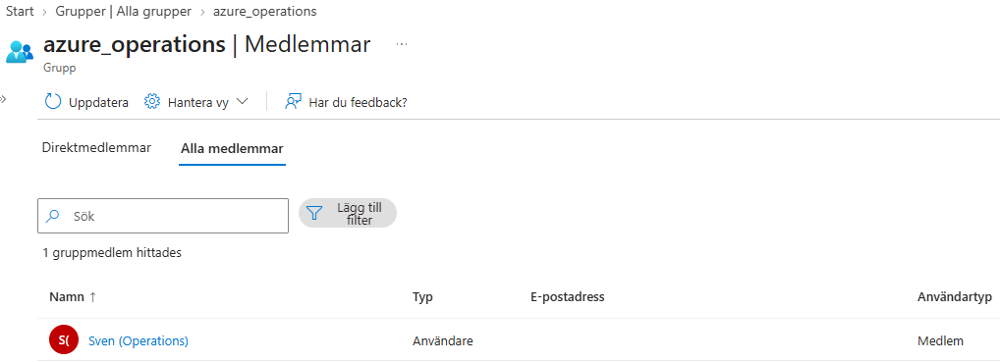

### *__4. Tilldela rollerna till säkerhetsgrupperna__*

Script (*__apply_role_to_group.sh__*) för att tilldela roller på säkerhetsgrupperna i resursgruppen är följande:

```bash
# 1. Prevent Git Bash path parsing corruptions
export MSYS_NO_PATHCONV=1

# 2. Define your exact targets
RG_NAME="placeholder"
GROUP_NAME="placeholder"
ROLE_NAME="placeholder"

# 3. Pull required parameters dynamically from your current session
SUB_ID=$(az account show --query id --output tsv)
GROUP_OBJECT_ID=$(az ad group show --group "$GROUP_NAME" --query id --output tsv)
SCOPE_PATH="/subscriptions/$SUB_ID/resourceGroups/$RG_NAME"

echo "Assigning role '$ROLE_NAME' to group '$GROUP_NAME'..."

# 4. Map the assignment
az role assignment create \
  --assignee-object-id "$GROUP_OBJECT_ID" \
  --assignee-principal-type "Group" \
  --role "$ROLE_NAME" \
  --scope "$SCOPE_PATH"
```
Script (*__apply_role_to_group.sh__*) körs i *__bash__* terminalen via *__Visual Studio Code__*. Man behöver ändra alla "*placeholder*" värden på steg 2 till sin egen data för att köra scriptet korrekt.

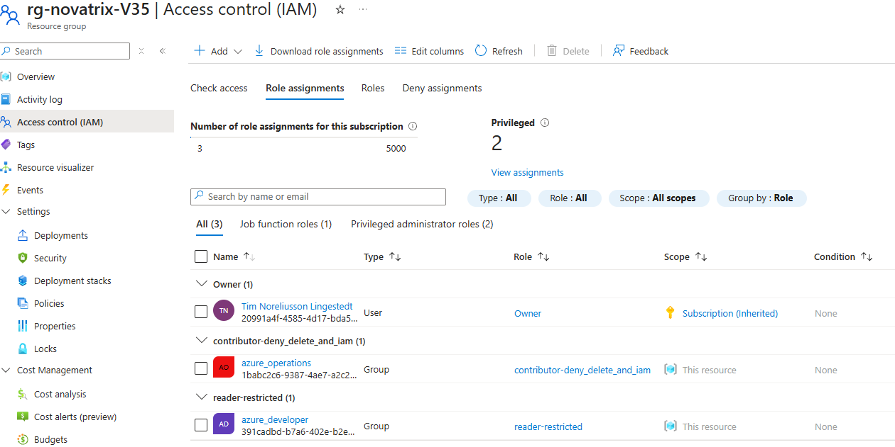

### *__5. Dokumentation och motivering__*

Även här bygger lösningen på "*__Least privilege__*" principen.
Användarkonton skall inte ha mer behörigheter än de som är nödvändiga för att utföra arbetsuppgifterna.

Birger och Sven använder specifika användarkonton när de arbetar med olika saker i *__Azure__* vilket leder till en minskad "*__Blast Radius__*" ifall ett konto skulle hackat / stulet.

Säkerhetsgrupp *__azure_developer__* - Får rollen *__reader-restricted__* som är baserad på rollen *__Reader__* för att de inte har behov av att utföra några ändringar i skarp miljö, och inget behov av att se så många detaljer. Företaget har tidigare haft en säkerhetsincident där någon läckte uppgifter till en känslig reursgrupp till obehöriga. Därför har man valt att skärpa ner denna rollen ganska rejält. *__Developer__* gruppen behöver dock fortfarande kunna se att reursgruppen finns.

Det är därför de får denna mer resriktiva roll. Skulle de behöva mer behörigheter i 
framtiden eller andra behörigheter så är det enkelt att justera i *__JSON__* filen för att skapa en en ny roll med andra behörigheter och koppla den till säkerhetsgruppen.
Rollen *__reader-restricted__* kan se resursgruppen och gå in på den men ger inte behörighet till att varken läsa eller ändra utöver det.

Säkerhetsgrupp *__azure_operations__* - Får rollen *__contributor-deny_delete_and_iam__* som är baserad på rollen *__Contributor__* då de behöver kunna ändra i resursgruppen för att utföra sitt arbete. De behöver till exempel kunna stoppa en VM i skarp miljö. De behöver dock inte se detaljer i *__Azure RBAC__* då *__IAM__* avdelningen sköter detta arbete. Samt minskar det risken för att dessa uppgifter läcks.

De behöver heller inte ha tillgång till att ta bort resursgruppen eller objekt i den. 
Detta då det kan leda till att saker tas bort av misstag eller att någon obehörig får kontroll över kontot och saboterar miljön.

Säkerhetsgrupper används som standard för *__Role-based access control (RBAC)__* då det möjliggör för bättre skalbarhet, säkerhet och spårbarhet än att ge enskilda användarkonton roller eller behörigheter.

Roller appliceras alltid på resursgruppen och inte på hela prenumerationen. 
En check minst en gång i månaden på vilka behörigheter som är utdelade till vilka görs som rutin. Där inaktuella och felaktika tilldelningar tas bort. Slutar någon som har konton med höga behrigheter tas de kontona bort så fort som möjligt.

Alla dessa rutiner, modeller, principer och arbetssätt leder till en säkrare miljö som snabbt kan skalas efter behov.

Om *__Novatrix__* lägger till fler team och saker behöver skalas så kan man snabbt göra nya roller via script, göra nya säkerhetsgrupper via script och dela koppla roller till säkerhetsgrupperna via script och tilldela medlemskap i säkerhetsgrupperna via script.
Detta leder till en snabb, effektiv och säker skalning. Där allt sker enligt samma standard. Allt skall såklart dokumenteras också.

### *__6. Verifiering__*

### Verifiering av att rollen *__contributor_deny_delete_and_iam__* fungerar.

Test genomfört med ett konto som har rollen *__contributor_deny_delete_and_iam__* via medlemskap i säkerhetsgrupp *__azure_operations__*.

Kan stoppa VM:
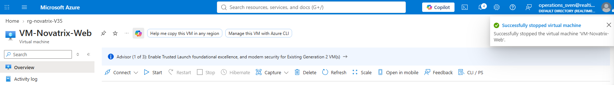

Kan inte ta bort VM:
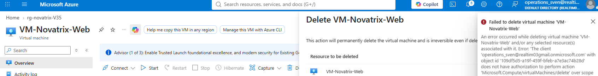

Kan inte se detaljer i *__IAM__* / *__RBAC__*:
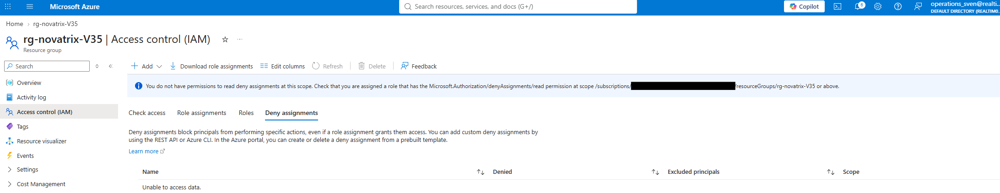
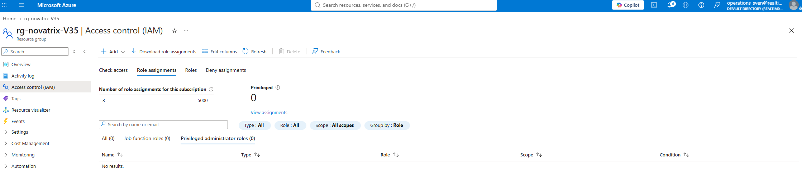

### Verifiering av att rollen *__reader-resrticted__* fungerar.

Test genomfört med ett konto som har rollen *__reader-resrticted__* via medlemskap i säkerhetsgrupp *__azure_developer__*.

Översiktssidan är tom:
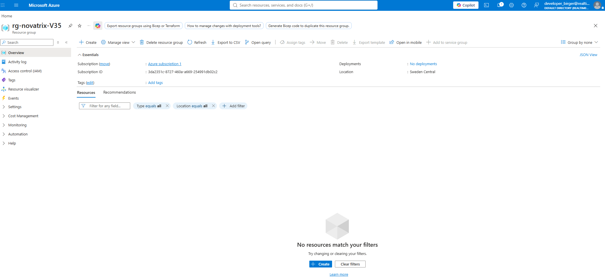

Kan inte ta bort resursgruppen:
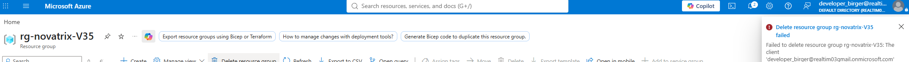

Kan inte se detaljer i *__IAM__* / *__RBAC__*:
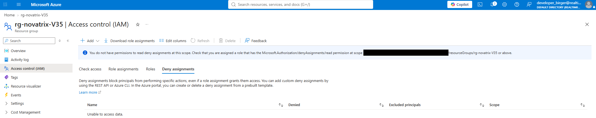
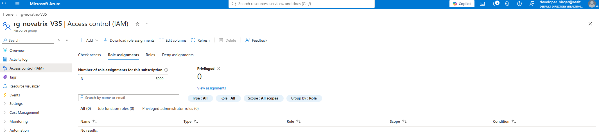


