# __Nätverk och säkerhet (Godkänt)__

__Repository:__ https://github.com/03timnor/Azure_MOV25

_Tim Noreliusson Lingestedt, 2026-08-20_

Veckans uppgift är att bygga ett säkert nätverkslager runt lösningen. Själva ärendeformuläret ska vara publikt nåbart, medan den känsliga delen, lagringen där ärenden
och bilagor senare hamnar, ska ligga skyddad i ett privat subnät. Defense in depth skall tillämpas så att bara nödvändig trafik släpps igenom.

### *__1. Bygg det virtuella nätverket__*

*__VNet__* `vnet-novatrix` via *__Azure__* portalen, address space är `10.0.0.0/16`.

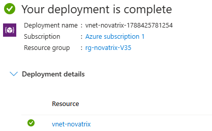

Subnät `snet-web` har skapats i `vnet-novatrix` med address space `10.0.1.0/24`.


Subnät `snet-db` har skapats i `vnet-novatrix` med address space `10.0.2.0/24`.


### *__2. Säkra trafiken__*

*__Network Security Group (NSG)__* `nsg-web` har skapats.

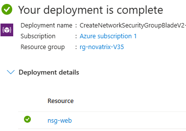

Regler har skapats i `nsg-web` för att släppa igenom TCP trafik på portar 80 och 443 samt att släppa igenom trafik från host datorns IP-adress på port 22 för *__SSH__*.

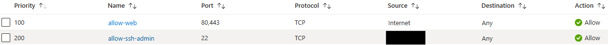

### *__3. Placera lösningen i nätverket__*

`nsg-web` associeras med `vnet-novatrix` och subnät `snet-web`.

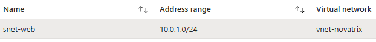

Tog bort befintlig VM men inte disken som var kopplad till den. Detta då man ej kunde knyta VM till rätt *__VNet__* / subnät annars.

Skapade en ny VM och kopplade den till `vnet-novatrix/snet-web` och använder samma disk som till den tidigare VM.

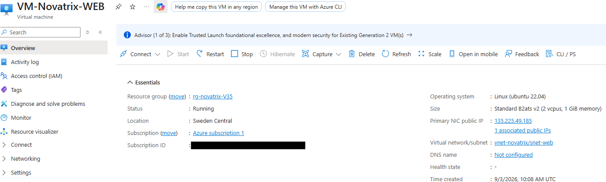


### *__4. Verifiering__*

Hemsidan kan nås:

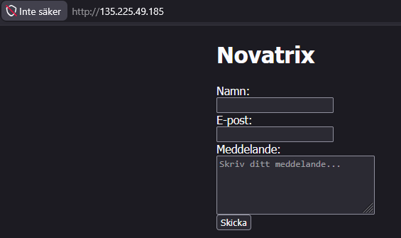

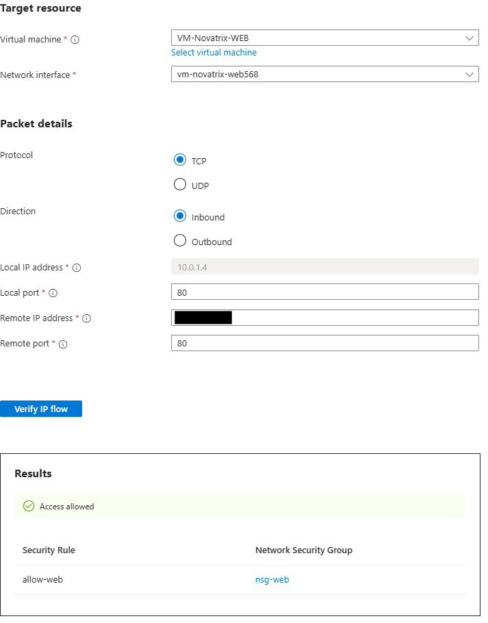

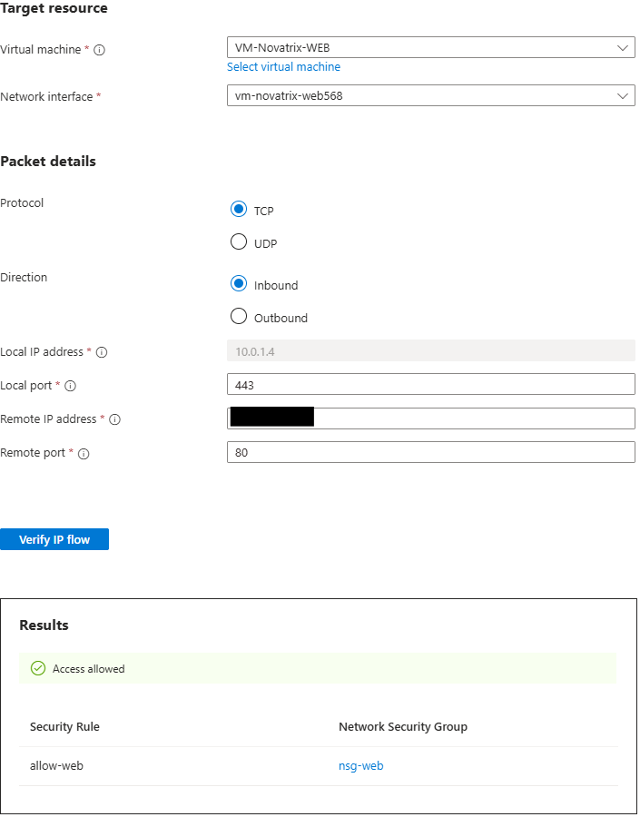

Kan ansluta via *__SSH__* från host dator:


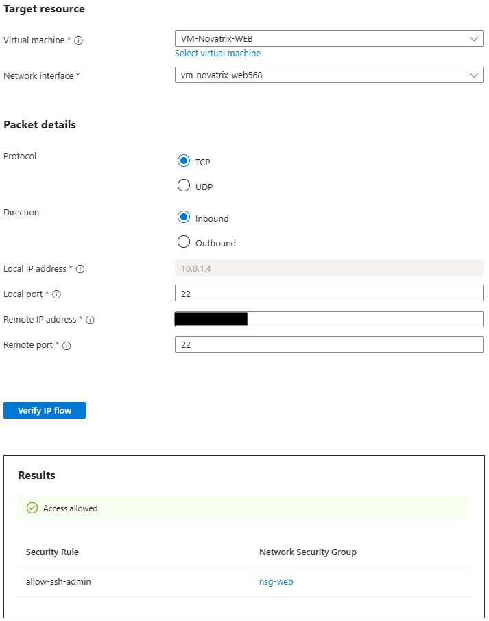

Kan inte via *__SSH__* ansluta ifrån annan dator:

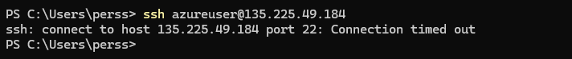

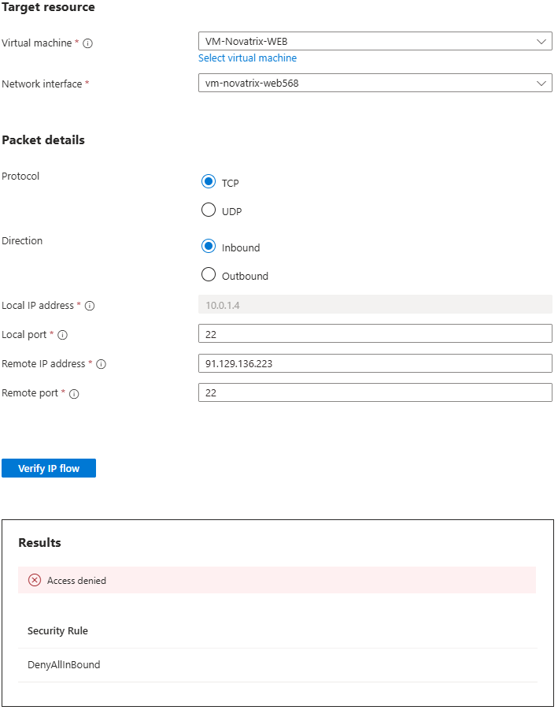

### *__5. Dokumentation och motivering__*

*__VNet__* `vnet-novatrix` address space är `10.0.0.0/16`
*__VNet__* används för att ge möjligheten att segmentera resurser i olika subnät. Resurserna kan även få en privat IP istället för en publik och bli mindre sårbara.

Subnät `snet-web` finns i `vnet-novatrix` med address space `10.0.1.0/24`. `VM-Novatrix-WEB` använder detta subnät. 

Subnät `snet-db` finns i `vnet-novatrix` med address space `10.0.2.0/24`. Används inte just nu, skapats som förberedelse inför nästa veckas uppgift.

Subnät används för att segmentera nätverket, man kan till exempel applicera olika *__Network Security Group (NSG)__* på olika subnät.

I *__Network Security Group (NSG)__* `nsg-web` finns följande regler:

`allow-web` - Tillåter inkommande TCP trafik på portar 80 och 443. Detta behövs för att komma åt *__Novatrix__* hemsdia.

`allow-ssh-admin` - Tillåter endast *__SSH__* inloggning ifrån host datorn. Begränsar till exempel brute force och minskar attackytan. Bidrar till en säkrare miljö.

`nsg-web` associeras med `vnet-novatrix` och subnät `snet-web`.

*__Network Security Group (NSG)__* används som en brandvägg där man kan skapa regler för att reglera nätverkstrafiken in och ut till resurser. Man kan basera regerlna på till exempel port, protokoll och IP.

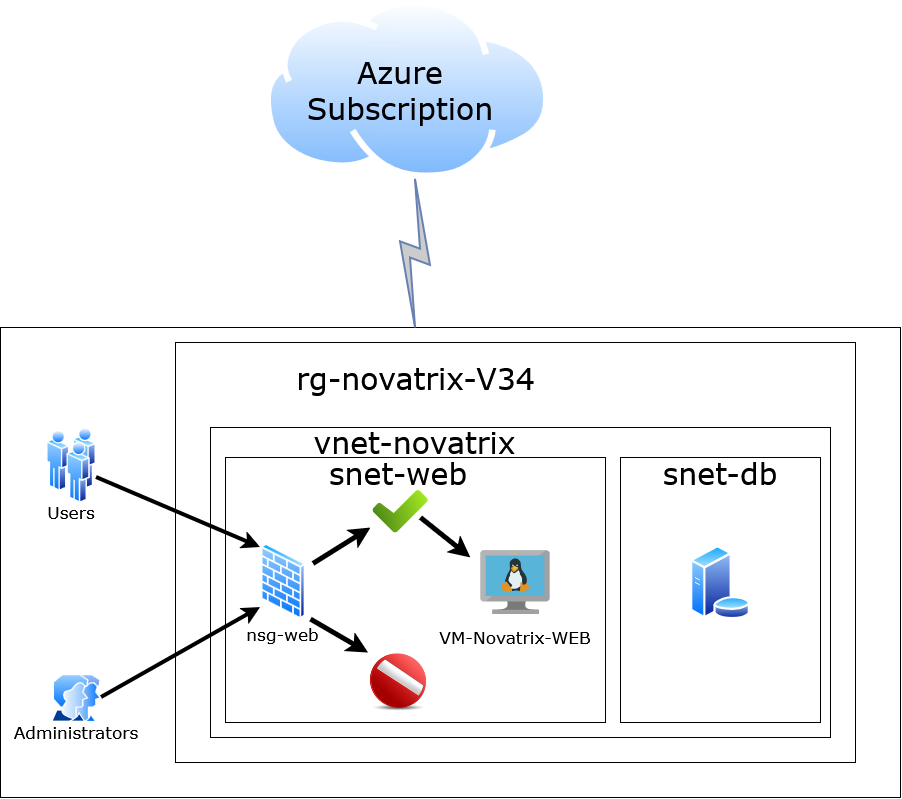

# __Nätverk och säkerhet (Väl Godkänt)__

Väl Godkänt delen av uppgiften denna vecka går ut på att göra Godkänt delen automatiserad med kod och utveckla lösningen utöver en enkel *__Network Security Group (NSG)__*. Man skall även implementera bastion eller hoppdesign och beskriva vilka hot som denna delen skyddar mot.

### *__1. Bygg det virtuella nätverket och VM__*

Scriptet `deploy.sh` från V34 har nu uppdaterats och innehåller och skapar nu även nätverksdesignen utöver skapandet av VM.
Scriptet `deploy_vm+network.sh` automatiserar alltså steg 1 till 3 i Godkänt delen plus att det skapar resursgrupp och VM.

Det nya scriptet `deploy_vm+network.sh` använder fortfarande `cloud-init.yaml` för att konfigurera Ubuntu Server på VM. Scriptet `deploy_vm+network.sh` körs via bash terminalen i *__Visual Studio Code__*.

```bash
#!/usr/bin/env bash
# Automated configuration of Novatrix web server

set -e

RESOURCE_GROUP="rg-novatrix-V35"
LOCATION="swedencentral"
VM_NAME="VM-Novatrix-Web"
VM_SIZE="Standard_B2ats_v2"

VNET_NAME="vnet-novatrix"
VNET_PREFIX="10.0.0.0/16"
SUBNET_WEB_NAME="snet-web"
SUBNET_WEB_PREFIX="10.0.1.0/24"
SUBNET_DB_NAME="snet-db"
SUBNET_DB_PREFIX="10.0.2.0/24"
SUBNET_BASTION_NAME="AzureBastionSubnet"
SUBNET_BASTION_PREFIX="10.0.3.0/26"

NSG_WEB_NAME="nsg-web"

BASTION_NAME="bastion-novatrix"
BASTION_PIP_NAME="pip-bastion-novatrix"

echo "Creating resource group..."
az group create --name "$RESOURCE_GROUP" --location "$LOCATION"

echo "Creating VNet with snet-web subnet..."
az network vnet create \
  --resource-group "$RESOURCE_GROUP" \
  --name "$VNET_NAME" \
  --address-prefix "$VNET_PREFIX" \
  --subnet-name "$SUBNET_WEB_NAME" \
  --subnet-prefix "$SUBNET_WEB_PREFIX"

echo "Creating snet-db subnet..."
az network vnet subnet create \
  --resource-group "$RESOURCE_GROUP" \
  --vnet-name "$VNET_NAME" \
  --name "$SUBNET_DB_NAME" \
  --address-prefix "$SUBNET_DB_PREFIX"

echo "Creating AzureBastionSubnet..."
az network vnet subnet create \
  --resource-group "$RESOURCE_GROUP" \
  --vnet-name "$VNET_NAME" \
  --name "$SUBNET_BASTION_NAME" \
  --address-prefix "$SUBNET_BASTION_PREFIX"

echo "Creating NSG nsg-web..."
az network nsg create \
  --resource-group "$RESOURCE_GROUP" \
  --name "$NSG_WEB_NAME"

echo "Adding rule to allow HTTP (80) from the internet..."
az network nsg rule create \
  --resource-group "$RESOURCE_GROUP" \
  --nsg-name "$NSG_WEB_NAME" \
  --name "Allow-HTTP" \
  --priority 100 \
  --direction Inbound \
  --access Allow \
  --protocol Tcp \
  --source-address-prefixes Internet \
  --source-port-ranges '*' \
  --destination-address-prefixes '*' \
  --destination-port-ranges 80

echo "Adding rule to allow HTTPS (443) from the internet..."
az network nsg rule create \
  --resource-group "$RESOURCE_GROUP" \
  --nsg-name "$NSG_WEB_NAME" \
  --name "Allow-HTTPS" \
  --priority 150 \
  --direction Inbound \
  --access Allow \
  --protocol Tcp \
  --source-address-prefixes Internet \
  --source-port-ranges '*' \
  --destination-address-prefixes '*' \
  --destination-port-ranges 443

echo "Associating nsg-web with snet-web..."
az network vnet subnet update \
  --resource-group "$RESOURCE_GROUP" \
  --vnet-name "$VNET_NAME" \
  --name "$SUBNET_WEB_NAME" \
  --network-security-group "$NSG_WEB_NAME"

echo "Creating public IP for Azure Bastion..."
az network public-ip create \
  --resource-group "$RESOURCE_GROUP" \
  --name "$BASTION_PIP_NAME" \
  --sku Standard \
  --location "$LOCATION"

echo "Creating Azure Bastion host (Standard SKU, this can take several minutes)..."
az network bastion create \
  --resource-group "$RESOURCE_GROUP" \
  --name "$BASTION_NAME" \
  --vnet-name "$VNET_NAME" \
  --public-ip-address "$BASTION_PIP_NAME" \
  --location "$LOCATION" \
  --sku Standard

echo "Creating virtual machine with cloud-init..."
az vm create \
  --resource-group "$RESOURCE_GROUP" \
  --name "$VM_NAME" \
  --image Ubuntu2204 \
  --size "$VM_SIZE" \
  --admin-username azureuser \
  --generate-ssh-keys \
  --custom-data cloud-init.yaml \
  --vnet-name "$VNET_NAME" \
  --subnet "$SUBNET_WEB_NAME" \
  --public-ip-sku Standard

echo "Done! Public IP:"
az vm show -d \
  --resource-group "$RESOURCE_GROUP" \
  --name "$VM_NAME" \
  --query publicIps -o tsv

echo "To connect via Bastion from your local terminal, run:"
echo "az network bastion ssh --name $BASTION_NAME --resource-group $RESOURCE_GROUP --target-resource-id \$(az vm show -g $RESOURCE_GROUP -n $VM_NAME --query id -o tsv) --auth-type ssh-key --username azureuser --ssh-key ~/.ssh/id_rsa"
```

### *__2. Verifiering__*

### *__3. Dokumentation__*
