# __Storage (Godkänt)__

Repository: https://github.com/03timnor/Azure_MOV25

Tim Noreliusson Lingestedt, 2026-09-15

Veckans uppgift är att koppla en lagringstjänst till lösningen så att inskickade ärenden och bifogade filer sparas, på ett säkert sätt.

### *__1. Skapa lagring, koppla formuläret till lagringen och säkra åtkomsten__*

Allt skapas via detta script (*deploy_server+network+db_V1*):

```bash
#!/usr/bin/env bash
# Automated configuration of Novatrix web server

set -e

RESOURCE_GROUP="rg-novatrix"
LOCATION="swedencentral"
VM_NAME="VM-Novatrix-Web"
VM_SIZE="Standard_B2ats_v2"

VNET_NAME="vnet-novatrix"
VNET_PREFIX="10.0.0.0/16"
SUBNET_WEB_NAME="snet-web"
SUBNET_WEB_PREFIX="10.0.1.0/24"
SUBNET_DB_NAME="snet-db"
SUBNET_DB_PREFIX="10.0.2.0/24"
SUBNET_BASTION_NAME="AzureBastionSubnet"
SUBNET_BASTION_PREFIX="10.0.3.0/26"

NSG_WEB_NAME="nsg-web"

BASTION_NAME="bastion-novatrix"
BASTION_PIP_NAME="pip-bastion-novatrix"

# --- New: storage account for support tickets --------------------------------
# Storage account names must be globally unique, lowercase letters/digits only.
STORAGE_ACCOUNT="stnovatrix$(openssl rand -hex 4)"
CONTAINER_NAME="arenden"
# ------------------------------------------------------------------------------

# Some subscriptions (notably brand-new "Azure subscription 1" trial accounts
# created with a personal Microsoft/Gmail account) represent the owning user
# as a guest (#EXT#) identity internally. This trips a known "az role
# assignment create" bug that fails with "MissingSubscription" even with a
# fully valid --scope, no matter how --assignee is specified. The workaround
# used throughout this script is to call the ARM REST API directly via
# "az rest" instead, which takes a different code path and isn't affected.
SUBSCRIPTION_ID=$(az account show --query id -o tsv | tr -d '\r\n')
echo "  -> SUBSCRIPTION_ID=[$SUBSCRIPTION_ID]"

# Portable GUID generator (roleAssignments need a GUID as their resource name).
# Tries several tools since Git Bash on Windows often has neither uuidgen nor
# a real python3 (only the Microsoft Store alias stub) available.
generate_uuid() {
  if command -v uuidgen >/dev/null 2>&1; then
    uuidgen
  elif command -v python3 >/dev/null 2>&1 && python3 -c "import uuid" >/dev/null 2>&1; then
    python3 -c "import uuid; print(uuid.uuid4())"
  elif command -v python >/dev/null 2>&1 && python -c "import uuid" >/dev/null 2>&1; then
    python -c "import uuid; print(uuid.uuid4())"
  elif command -v powershell.exe >/dev/null 2>&1; then
    powershell.exe -NoProfile -Command "[guid]::NewGuid().ToString()" | tr -d '\r\n'
  else
    # Pure-bash fallback: build a v4-style GUID from /dev/urandom
    local hex nibble dec variant
    hex=$(od -An -N16 -tx1 /dev/urandom | tr -d ' \n')
    nibble=${hex:16:1}
    dec=$(( (16#$nibble & 0x3) | 0x8 ))
    variant=$(printf '%x' "$dec")
    printf '%s-%s-4%s-%s%s-%s\n' \
      "${hex:0:8}" "${hex:8:4}" "${hex:13:3}" \
      "$variant" "${hex:17:3}" "${hex:20:12}"
  fi
}

# assign_role <principal-id> <principal-type: User|ServicePrincipal> <scope>
assign_role() {
  local principal_id="$1"
  local principal_type="$2"
  local scope="$3"
  local assignment_id body_file

  assignment_id=$(generate_uuid)
  body_file="$(mktemp /tmp/roleassign.XXXXXX.json)"

  cat > "$body_file" <<JSONEOF
{
  "properties": {
    "roleDefinitionId": "${ROLE_DEF_ID}",
    "principalId": "${principal_id}",
    "principalType": "${principal_type}"
  }
}
JSONEOF

  az rest --method PUT \
    --url "https://management.azure.com${scope}/providers/Microsoft.Authorization/roleAssignments/${assignment_id}?api-version=2022-04-01" \
    --body @"$body_file"

  rm -f "$body_file"
}

echo "Creating resource group..."
az group create --name "$RESOURCE_GROUP" --location "$LOCATION"

echo "Creating storage account $STORAGE_ACCOUNT..."
az storage account create \
  --name "$STORAGE_ACCOUNT" \
  --resource-group "$RESOURCE_GROUP" \
  --location "$LOCATION" \
  --sku Standard_LRS \
  --kind StorageV2 \
  --min-tls-version TLS1_2 \
  --allow-blob-public-access false \
  --allow-shared-key-access false

STORAGE_ID=$(az storage account show \
  --name "$STORAGE_ACCOUNT" \
  --resource-group "$RESOURCE_GROUP" \
  --query id -o tsv | tr -d '\r\n')

if [ -z "$STORAGE_ID" ]; then
  echo "ERROR: could not resolve the resource ID for storage account '$STORAGE_ACCOUNT'." >&2
  echo "Check that 'az account show' points at the subscription where '$RESOURCE_GROUP' lives" >&2
  echo "(run 'az account set --subscription <name-or-id>' if you have more than one)." >&2
  exit 1
fi
echo "  -> STORAGE_ID=[$STORAGE_ID]"

ROLE_DEF_ID=$(az role definition list --name "Storage Blob Data Contributor" --query "[0].id" -o tsv | tr -d '\r\n')
if [ -z "$ROLE_DEF_ID" ]; then
  echo "ERROR: could not resolve role definition id for 'Storage Blob Data Contributor'." >&2
  exit 1
fi
echo "  -> ROLE_DEF_ID=[$ROLE_DEF_ID]"

echo "Granting your own Azure AD identity access to create the container..."
# No account key is used anywhere in this script. Instead, your own signed-in
# identity (az login) is granted data-plane access so the container can be
# created with Azure AD auth (--auth-mode login).
CALLER_OBJECT_ID=$(az ad signed-in-user show --query id -o tsv | tr -d '\r\n')

if [ -z "$CALLER_OBJECT_ID" ]; then
  echo "ERROR: could not resolve your signed-in Azure AD object id." >&2
  echo "Make sure you're logged in with 'az login' as a regular user account." >&2
  exit 1
fi
echo "  -> CALLER_OBJECT_ID=[$CALLER_OBJECT_ID]"

assign_role "$CALLER_OBJECT_ID" "User" "$STORAGE_ID"

# RBAC role assignments can take a short while to propagate before they're
# usable, so give it a moment before the first data-plane call.
sleep 30

echo "Creating container $CONTAINER_NAME..."
az storage container create \
  --name "$CONTAINER_NAME" \
  --account-name "$STORAGE_ACCOUNT" \
  --auth-mode login

echo "Creating VNet with snet-web subnet..."
az network vnet create \
  --resource-group "$RESOURCE_GROUP" \
  --name "$VNET_NAME" \
  --address-prefix "$VNET_PREFIX" \
  --subnet-name "$SUBNET_WEB_NAME" \
  --subnet-prefix "$SUBNET_WEB_PREFIX"

echo "Creating snet-db subnet..."
az network vnet subnet create \
  --resource-group "$RESOURCE_GROUP" \
  --vnet-name "$VNET_NAME" \
  --name "$SUBNET_DB_NAME" \
  --address-prefix "$SUBNET_DB_PREFIX"

echo "Creating AzureBastionSubnet..."
az network vnet subnet create \
  --resource-group "$RESOURCE_GROUP" \
  --vnet-name "$VNET_NAME" \
  --name "$SUBNET_BASTION_NAME" \
  --address-prefix "$SUBNET_BASTION_PREFIX"

echo "Creating NSG nsg-web..."
az network nsg create \
  --resource-group "$RESOURCE_GROUP" \
  --name "$NSG_WEB_NAME"

echo "Adding rule to allow HTTP (80) from the internet..."
az network nsg rule create \
  --resource-group "$RESOURCE_GROUP" \
  --nsg-name "$NSG_WEB_NAME" \
  --name "Allow-HTTP" \
  --priority 100 \
  --direction Inbound \
  --access Allow \
  --protocol Tcp \
  --source-address-prefixes Internet \
  --source-port-ranges '*' \
  --destination-address-prefixes '*' \
  --destination-port-ranges 80

echo "Adding rule to allow HTTPS (443) from the internet..."
az network nsg rule create \
  --resource-group "$RESOURCE_GROUP" \
  --nsg-name "$NSG_WEB_NAME" \
  --name "Allow-HTTPS" \
  --priority 150 \
  --direction Inbound \
  --access Allow \
  --protocol Tcp \
  --source-address-prefixes Internet \
  --source-port-ranges '*' \
  --destination-address-prefixes '*' \
  --destination-port-ranges 443

echo "Associating nsg-web with snet-web..."
az network vnet subnet update \
  --resource-group "$RESOURCE_GROUP" \
  --vnet-name "$VNET_NAME" \
  --name "$SUBNET_WEB_NAME" \
  --network-security-group "$NSG_WEB_NAME"

echo "Creating public IP for Azure Bastion..."
az network public-ip create \
  --resource-group "$RESOURCE_GROUP" \
  --name "$BASTION_PIP_NAME" \
  --sku Standard \
  --location "$LOCATION"

echo "Creating Azure Bastion host (Standard SKU with native client support, this can take several minutes)..."
az network bastion create \
  --resource-group "$RESOURCE_GROUP" \
  --name "$BASTION_NAME" \
  --vnet-name "$VNET_NAME" \
  --public-ip-address "$BASTION_PIP_NAME" \
  --location "$LOCATION" \
  --sku Standard \
  --enable-tunneling true

echo "Injecting the generated storage account name into cloud-init.yaml..."
# cloud-init.yaml is static and was written before this script ran, so it
# still contains the placeholder account name from app.py. We patch a copy
# of it with the real, randomly generated $STORAGE_ACCOUNT before boot.
# Adjust the placeholder text below if yours differs from "stnovatrixXXXX".
PLACEHOLDER="stnovatrixXXXX"
PATCHED_CLOUD_INIT="$(mktemp /tmp/cloud-init.XXXXXX.yaml)"
trap 'rm -f "$PATCHED_CLOUD_INIT"' EXIT

sed "s/${PLACEHOLDER}/${STORAGE_ACCOUNT}/g" cloud-init.yaml > "$PATCHED_CLOUD_INIT"

echo "Creating virtual machine with cloud-init..."
# --assign-identity gives the VM a system-assigned Managed Identity.
az vm create \
  --resource-group "$RESOURCE_GROUP" \
  --name "$VM_NAME" \
  --image Ubuntu2204 \
  --size "$VM_SIZE" \
  --admin-username azureuser \
  --generate-ssh-keys \
  --custom-data "$PATCHED_CLOUD_INIT" \
  --vnet-name "$VNET_NAME" \
  --subnet "$SUBNET_WEB_NAME" \
  --nsg "$NSG_WEB_NAME" \
  --public-ip-sku Standard \
  --assign-identity

echo "Granting the VM's Managed Identity access to the '$CONTAINER_NAME' container only..."
VM_PRINCIPAL_ID=$(az vm identity show \
  --resource-group "$RESOURCE_GROUP" \
  --name "$VM_NAME" \
  --query principalId -o tsv | tr -d '\r\n')

if [ -z "$VM_PRINCIPAL_ID" ]; then
  echo "ERROR: could not resolve the VM's managed identity principal id." >&2
  exit 1
fi
echo "  -> VM_PRINCIPAL_ID=[$VM_PRINCIPAL_ID]"

CONTAINER_SCOPE="${STORAGE_ID}/blobServices/default/containers/${CONTAINER_NAME}"
echo "  -> CONTAINER_SCOPE=[$CONTAINER_SCOPE]"

assign_role "$VM_PRINCIPAL_ID" "ServicePrincipal" "$CONTAINER_SCOPE"

echo "Done! Storage account: $STORAGE_ACCOUNT (container: $CONTAINER_NAME)"
echo "app.py on the VM has been patched with this account name automatically."
echo "Note: role assignment propagation can take a couple of minutes -"
echo "if the app briefly gets an auth error right after boot, just retry."

echo "Public IP:"
az vm show -d \
  --resource-group "$RESOURCE_GROUP" \
  --name "$VM_NAME" \
  --query publicIps -o tsv

echo "To connect via Bastion from your local terminal, run:"
echo "az network bastion ssh --name $BASTION_NAME --resource-group $RESOURCE_GROUP --target-resource-id \$(az vm show -g $RESOURCE_GROUP -n $VM_NAME --query id -o tsv) --auth-type ssh-key --username azureuser --ssh-key ~/.ssh/id_rsa"
```

Scriptet (*deploy_server+network+db_V1.sh*) körs via *__bash__* terminalen i *__Visual Studio Code__*.

Scriptet (*deploy_server+network+db_V1.sh*) skapar en *__Managed Identity__* som hör till webbservern (VM) och som också får rollen *Storage Blob Data Contributor*. Webbserverns (VM) *__Managed Identity__* kopplas även till containern *"arenden"*. Detta gör att webbservern (VM) kan skriva till containern *"arenden"* utan att några nycklar behöver användas vilket leder till säkrare åtkomst.

Scriptet (*deploy_server+network+db_V1.sh*) använder *cloud-init-yaml* för att konfigurera webbservern (VM) med en backend så att den kan skicka ärenden till storage.
*cloud-init-yaml* innehåller följande kod:

```bash
#cloud-config
# V37 Utokad: web VM that serves the Novatrix ticket form AND writes each
# ticket to Blob Storage via the VM's system-assigned managed identity.
# Pure ASCII on purpose, so az --custom-data does not mangle it.

package_update: true

packages:
  - nginx
  - python3
  - python3-pip

write_files:
  - path: /opt/arendeapp/app.py
    owner: root:root
    permissions: '0644'
    content: |
      # -*- coding: ascii -*-
      # Novatrix arende backend (V37 Utokad).
      # Receives a support ticket from the web form and stores it in Blob Storage
      # using the web VM's system-assigned managed identity. No account key is used.
      #
      # Students change STORAGE_ACCOUNT below to their own globally unique account
      # name (the same account the provisioning script created). Nothing else needs
      # to change for the base to work.

      import json
      import uuid
      from datetime import datetime, timezone

      from flask import Flask, request, Response
      from azure.identity import DefaultAzureCredential
      from azure.storage.blob import BlobServiceClient, ContentSettings

      # --- Settings students may change -------------------------------------------
      # Your globally unique storage account name (no https, no .blob..., just name).
      STORAGE_ACCOUNT = "stnovatrixXXXX"
      # Container that receives the tickets (created by the provisioning script).
      CONTAINER = "arenden"
      # ----------------------------------------------------------------------------

      ACCOUNT_URL = "https://{0}.blob.core.windows.net".format(STORAGE_ACCOUNT)

      app = Flask(__name__)

      # One credential and one client for the whole app.
      # DefaultAzureCredential automatically picks up the VM's system-assigned
      # managed identity through IMDS, so there is no secret anywhere in the code.
      _credential = DefaultAzureCredential()
      _blob_service = BlobServiceClient(account_url=ACCOUNT_URL, credential=_credential)


      def _container():
          return _blob_service.get_container_client(CONTAINER)


      @app.post("/submit")
      def submit():
          # Read the fields from the form. The names here must match index.html.
          name = request.form.get("name", "").strip()
          mail = request.form.get("mail", "").strip()
          msg = request.form.get("msg", "").strip()
          image = request.files.get("bild")

          # A unique id per ticket: UTC timestamp plus a short random suffix.
          stamp = datetime.now(timezone.utc).strftime("%Y%m%dT%H%M%SZ")
          ticket_id = "{0}-{1}".format(stamp, uuid.uuid4().hex[:8])

          ticket = {
              "id": ticket_id,
              "name": name,
              "mail": mail,
              "message": msg,
              "created": stamp,
          }

          container = _container()

          # 1) Store the ticket itself as a JSON blob under its own folder.
          container.upload_blob(
              name="{0}/arende.json".format(ticket_id),
              data=json.dumps(ticket, ensure_ascii=False).encode("utf-8"),
              overwrite=True,
              content_settings=ContentSettings(content_type="application/json"),
          )

          # 2) Store the attached image next to it, if the user sent one.
          if image is not None and image.filename:
              container.upload_blob(
                  name="{0}/{1}".format(ticket_id, image.filename),
                  data=image.stream,
                  overwrite=True,
              )

          # A plain confirmation page. ASCII only, so the file survives cloud-init.
          body = (
              "<!DOCTYPE html><html lang='sv'><head><meta charset='UTF-8'>"
              "<title>Tack</title></head>"
              "<body style='font-family:Arial;max-width:640px;margin:40px auto'>"
              "<h1>Tack!</h1>"
              "<p>Ditt arende ar sparat med id <code>{0}</code>.</p>"
              "<p><a href='/'>Skicka in ett till</a></p>"
              "</body></html>"
          ).format(ticket_id)
          return Response(body, mimetype="text/html")


      @app.get("/health")
      def health():
          # Handy for a quick check that the backend is up and reading its config.
          return {"status": "ok", "account": STORAGE_ACCOUNT, "container": CONTAINER}


      if __name__ == "__main__":
          # Bind to localhost only. nginx sits in front and proxies /submit to here.
          app.run(host="127.0.0.1", port=5000)


  - path: /var/www/html/index.html
    owner: root:root
    permissions: '0644'
    content: |
      <!DOCTYPE html>
      <html lang="sv">
      <head>
        <meta charset="UTF-8">
        <meta name="viewport" content="width=device-width, initial-scale=1.0">
        <title>Novatrix kundtj&auml;nst</title>
        <style>
          body { font-family: Arial, sans-serif; max-width: 640px; margin: 40px auto; padding: 0 16px; color: #1f2d3d; }
          h1 { color: #2f5496; }
          p { color: #4a5568; }
          form { display: grid; gap: 12px; margin-top: 24px; }
          label { font-weight: bold; }
          input, textarea { width: 100%; padding: 8px; box-sizing: border-box; }
          button { width: 180px; padding: 10px; background: #2f5496; color: #fff; border: none; cursor: pointer; }
        </style>
      </head>
      <body>
        <h1>Novatrix kundtj&auml;nst</h1>
        <p>Skicka in ett &auml;rende s&aring; &aring;terkommer vi s&aring; snart vi kan.</p>
        <!-- action points at the backend, method post, enctype so the file follows along -->
        <form action="/submit" method="post" enctype="multipart/form-data">
          <label for="name">Namn</label>
          <input type="text" id="name" name="name">

          <label for="mail">E-post</label>
          <input type="email" id="mail" name="mail">

          <label for="msg">Meddelande</label>
          <textarea id="msg" name="msg" rows="5"></textarea>

          <label for="bild">Bifoga en bild</label>
          <input type="file" id="bild" name="bild">

          <button type="submit">Skicka &auml;rende</button>
        </form>
      </body>
      </html>


  - path: /etc/nginx/sites-available/default
    owner: root:root
    permissions: '0644'
    content: |
      # nginx site for the Novatrix ticket form (V37 Utokad).
      # nginx serves the static page and reverse-proxies /submit to the Flask backend.
      server {
          listen 80 default_server;
          listen [::]:80 default_server;

          root /var/www/html;
          index index.html;

          # Allow a reasonably sized image upload (the browser posts the file here).
          client_max_body_size 10m;

          location / {
              try_files $uri $uri/ =404;
          }

          # The form posts here; hand it to the backend that owns the managed identity.
          location = /submit {
              proxy_pass http://127.0.0.1:5000/submit;
              proxy_set_header Host $host;
              proxy_set_header X-Real-IP $remote_addr;
          }
      }


  - path: /etc/systemd/system/arendeapp.service
    owner: root:root
    permissions: '0644'
    content: |
      # systemd unit for the Flask backend (V37 Utokad).
      # Keeps the ticket backend running and restarts it if it stops.
      [Unit]
      Description=Novatrix arende backend (Flask)
      After=network-online.target
      Wants=network-online.target

      [Service]
      WorkingDirectory=/opt/arendeapp
      ExecStart=/usr/bin/python3 /opt/arendeapp/app.py
      Restart=on-failure
      User=www-data

      [Install]
      WantedBy=multi-user.target


runcmd:
  # Install the Azure SDK bits the backend needs (system-wide).
  - pip3 install flask azure-identity azure-storage-blob || pip3 install --break-system-packages flask azure-identity azure-storage-blob
  # Start the ticket backend and make sure it comes back on reboot.
  - systemctl daemon-reload
  - systemctl enable --now arendeapp
  # (Re)load nginx so it serves the page and proxies /submit to the backend.
  - systemctl enable --now nginx
  - systemctl restart nginx
```

### *__2. Verifiering__*

Hemsida kan nås:
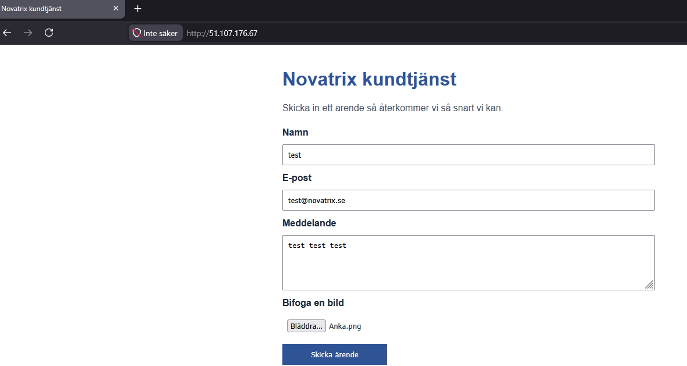

Hemsida kan skicka ärenden:
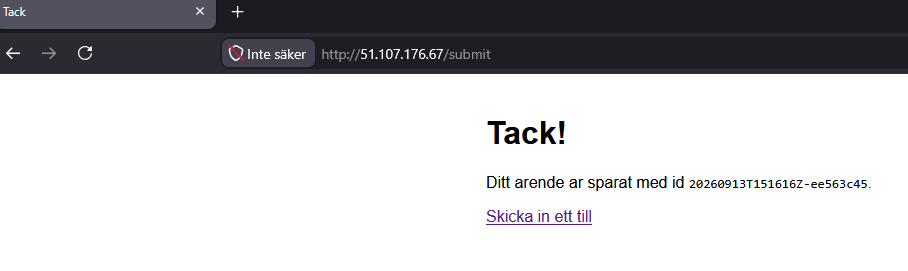

VM hanterade indentitet med *__RBAC__* fungerar:

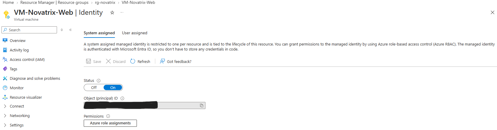

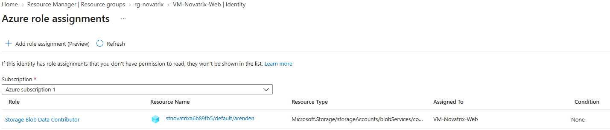

Lagring fungerar som det skall:

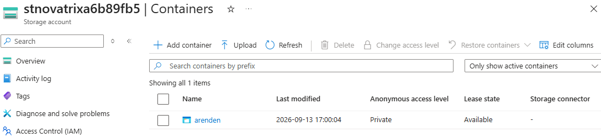

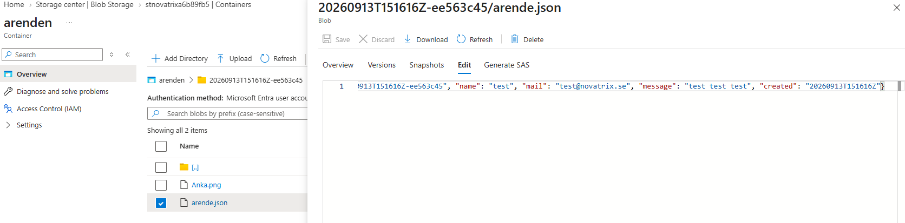

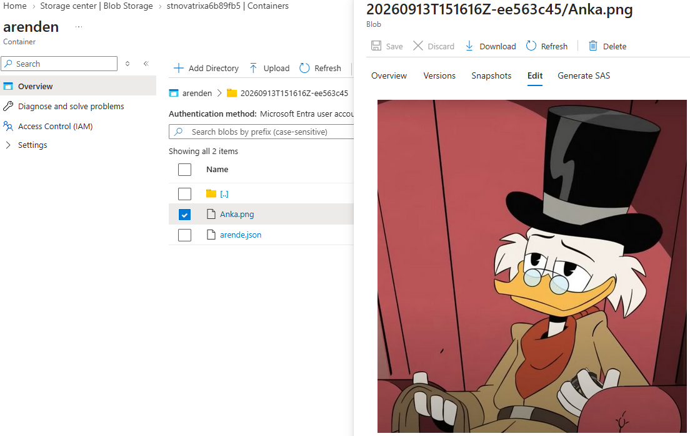

Autentiseringsmetod:

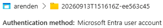

### *__3. Dokumentation__*

Scriptet (*deploy_server+network+db_V1.sh*) och cloud-init (*cloud-init.yaml*) hanterar att uppsättning och konfiguration av miljön.

*Access tier* på filerna är av typen *Hot*.

Lagringstyp är *Blob storage*.

Skrivning av filer till storage sker via webbserverns (VM) *__Managed Identity__*. Webbserverns (VM) *__Managed Identity__* har rollen *Storage Blob Data Contributor*

# __Storage (Väl Godkänt)__

Väl Godkänt delen av veckans uppgift går ut på att automatisera Godkänt delen, göra miljön säkrare med exempelvis *__Secure Endpoint__* och motivera olika val.

### *__1. Skapa lagring, koppla formuläret till lagringen och säkra åtkomsten__*

Allt skapas via detta script (*deploy_server+network+db_V2*):

```bash
#!/usr/bin/env bash
# Automated configuration of Novatrix web server

set -e

RESOURCE_GROUP="rg-novatrix"
LOCATION="swedencentral"
VM_NAME="VM-Novatrix-Web"
VM_SIZE="Standard_B2ats_v2"

VNET_NAME="vnet-novatrix"
VNET_PREFIX="10.0.0.0/16"
SUBNET_WEB_NAME="snet-web"
SUBNET_WEB_PREFIX="10.0.1.0/24"
SUBNET_DB_NAME="snet-db"
SUBNET_DB_PREFIX="10.0.2.0/24"
SUBNET_BASTION_NAME="AzureBastionSubnet"
SUBNET_BASTION_PREFIX="10.0.3.0/26"

NSG_WEB_NAME="nsg-web"

BASTION_NAME="bastion-novatrix"
BASTION_PIP_NAME="pip-bastion-novatrix"

# --- New: storage account for support tickets --------------------------------
# Storage account names must be globally unique, lowercase letters/digits only.
STORAGE_ACCOUNT="stnovatrix$(openssl rand -hex 4)"
CONTAINER_NAME="arenden"
# ------------------------------------------------------------------------------

# Some subscriptions (notably brand-new "Azure subscription 1" trial accounts
# created with a personal Microsoft/Gmail account) represent the owning user
# as a guest (#EXT#) identity internally. This trips a known "az role
# assignment create" bug that fails with "MissingSubscription" even with a
# fully valid --scope, no matter how --assignee is specified. The workaround
# used throughout this script is to call the ARM REST API directly via
# "az rest" instead, which takes a different code path and isn't affected.
SUBSCRIPTION_ID=$(az account show --query id -o tsv | tr -d '\r\n')
echo "  -> SUBSCRIPTION_ID=[$SUBSCRIPTION_ID]"

# Portable GUID generator (roleAssignments need a GUID as their resource name).
# Tries several tools since Git Bash on Windows often has neither uuidgen nor
# a real python3 (only the Microsoft Store alias stub) available.
generate_uuid() {
  if command -v uuidgen >/dev/null 2>&1; then
    uuidgen
  elif command -v python3 >/dev/null 2>&1 && python3 -c "import uuid" >/dev/null 2>&1; then
    python3 -c "import uuid; print(uuid.uuid4())"
  elif command -v python >/dev/null 2>&1 && python -c "import uuid" >/dev/null 2>&1; then
    python -c "import uuid; print(uuid.uuid4())"
  elif command -v powershell.exe >/dev/null 2>&1; then
    powershell.exe -NoProfile -Command "[guid]::NewGuid().ToString()" | tr -d '\r\n'
  else
    # Pure-bash fallback: build a v4-style GUID from /dev/urandom
    local hex nibble dec variant
    hex=$(od -An -N16 -tx1 /dev/urandom | tr -d ' \n')
    nibble=${hex:16:1}
    dec=$(( (16#$nibble & 0x3) | 0x8 ))
    variant=$(printf '%x' "$dec")
    printf '%s-%s-4%s-%s%s-%s\n' \
      "${hex:0:8}" "${hex:8:4}" "${hex:13:3}" \
      "$variant" "${hex:17:3}" "${hex:20:12}"
  fi
}

# assign_role <principal-id> <principal-type: User|ServicePrincipal> <scope>
assign_role() {
  local principal_id="$1"
  local principal_type="$2"
  local scope="$3"
  local assignment_id body_file

  assignment_id=$(generate_uuid)
  body_file="$(mktemp /tmp/roleassign.XXXXXX.json)"

  cat > "$body_file" <<JSONEOF
{
  "properties": {
    "roleDefinitionId": "${ROLE_DEF_ID}",
    "principalId": "${principal_id}",
    "principalType": "${principal_type}"
  }
}
JSONEOF

  az rest --method PUT \
    --url "https://management.azure.com${scope}/providers/Microsoft.Authorization/roleAssignments/${assignment_id}?api-version=2022-04-01" \
    --headers "Content-Type=application/json" \
    --body @"$body_file"

  rm -f "$body_file"
}

echo "Creating resource group..."
az group create --name "$RESOURCE_GROUP" --location "$LOCATION"

echo "Creating storage account $STORAGE_ACCOUNT..."
az storage account create \
  --name "$STORAGE_ACCOUNT" \
  --resource-group "$RESOURCE_GROUP" \
  --location "$LOCATION" \
  --sku Standard_LRS \
  --kind StorageV2 \
  --min-tls-version TLS1_2 \
  --allow-blob-public-access false \
  --allow-shared-key-access false

STORAGE_ID=$(az storage account show \
  --name "$STORAGE_ACCOUNT" \
  --resource-group "$RESOURCE_GROUP" \
  --query id -o tsv | tr -d '\r\n')

if [ -z "$STORAGE_ID" ]; then
  echo "ERROR: could not resolve the resource ID for storage account '$STORAGE_ACCOUNT'." >&2
  echo "Check that 'az account show' points at the subscription where '$RESOURCE_GROUP' lives" >&2
  echo "(run 'az account set --subscription <name-or-id>' if you have more than one)." >&2
  exit 1
fi
echo "  -> STORAGE_ID=[$STORAGE_ID]"

ROLE_DEF_ID=$(az role definition list --name "Storage Blob Data Contributor" --query "[0].id" -o tsv | tr -d '\r\n')
if [ -z "$ROLE_DEF_ID" ]; then
  echo "ERROR: could not resolve role definition id for 'Storage Blob Data Contributor'." >&2
  exit 1
fi
echo "  -> ROLE_DEF_ID=[$ROLE_DEF_ID]"

echo "Granting your own Azure AD identity access to create the container..."
# No account key is used anywhere in this script. Instead, your own signed-in
# identity (az login) is granted data-plane access so the container can be
# created with Azure AD auth (--auth-mode login).
CALLER_OBJECT_ID=$(az ad signed-in-user show --query id -o tsv | tr -d '\r\n')

if [ -z "$CALLER_OBJECT_ID" ]; then
  echo "ERROR: could not resolve your signed-in Azure AD object id." >&2
  echo "Make sure you're logged in with 'az login' as a regular user account." >&2
  exit 1
fi
echo "  -> CALLER_OBJECT_ID=[$CALLER_OBJECT_ID]"

assign_role "$CALLER_OBJECT_ID" "User" "$STORAGE_ID"

# RBAC role assignments can take a short while to propagate before they're
# usable, so give it a moment before the first data-plane call.
sleep 30

echo "Creating container $CONTAINER_NAME..."
az storage container create \
  --name "$CONTAINER_NAME" \
  --account-name "$STORAGE_ACCOUNT" \
  --auth-mode login

echo "Creating VNet with snet-web subnet..."
az network vnet create \
  --resource-group "$RESOURCE_GROUP" \
  --name "$VNET_NAME" \
  --address-prefix "$VNET_PREFIX" \
  --subnet-name "$SUBNET_WEB_NAME" \
  --subnet-prefix "$SUBNET_WEB_PREFIX"

echo "Creating snet-db subnet..."
az network vnet subnet create \
  --resource-group "$RESOURCE_GROUP" \
  --vnet-name "$VNET_NAME" \
  --name "$SUBNET_DB_NAME" \
  --address-prefix "$SUBNET_DB_PREFIX" \
  --private-endpoint-network-policies Disabled

echo "Creating private DNS zone for Blob Storage private endpoint..."
PRIVATE_DNS_ZONE_NAME="privatelink.blob.core.windows.net"
az network private-dns zone create \
  --resource-group "$RESOURCE_GROUP" \
  --name "$PRIVATE_DNS_ZONE_NAME"

echo "Linking the private DNS zone to $VNET_NAME..."
az network private-dns link vnet create \
  --resource-group "$RESOURCE_GROUP" \
  --zone-name "$PRIVATE_DNS_ZONE_NAME" \
  --name "link-${VNET_NAME}" \
  --virtual-network "$VNET_NAME" \
  --registration-enabled false

echo "Creating private endpoint for $STORAGE_ACCOUNT (blob) in snet-db..."
PE_NAME="pe-${STORAGE_ACCOUNT}-blob"
# MSYS_NO_PATHCONV=1 is scoped to just this one command: Git Bash on Windows
# would otherwise mangle --private-connection-resource-id (which starts with
# "/subscriptions/...") into a Windows path. Setting it globally instead
# breaks other commands (like "az rest --body @file") that genuinely need
# normal path conversion to find real files on disk.
MSYS_NO_PATHCONV=1 az network private-endpoint create \
  --resource-group "$RESOURCE_GROUP" \
  --name "$PE_NAME" \
  --vnet-name "$VNET_NAME" \
  --subnet "$SUBNET_DB_NAME" \
  --private-connection-resource-id "$STORAGE_ID" \
  --group-id blob \
  --connection-name "conn-${PE_NAME}"

echo "Registering the private endpoint in the private DNS zone..."
az network private-endpoint dns-zone-group create \
  --resource-group "$RESOURCE_GROUP" \
  --endpoint-name "$PE_NAME" \
  --name "default" \
  --private-dns-zone "$PRIVATE_DNS_ZONE_NAME" \
  --zone-name "blob"

echo "Detecting your public IP address..."
MY_PUBLIC_IP=$( (curl -s https://ifconfig.me || curl -s https://api.ipify.org) | tr -d '\r\n' )
echo "  -> MY_PUBLIC_IP=[$MY_PUBLIC_IP]"

echo "Restricting $STORAGE_ACCOUNT to the private endpoint plus your own IP..."
# Public network access stays Enabled, but the default action is Deny -
# nobody gets in over the public endpoint except IPs explicitly allow-listed
# below. The private endpoint in snet-db is unaffected by this setting; it
# always works regardless of --default-action.
az storage account update \
  --resource-group "$RESOURCE_GROUP" \
  --name "$STORAGE_ACCOUNT" \
  --public-network-access Enabled \
  --default-action Deny

if [ -n "$MY_PUBLIC_IP" ]; then
  az storage account network-rule add \
    --resource-group "$RESOURCE_GROUP" \
    --account-name "$STORAGE_ACCOUNT" \
    --ip-address "$MY_PUBLIC_IP"
else
  echo "WARNING: could not detect your public IP automatically." >&2
  echo "Add it manually later with:" >&2
  echo "  az storage account network-rule add --resource-group $RESOURCE_GROUP --account-name $STORAGE_ACCOUNT --ip-address <your-ip>" >&2
fi

echo "Creating AzureBastionSubnet..."
az network vnet subnet create \
  --resource-group "$RESOURCE_GROUP" \
  --vnet-name "$VNET_NAME" \
  --name "$SUBNET_BASTION_NAME" \
  --address-prefix "$SUBNET_BASTION_PREFIX"

echo "Creating NSG nsg-web..."
az network nsg create \
  --resource-group "$RESOURCE_GROUP" \
  --name "$NSG_WEB_NAME"

echo "Adding rule to allow HTTP (80) from the internet..."
az network nsg rule create \
  --resource-group "$RESOURCE_GROUP" \
  --nsg-name "$NSG_WEB_NAME" \
  --name "Allow-HTTP" \
  --priority 100 \
  --direction Inbound \
  --access Allow \
  --protocol Tcp \
  --source-address-prefixes Internet \
  --source-port-ranges '*' \
  --destination-address-prefixes '*' \
  --destination-port-ranges 80

echo "Adding rule to allow HTTPS (443) from the internet..."
az network nsg rule create \
  --resource-group "$RESOURCE_GROUP" \
  --nsg-name "$NSG_WEB_NAME" \
  --name "Allow-HTTPS" \
  --priority 150 \
  --direction Inbound \
  --access Allow \
  --protocol Tcp \
  --source-address-prefixes Internet \
  --source-port-ranges '*' \
  --destination-address-prefixes '*' \
  --destination-port-ranges 443

echo "Associating nsg-web with snet-web..."
az network vnet subnet update \
  --resource-group "$RESOURCE_GROUP" \
  --vnet-name "$VNET_NAME" \
  --name "$SUBNET_WEB_NAME" \
  --network-security-group "$NSG_WEB_NAME"

echo "Creating public IP for Azure Bastion..."
az network public-ip create \
  --resource-group "$RESOURCE_GROUP" \
  --name "$BASTION_PIP_NAME" \
  --sku Standard \
  --location "$LOCATION"

echo "Creating Azure Bastion host (Standard SKU with native client support, this can take several minutes)..."
az network bastion create \
  --resource-group "$RESOURCE_GROUP" \
  --name "$BASTION_NAME" \
  --vnet-name "$VNET_NAME" \
  --public-ip-address "$BASTION_PIP_NAME" \
  --location "$LOCATION" \
  --sku Standard \
  --enable-tunneling true

echo "Injecting the generated storage account name into cloud-init.yaml..."
# cloud-init.yaml is static and was written before this script ran, so it
# still contains the placeholder account name from app.py. We patch a copy
# of it with the real, randomly generated $STORAGE_ACCOUNT before boot.
# Adjust the placeholder text below if yours differs from "stnovatrixXXXX".
PLACEHOLDER="stnovatrixXXXX"
PATCHED_CLOUD_INIT="$(mktemp /tmp/cloud-init.XXXXXX.yaml)"
trap 'rm -f "$PATCHED_CLOUD_INIT"' EXIT

sed "s/${PLACEHOLDER}/${STORAGE_ACCOUNT}/g" cloud-init.yaml > "$PATCHED_CLOUD_INIT"

echo "Creating virtual machine with cloud-init..."
# --assign-identity gives the VM a system-assigned Managed Identity.
az vm create \
  --resource-group "$RESOURCE_GROUP" \
  --name "$VM_NAME" \
  --image Ubuntu2204 \
  --size "$VM_SIZE" \
  --admin-username azureuser \
  --generate-ssh-keys \
  --custom-data "$PATCHED_CLOUD_INIT" \
  --vnet-name "$VNET_NAME" \
  --subnet "$SUBNET_WEB_NAME" \
  --nsg "$NSG_WEB_NAME" \
  --public-ip-sku Standard \
  --assign-identity

echo "Granting the VM's Managed Identity access to the '$CONTAINER_NAME' container only..."
VM_PRINCIPAL_ID=$(az vm identity show \
  --resource-group "$RESOURCE_GROUP" \
  --name "$VM_NAME" \
  --query principalId -o tsv | tr -d '\r\n')

if [ -z "$VM_PRINCIPAL_ID" ]; then
  echo "ERROR: could not resolve the VM's managed identity principal id." >&2
  exit 1
fi
echo "  -> VM_PRINCIPAL_ID=[$VM_PRINCIPAL_ID]"

CONTAINER_SCOPE="${STORAGE_ID}/blobServices/default/containers/${CONTAINER_NAME}"
echo "  -> CONTAINER_SCOPE=[$CONTAINER_SCOPE]"

assign_role "$VM_PRINCIPAL_ID" "ServicePrincipal" "$CONTAINER_SCOPE"

echo "Done! Storage account: $STORAGE_ACCOUNT (container: $CONTAINER_NAME)"
echo "Private endpoint: $PE_NAME (in snet-db). Public access is restricted:"
echo "only the private endpoint and your IP ($MY_PUBLIC_IP) can reach $STORAGE_ACCOUNT."
echo "If your IP changes later, re-run the 'network-rule add' command shown above."
echo "app.py on the VM has been patched with this account name automatically."
echo "Note: role assignment propagation can take a couple of minutes -"
echo "if the app briefly gets an auth error right after boot, just retry."

echo "Public IP:"
az vm show -d \
  --resource-group "$RESOURCE_GROUP" \
  --name "$VM_NAME" \
  --query publicIps -o tsv

echo "To connect via Bastion from your local terminal, run:"
echo "az network bastion ssh --name $BASTION_NAME --resource-group $RESOURCE_GROUP --target-resource-id \$(az vm show -g $RESOURCE_GROUP -n $VM_NAME --query id -o tsv) --auth-type ssh-key --username azureuser --ssh-key ~/.ssh/id_rsa"
```

Scriptet (*deploy_server+network+db_V2.sh*) körs via *__bash__* terminalen i *__Visual Studio Code__*.

Scriptet (*deploy_server+network+db_V2.sh*) skapar en *__Managed Identity__* som hör till webbservern (VM) och som också får rollen *Storage Blob Data Contributor*. Webbserverns (VM) *__Managed Identity__* kopplas även till containern *"arenden"*. Detta gör att webbservern (VM) kan skriva till containern *"arenden"* utan att några nycklar behöver användas vilket leder till säkrare åtkomst.

Scriptet (*deploy_server+network+db_V2.sh*) skapar också en *__Private Endpoint__* vilket gör att publik nätverksåtkomst stängs av på storage kontot för icke godkända IP-adresser/enheter.

Scriptet (*deploy_server+network+db_V2.sh*) använder *cloud-init-yaml* för att konfigurera webbservern (VM) med en backend så att den kan skicka ärenden till storage.
*cloud-init-yaml* innehåller följande kod:

```bash
#cloud-config
# V37 Utokad: web VM that serves the Novatrix ticket form AND writes each
# ticket to Blob Storage via the VM's system-assigned managed identity.
# Pure ASCII on purpose, so az --custom-data does not mangle it.

package_update: true

packages:
  - nginx
  - python3
  - python3-pip

write_files:
  - path: /opt/arendeapp/app.py
    owner: root:root
    permissions: '0644'
    content: |
      # -*- coding: ascii -*-
      # Novatrix arende backend (V37 Utokad).
      # Receives a support ticket from the web form and stores it in Blob Storage
      # using the web VM's system-assigned managed identity. No account key is used.
      #
      # Students change STORAGE_ACCOUNT below to their own globally unique account
      # name (the same account the provisioning script created). Nothing else needs
      # to change for the base to work.

      import json
      import uuid
      from datetime import datetime, timezone

      from flask import Flask, request, Response
      from azure.identity import DefaultAzureCredential
      from azure.storage.blob import BlobServiceClient, ContentSettings

      # --- Settings students may change -------------------------------------------
      # Your globally unique storage account name (no https, no .blob..., just name).
      STORAGE_ACCOUNT = "stnovatrixXXXX"
      # Container that receives the tickets (created by the provisioning script).
      CONTAINER = "arenden"
      # ----------------------------------------------------------------------------

      ACCOUNT_URL = "https://{0}.blob.core.windows.net".format(STORAGE_ACCOUNT)

      app = Flask(__name__)

      # One credential and one client for the whole app.
      # DefaultAzureCredential automatically picks up the VM's system-assigned
      # managed identity through IMDS, so there is no secret anywhere in the code.
      _credential = DefaultAzureCredential()
      _blob_service = BlobServiceClient(account_url=ACCOUNT_URL, credential=_credential)


      def _container():
          return _blob_service.get_container_client(CONTAINER)


      @app.post("/submit")
      def submit():
          # Read the fields from the form. The names here must match index.html.
          name = request.form.get("name", "").strip()
          mail = request.form.get("mail", "").strip()
          msg = request.form.get("msg", "").strip()
          image = request.files.get("bild")

          # A unique id per ticket: UTC timestamp plus a short random suffix.
          stamp = datetime.now(timezone.utc).strftime("%Y%m%dT%H%M%SZ")
          ticket_id = "{0}-{1}".format(stamp, uuid.uuid4().hex[:8])

          ticket = {
              "id": ticket_id,
              "name": name,
              "mail": mail,
              "message": msg,
              "created": stamp,
          }

          container = _container()

          # 1) Store the ticket itself as a JSON blob under its own folder.
          container.upload_blob(
              name="{0}/arende.json".format(ticket_id),
              data=json.dumps(ticket, ensure_ascii=False).encode("utf-8"),
              overwrite=True,
              content_settings=ContentSettings(content_type="application/json"),
          )

          # 2) Store the attached image next to it, if the user sent one.
          if image is not None and image.filename:
              container.upload_blob(
                  name="{0}/{1}".format(ticket_id, image.filename),
                  data=image.stream,
                  overwrite=True,
              )

          # A plain confirmation page. ASCII only, so the file survives cloud-init.
          body = (
              "<!DOCTYPE html><html lang='sv'><head><meta charset='UTF-8'>"
              "<title>Tack</title></head>"
              "<body style='font-family:Arial;max-width:640px;margin:40px auto'>"
              "<h1>Tack!</h1>"
              "<p>Ditt arende ar sparat med id <code>{0}</code>.</p>"
              "<p><a href='/'>Skicka in ett till</a></p>"
              "</body></html>"
          ).format(ticket_id)
          return Response(body, mimetype="text/html")


      @app.get("/health")
      def health():
          # Handy for a quick check that the backend is up and reading its config.
          return {"status": "ok", "account": STORAGE_ACCOUNT, "container": CONTAINER}


      if __name__ == "__main__":
          # Bind to localhost only. nginx sits in front and proxies /submit to here.
          app.run(host="127.0.0.1", port=5000)


  - path: /var/www/html/index.html
    owner: root:root
    permissions: '0644'
    content: |
      <!DOCTYPE html>
      <html lang="sv">
      <head>
        <meta charset="UTF-8">
        <meta name="viewport" content="width=device-width, initial-scale=1.0">
        <title>Novatrix kundtj&auml;nst</title>
        <style>
          body { font-family: Arial, sans-serif; max-width: 640px; margin: 40px auto; padding: 0 16px; color: #1f2d3d; }
          h1 { color: #2f5496; }
          p { color: #4a5568; }
          form { display: grid; gap: 12px; margin-top: 24px; }
          label { font-weight: bold; }
          input, textarea { width: 100%; padding: 8px; box-sizing: border-box; }
          button { width: 180px; padding: 10px; background: #2f5496; color: #fff; border: none; cursor: pointer; }
        </style>
      </head>
      <body>
        <h1>Novatrix kundtj&auml;nst</h1>
        <p>Skicka in ett &auml;rende s&aring; &aring;terkommer vi s&aring; snart vi kan.</p>
        <!-- action points at the backend, method post, enctype so the file follows along -->
        <form action="/submit" method="post" enctype="multipart/form-data">
          <label for="name">Namn</label>
          <input type="text" id="name" name="name">

          <label for="mail">E-post</label>
          <input type="email" id="mail" name="mail">

          <label for="msg">Meddelande</label>
          <textarea id="msg" name="msg" rows="5"></textarea>

          <label for="bild">Bifoga en bild</label>
          <input type="file" id="bild" name="bild">

          <button type="submit">Skicka &auml;rende</button>
        </form>
      </body>
      </html>


  - path: /etc/nginx/sites-available/default
    owner: root:root
    permissions: '0644'
    content: |
      # nginx site for the Novatrix ticket form (V37 Utokad).
      # nginx serves the static page and reverse-proxies /submit to the Flask backend.
      server {
          listen 80 default_server;
          listen [::]:80 default_server;

          root /var/www/html;
          index index.html;

          # Allow a reasonably sized image upload (the browser posts the file here).
          client_max_body_size 10m;

          location / {
              try_files $uri $uri/ =404;
          }

          # The form posts here; hand it to the backend that owns the managed identity.
          location = /submit {
              proxy_pass http://127.0.0.1:5000/submit;
              proxy_set_header Host $host;
              proxy_set_header X-Real-IP $remote_addr;
          }
      }


  - path: /etc/systemd/system/arendeapp.service
    owner: root:root
    permissions: '0644'
    content: |
      # systemd unit for the Flask backend (V37 Utokad).
      # Keeps the ticket backend running and restarts it if it stops.
      [Unit]
      Description=Novatrix arende backend (Flask)
      After=network-online.target
      Wants=network-online.target

      [Service]
      WorkingDirectory=/opt/arendeapp
      ExecStart=/usr/bin/python3 /opt/arendeapp/app.py
      Restart=on-failure
      User=www-data

      [Install]
      WantedBy=multi-user.target


runcmd:
  # Install the Azure SDK bits the backend needs (system-wide).
  - pip3 install flask azure-identity azure-storage-blob || pip3 install --break-system-packages flask azure-identity azure-storage-blob
  # Start the ticket backend and make sure it comes back on reboot.
  - systemctl daemon-reload
  - systemctl enable --now arendeapp
  # (Re)load nginx so it serves the page and proxies /submit to the backend.
  - systemctl enable --now nginx
  - systemctl restart nginx
```

### *__2. Verifiering__*

Hemsida kan nås:

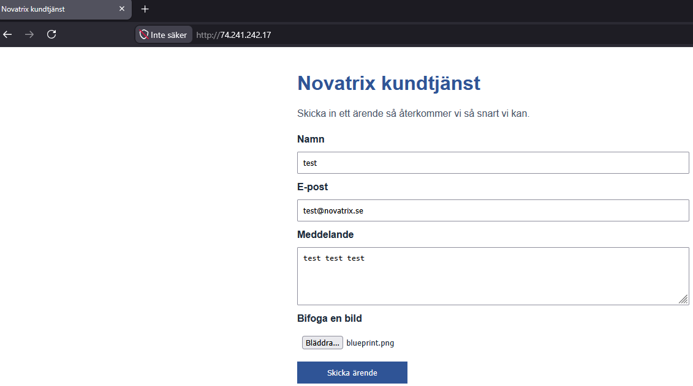

Hemsida kan skicka ärenden:

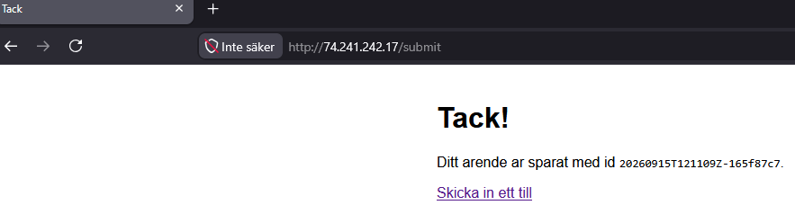

VM hanterade indentitet med *__RBAC__* fungerar:

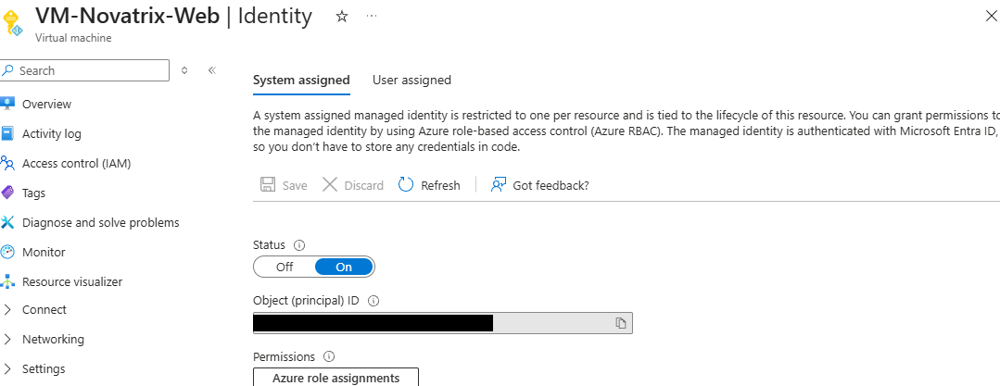

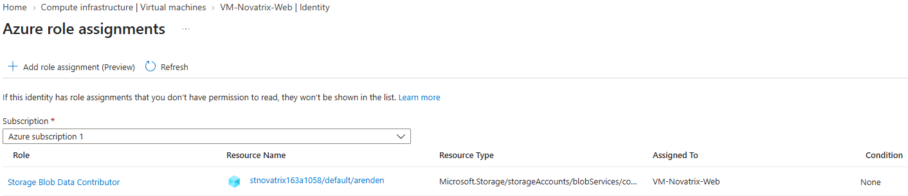

Lagring fungerar som det skall:

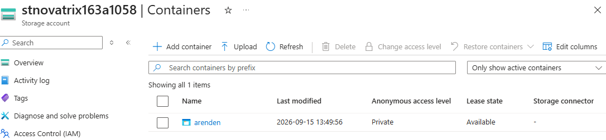

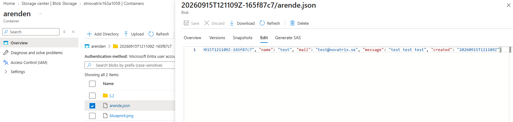

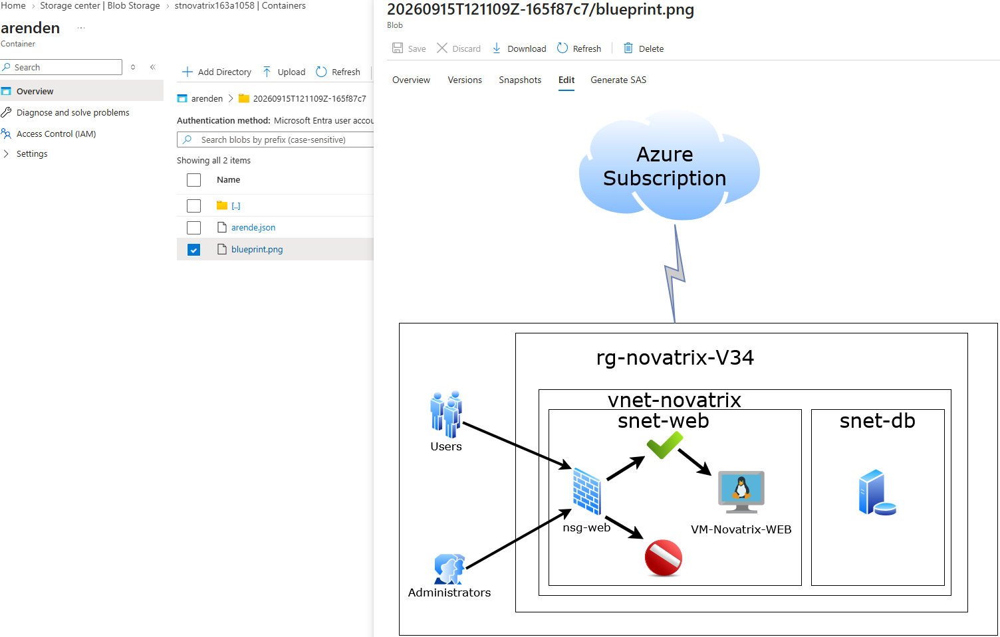

Autentiseringsmetod:


*__Secure Endpoint__* släpper igenom trafik från accepterade enheter (host datorns IP via regel eller VM/webbserverns trafik via vnet/subnät):

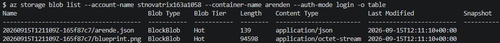

*__Secure Endpoint__* släpper inte igenom trafik från ej accepterade enheter (ej host dators IP eller enhet som inte är med i korrekt vnet/subnät):

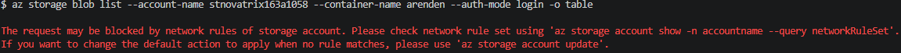


### *__3. Dokumentation och motivering__*

Scriptet (*deploy_server+network+db_V2.sh*) och cloud-init (*cloud-init.yaml*) hanterar att uppsättning och konfiguration av miljön.

Lagringstyp är *Blob storage*. *Blob storage* används då varje ärende är en kombination av strukturerad text  (en JSON med meddelande, e-post, namn och bifogad bild). Det är olika datatyper som behöver kunna finnas samtidigt. *Blob storage* kan hantera detta utan ett fast schema. En *__SQL__*-databas har inte den möjligheten.

*Blob storage* behöver ingen kapacitetsplanering, kontot växer per automatik när fler ärenden inkommer. *Blob storage* är billigare per *__gigabyte__* än en databaslösning när datan som hanteras är enkel och filbaserad. *Blob storage* även har inbyggt stöd för *__RBAC__* och *__Managed Identity__*.

*__Access tier__* på filerna är av typen *Hot*. Att *Hot*-tier används beror på att användningsområdet för vad de andra tiers (*Cool*, *Cold* och *Archive*) är gjorda för. De som arbetar för *Novatrix Kundtjänst* arbetar med ärendena varje dag, det vill säga att de öppnar filerna väligt ofta. *Cool* och *Cold* har en lägre lagringskostnad men samtidigt en högre kostad för skrivning och läsning. Då detta är något som görs ofta i arbetet så blir detta mer kostsamt i längden.

Datavolymen är i dagsläget liten. Ärendena är endast små *__JSON__* filer samt enstaka bilder. Detta innebär att den högre lagringskostaden per *__gigabyte__* som *Hot*-tier har ändå inte blir så hög. Detta kan dock komma att ändras om ärendemängden eller datan som tas emot ändras bör man ha i åtanke.

*Archive*-tier är inget tänkbart alternativ, den behöver timmar av *Rehydration* innan en fil kan läsas. Detta fungerar inte för ett system som används "*live*".

Skrivning av filer till storage sker via webbserverns (VM) *__Managed Identity__*. VM/Webbserverns *__Managed Identity__* har rollen *Storage Blob Data Contributor* vilket är en roll som kan läsa och skriva. *Storage Blob Data Contributor* kan inte ändra några inställningar på kontot eller ta bort kontot. VM/Webbservern har alltså endast tillgång till det som behövs, inte mer (*Least Privilege*).

Inga kontonycklar används, så inga nycklar kan läckas. Inga hemligheter lagras i kod, vilket minskar risken för att hemligheter kan läckas.

VM/Webbservern har endast åtkomst ill containern *"arenden"*. Inte hela storage kontot. Den har endast åtkomst till det som behövs (*Least Privilege*).

*__Private Endpoint__* stänger ner åtkomst för alla enheter, förutom de som behöver det (VM/Webbserver och host dator). Detta gör att åtkomsten säkras och en potentiell attackyta blir mindre.