# __IaC med templates (Godkänt och Väl Godkänt)__

Veckans uppgift går ut på att templates provisionera infrastrukturen runt ärendeformuläret på ett reproducerbart sätt, versionshanterat i GitHub,
så att hela miljön kan återskapas utan manuellt klickande.

### *__1. Skriv template__*

Template är skriven i språket *__bicep__*.
Template innehåller följande kod:

*main.bicep*:

```bicep
targetScope = 'subscription'

@description('Azure region for all resources')
param location string = 'swedencentral'

@description('Name of the resource group')
param resourceGroupName string = 'rg-novatrix'

@description('Admin username for the VM')
param vmAdminUsername string = 'azureuser'

@description('SSH public key to add to the VM for the admin user')
@secure()
param sshPublicKey string

@description('Object ID of the Azure AD identity that should get Storage Blob Data Contributor on the storage account (e.g. the output of "az ad signed-in-user show --query id -o tsv")')
param callerObjectId string

@description('Your public IP address, allowed through the storage account firewall. Leave empty to skip.')
param allowedIpAddress string = ''

@description('Size of the web server VM')
param vmSize string = 'Standard_B2ats_v2'

@description('Name of the virtual machine')
param vmName string = 'VM-Novatrix-Web'

@description('SKU of the OS image used for the VM')
param vmImageSku string = '22_04-lts-gen2'

@description('Name of the virtual network')
param vnetName string = 'vnet-novatrix'

@description('Address space of the virtual network')
param vnetAddressPrefix string = '10.0.0.0/16'

@description('Name of the web subnet')
param subnetWebName string = 'snet-web'

@description('Address prefix of the web subnet')
param subnetWebPrefix string = '10.0.1.0/24'

@description('Name of the database subnet')
param subnetDbName string = 'snet-db'

@description('Address prefix of the database subnet')
param subnetDbPrefix string = '10.0.2.0/24'

@description('Address prefix of the AzureBastionSubnet (the subnet name itself is fixed by Azure and cannot be changed)')
param subnetBastionPrefix string = '10.0.3.0/26'

@description('Name of the network security group protecting the web subnet')
param nsgWebName string = 'nsg-web'

@description('TCP port allowed inbound for HTTP')
param httpPort int = 80

@description('TCP port allowed inbound for HTTPS')
param httpsPort int = 443

@description('Name of the Azure Bastion host')
param bastionName string = 'bastion-novatrix'

@description('SKU of the Azure Bastion host')
param bastionSkuName string = 'Standard'

@description('Name of the Bastion public IP address')
param bastionPipName string = 'pip-bastion-novatrix'

@description('Prefix used to generate a globally unique storage account name (a random suffix is appended)')
param storageAccountNamePrefix string = 'stnovatrix'

@description('SKU of the storage account')
param storageAccountSku string = 'Standard_LRS'

@description('Name of the blob container used for support tickets')
param containerName string = 'arenden'

resource rg 'Microsoft.Resources/resourceGroups@2024-03-01' = {
  name: resourceGroupName
  location: location
}

module novatrix 'resources.bicep' = {
  name: 'novatrix-resources'
  scope: rg
  params: {
    location: location
    vmAdminUsername: vmAdminUsername
    sshPublicKey: sshPublicKey
    callerObjectId: callerObjectId
    allowedIpAddress: allowedIpAddress
    vmSize: vmSize
    vmName: vmName
    vmImageSku: vmImageSku
    vnetName: vnetName
    vnetAddressPrefix: vnetAddressPrefix
    subnetWebName: subnetWebName
    subnetWebPrefix: subnetWebPrefix
    subnetDbName: subnetDbName
    subnetDbPrefix: subnetDbPrefix
    subnetBastionPrefix: subnetBastionPrefix
    nsgWebName: nsgWebName
    httpPort: httpPort
    httpsPort: httpsPort
    bastionName: bastionName
    bastionSkuName: bastionSkuName
    bastionPipName: bastionPipName
    storageAccountNamePrefix: storageAccountNamePrefix
    storageAccountSku: storageAccountSku
    containerName: containerName
  }
}

output vmPublicIp string = novatrix.outputs.vmPublicIp
output storageAccountName string = novatrix.outputs.storageAccountName
```

*main.biceparm*:

```bicep
using 'main.bicep'

// --------------------------------------------------------------------------
// Required — these have no default value in main.bicep and must be set here
// (or passed via --parameters at deploy time).
// --------------------------------------------------------------------------

// Your SSH public key, e.g. the contents of ~/.ssh/id_rsa.pub
param sshPublicKey = 'placeholder'

// Object ID of the identity that should get Storage Blob Data Contributor
// on the storage account, e.g.:
//   az ad signed-in-user show --query id -o tsv
param callerObjectId = 'placeholder'

// Your public IP address, allowed through the storage account firewall.
// Find it with: curl -s https://ifconfig.me
param allowedIpAddress = 'placeholder'

// --------------------------------------------------------------------------
// Optional — everything below already has a default in main.bicep.
// Uncomment and change only the values you want to override for this
// environment; leave the rest to fall back to the defaults.
// --------------------------------------------------------------------------

// param location = 'swedencentral'
// param resourceGroupName = 'rg-novatrix'
// param vmAdminUsername = 'azureuser'
// param vmSize = 'Standard_B2ats_v2'
// param vmName = 'VM-Novatrix-Web'
// param vmImageSku = '22_04-lts-gen2'
// param vnetName = 'vnet-novatrix'
// param vnetAddressPrefix = '10.0.0.0/16'
// param subnetWebName = 'snet-web'
// param subnetWebPrefix = '10.0.1.0/24'
// param subnetDbName = 'snet-db'
// param subnetDbPrefix = '10.0.2.0/24'
// param subnetBastionPrefix = '10.0.3.0/26'
// param nsgWebName = 'nsg-web'
// param httpPort = 80
// param httpsPort = 443
// param bastionName = 'bastion-novatrix'
// param bastionSkuName = 'Standard'
// param bastionPipName = 'pip-bastion-novatrix'
// param storageAccountNamePrefix = 'stnovatrix'
// param storageAccountSku = 'Standard_LRS'
// param containerName = 'arenden'
```

Man måste byta ut "*placeholder*" till sin egna data för att script skall fungera korrekt.

*resources.bicep*:

```bicep
@description('Azure region for all resources')
param location string

@description('Admin username for the VM')
param vmAdminUsername string

@secure()
@description('SSH public key to add to the VM for the admin user')
param sshPublicKey string

@description('Object ID of the identity that should get data-plane access to the storage account')
param callerObjectId string

@description('Public IP address allowed through the storage account firewall')
param allowedIpAddress string = ''

@description('Size of the web server VM')
param vmSize string

@description('Name of the virtual machine')
param vmName string

@description('SKU of the OS image used for the VM')
param vmImageSku string

@description('Name of the virtual network')
param vnetName string

@description('Address space of the virtual network')
param vnetAddressPrefix string

@description('Name of the web subnet')
param subnetWebName string

@description('Address prefix of the web subnet')
param subnetWebPrefix string

@description('Name of the database subnet')
param subnetDbName string

@description('Address prefix of the database subnet')
param subnetDbPrefix string

@description('Address prefix of the AzureBastionSubnet')
param subnetBastionPrefix string

@description('Name of the network security group protecting the web subnet')
param nsgWebName string

@description('TCP port allowed inbound for HTTP')
param httpPort int

@description('TCP port allowed inbound for HTTPS')
param httpsPort int

@description('Name of the Azure Bastion host')
param bastionName string

@description('SKU of the Azure Bastion host')
param bastionSkuName string

@description('Name of the Bastion public IP address')
param bastionPipName string

@description('Prefix used to generate a globally unique storage account name')
param storageAccountNamePrefix string

@description('SKU of the storage account')
param storageAccountSku string

@description('Name of the blob container used for support tickets')
param containerName string

// Fixed subnet name required by Azure Bastion; cannot be renamed.
var subnetBastionName = 'AzureBastionSubnet'

// Globally unique storage account name derived from the resource group.
var storageAccountName = toLower('${storageAccountNamePrefix}${uniqueString(resourceGroup().id)}')

// Placeholder text expected inside cloud-init.yaml, replaced with the real
// generated storage account name before it's passed to the VM.
var cloudInitPlaceholder = '${storageAccountNamePrefix}XXXX'

// Built-in role definition ID for "Storage Blob Data Contributor".
var storageBlobDataContributorRoleId = subscriptionResourceId('Microsoft.Authorization/roleDefinitions', 'ba92f5b4-2d11-453d-a403-e96b0029c9fe')

// --------------------------------------------------------------------------
// Networking
// --------------------------------------------------------------------------
resource vnet 'Microsoft.Network/virtualNetworks@2023-11-01' = {
  name: vnetName
  location: location
  properties: {
    addressSpace: {
      addressPrefixes: [vnetAddressPrefix]
    }
  }
}

resource nsgWeb 'Microsoft.Network/networkSecurityGroups@2023-11-01' = {
  name: nsgWebName
  location: location
  properties: {
    securityRules: [
      {
        name: 'Allow-HTTP'
        properties: {
          priority: 100
          direction: 'Inbound'
          access: 'Allow'
          protocol: 'Tcp'
          sourceAddressPrefix: 'Internet'
          sourcePortRange: '*'
          destinationAddressPrefix: '*'
          destinationPortRange: string(httpPort)
        }
      }
      {
        name: 'Allow-HTTPS'
        properties: {
          priority: 150
          direction: 'Inbound'
          access: 'Allow'
          protocol: 'Tcp'
          sourceAddressPrefix: 'Internet'
          sourcePortRange: '*'
          destinationAddressPrefix: '*'
          destinationPortRange: string(httpsPort)
        }
      }
    ]
  }
}

resource subnetWeb 'Microsoft.Network/virtualNetworks/subnets@2023-11-01' = {
  parent: vnet
  name: subnetWebName
  properties: {
    addressPrefix: subnetWebPrefix
    networkSecurityGroup: { id: nsgWeb.id }
  }
}

resource subnetDb 'Microsoft.Network/virtualNetworks/subnets@2023-11-01' = {
  parent: vnet
  name: subnetDbName
  properties: {
    addressPrefix: subnetDbPrefix
    privateEndpointNetworkPolicies: 'Disabled'
  }
  dependsOn: [subnetWeb]
}

resource subnetBastion 'Microsoft.Network/virtualNetworks/subnets@2023-11-01' = {
  parent: vnet
  name: subnetBastionName
  properties: {
    addressPrefix: subnetBastionPrefix
  }
  dependsOn: [subnetDb]
}

// --------------------------------------------------------------------------
// Storage account + private endpoint
// --------------------------------------------------------------------------
resource storage 'Microsoft.Storage/storageAccounts@2023-01-01' = {
  name: storageAccountName
  location: location
  sku: { name: storageAccountSku }
  kind: 'StorageV2'
  properties: {
    minimumTlsVersion: 'TLS1_2'
    allowBlobPublicAccess: false
    allowSharedKeyAccess: false
    publicNetworkAccess: 'Enabled'
    networkAcls: {
      defaultAction: 'Deny'
      ipRules: empty(allowedIpAddress) ? [] : [
        {
          value: allowedIpAddress
          action: 'Allow'
        }
      ]
    }
  }
}

resource blobService 'Microsoft.Storage/storageAccounts/blobServices@2023-01-01' = {
  parent: storage
  name: 'default'
}

resource container 'Microsoft.Storage/storageAccounts/blobServices/containers@2023-01-01' = {
  parent: blobService
  name: containerName
}

resource privateDnsZone 'Microsoft.Network/privateDnsZones@2024-06-01' = {
  name: 'privatelink.blob.core.windows.net'
  location: 'global'
}

resource dnsZoneLink 'Microsoft.Network/privateDnsZones/virtualNetworkLinks@2024-06-01' = {
  parent: privateDnsZone
  name: 'link-${vnetName}'
  location: 'global'
  properties: {
    virtualNetwork: { id: vnet.id }
    registrationEnabled: false
  }
}

resource privateEndpoint 'Microsoft.Network/privateEndpoints@2023-11-01' = {
  name: 'pe-${storageAccountName}-blob'
  location: location
  properties: {
    subnet: { id: subnetDb.id }
    privateLinkServiceConnections: [
      {
        name: 'conn-pe-${storageAccountName}-blob'
        properties: {
          privateLinkServiceId: storage.id
          groupIds: ['blob']
        }
      }
    ]
  }
}

resource peDnsZoneGroup 'Microsoft.Network/privateEndpoints/privateDnsZoneGroups@2023-11-01' = {
  parent: privateEndpoint
  name: 'default'
  properties: {
    privateDnsZoneConfigs: [
      {
        name: 'blob'
        properties: { privateDnsZoneId: privateDnsZone.id }
      }
    ]
  }
}

// --------------------------------------------------------------------------
// Bastion
// --------------------------------------------------------------------------
resource bastionPip 'Microsoft.Network/publicIPAddresses@2023-11-01' = {
  name: bastionPipName
  location: location
  sku: { name: 'Standard' }
  properties: { publicIPAllocationMethod: 'Static' }
}

resource bastion 'Microsoft.Network/bastionHosts@2023-11-01' = {
  name: bastionName
  location: location
  sku: { name: bastionSkuName }
  properties: {
    enableTunneling: true
    ipConfigurations: [
      {
        name: 'ipconfig'
        properties: {
          subnet: { id: subnetBastion.id }
          publicIPAddress: { id: bastionPip.id }
        }
      }
    ]
  }
}

// --------------------------------------------------------------------------
// Web server VM
// --------------------------------------------------------------------------
resource vmPip 'Microsoft.Network/publicIPAddresses@2023-11-01' = {
  name: 'pip-${vmName}'
  location: location
  sku: { name: 'Standard' }
  properties: { publicIPAllocationMethod: 'Static' }
}

resource nic 'Microsoft.Network/networkInterfaces@2023-11-01' = {
  name: 'nic-${vmName}'
  location: location
  properties: {
    ipConfigurations: [
      {
        name: 'ipconfig1'
        properties: {
          subnet: { id: subnetWeb.id }
          publicIPAddress: { id: vmPip.id }
        }
      }
    ]
  }
}

// Requires cloud-init.yaml to be present next to this file. The placeholder
// text inside it (storageAccountNamePrefix + "XXXX") is replaced with the
// actual generated storage account name before being passed to the VM.
var cloudInitContent = replace(loadTextContent('cloud-init.yaml'), cloudInitPlaceholder, storageAccountName)

resource vm 'Microsoft.Compute/virtualMachines@2023-09-01' = {
  name: vmName
  location: location
  identity: {
    type: 'SystemAssigned'
  }
  properties: {
    hardwareProfile: { vmSize: vmSize }
    osProfile: {
      computerName: vmName
      adminUsername: vmAdminUsername
      customData: base64(cloudInitContent)
      linuxConfiguration: {
        disablePasswordAuthentication: true
        ssh: {
          publicKeys: [
            {
              path: '/home/${vmAdminUsername}/.ssh/authorized_keys'
              keyData: sshPublicKey
            }
          ]
        }
      }
    }
    storageProfile: {
      imageReference: {
        publisher: 'Canonical'
        offer: '0001-com-ubuntu-server-jammy'
        sku: vmImageSku
        version: 'latest'
      }
      osDisk: { createOption: 'FromImage' }
    }
    networkProfile: {
      networkInterfaces: [
        { id: nic.id }
      ]
    }
  }
}

// --------------------------------------------------------------------------
// Role assignments
// --------------------------------------------------------------------------
resource callerRoleAssignment 'Microsoft.Authorization/roleAssignments@2022-04-01' = {
  name: guid(storage.id, callerObjectId, storageBlobDataContributorRoleId)
  scope: storage
  properties: {
    roleDefinitionId: storageBlobDataContributorRoleId
    principalId: callerObjectId
    principalType: 'User'
  }
}

resource vmRoleAssignment 'Microsoft.Authorization/roleAssignments@2022-04-01' = {
  name: guid(container.id, vm.id, storageBlobDataContributorRoleId)
  scope: container
  properties: {
    roleDefinitionId: storageBlobDataContributorRoleId
    principalId: vm.identity.principalId
    principalType: 'ServicePrincipal'
  }
}

output vmPublicIp string = vmPip.properties.ipAddress
output storageAccountName string = storageAccountName
```

Script exekveras med kommando:

```bash
az deployment sub create \
  --location swedencentral \
  --template-file main.bicep \
  --parameters main.bicepparam
```

Scriptet tar hjälp av följande cloud-init fil för konfiguration av Webbserver/VM:

```yaml
#cloud-config
# V37 Utokad: web VM that serves the Novatrix ticket form AND writes each
# ticket to Blob Storage via the VM's system-assigned managed identity.
# Pure ASCII on purpose, so az --custom-data does not mangle it.

package_update: true

packages:
  - nginx
  - python3
  - python3-pip

write_files:
  - path: /opt/arendeapp/app.py
    owner: root:root
    permissions: '0644'
    content: |
      # -*- coding: ascii -*-
      # Novatrix arende backend (V37 Utokad).
      # Receives a support ticket from the web form and stores it in Blob Storage
      # using the web VM's system-assigned managed identity. No account key is used.
      #
      # Students change STORAGE_ACCOUNT below to their own globally unique account
      # name (the same account the provisioning script created). Nothing else needs
      # to change for the base to work.

      import json
      import uuid
      from datetime import datetime, timezone

      from flask import Flask, request, Response
      from azure.identity import DefaultAzureCredential
      from azure.storage.blob import BlobServiceClient, ContentSettings

      # --- Settings students may change -------------------------------------------
      # Your globally unique storage account name (no https, no .blob..., just name).
      STORAGE_ACCOUNT = "stnovatrixXXXX"
      # Container that receives the tickets (created by the provisioning script).
      CONTAINER = "arenden"
      # ----------------------------------------------------------------------------

      ACCOUNT_URL = "https://{0}.blob.core.windows.net".format(STORAGE_ACCOUNT)

      app = Flask(__name__)

      # One credential and one client for the whole app.
      # DefaultAzureCredential automatically picks up the VM's system-assigned
      # managed identity through IMDS, so there is no secret anywhere in the code.
      _credential = DefaultAzureCredential()
      _blob_service = BlobServiceClient(account_url=ACCOUNT_URL, credential=_credential)


      def _container():
          return _blob_service.get_container_client(CONTAINER)


      @app.post("/submit")
      def submit():
          # Read the fields from the form. The names here must match index.html.
          name = request.form.get("name", "").strip()
          mail = request.form.get("mail", "").strip()
          msg = request.form.get("msg", "").strip()
          image = request.files.get("bild")

          # A unique id per ticket: UTC timestamp plus a short random suffix.
          stamp = datetime.now(timezone.utc).strftime("%Y%m%dT%H%M%SZ")
          ticket_id = "{0}-{1}".format(stamp, uuid.uuid4().hex[:8])

          ticket = {
              "id": ticket_id,
              "name": name,
              "mail": mail,
              "message": msg,
              "created": stamp,
          }

          container = _container()

          # 1) Store the ticket itself as a JSON blob under its own folder.
          container.upload_blob(
              name="{0}/arende.json".format(ticket_id),
              data=json.dumps(ticket, ensure_ascii=False).encode("utf-8"),
              overwrite=True,
              content_settings=ContentSettings(content_type="application/json"),
          )

          # 2) Store the attached image next to it, if the user sent one.
          if image is not None and image.filename:
              container.upload_blob(
                  name="{0}/{1}".format(ticket_id, image.filename),
                  data=image.stream,
                  overwrite=True,
              )

          # A plain confirmation page. ASCII only, so the file survives cloud-init.
          body = (
              "<!DOCTYPE html><html lang='sv'><head><meta charset='UTF-8'>"
              "<title>Tack</title></head>"
              "<body style='font-family:Arial;max-width:640px;margin:40px auto'>"
              "<h1>Tack!</h1>"
              "<p>Ditt arende ar sparat med id <code>{0}</code>.</p>"
              "<p><a href='/'>Skicka in ett till</a></p>"
              "</body></html>"
          ).format(ticket_id)
          return Response(body, mimetype="text/html")


      @app.get("/health")
      def health():
          # Handy for a quick check that the backend is up and reading its config.
          return {"status": "ok", "account": STORAGE_ACCOUNT, "container": CONTAINER}


      if __name__ == "__main__":
          # Bind to localhost only. nginx sits in front and proxies /submit to here.
          app.run(host="127.0.0.1", port=5000)


  - path: /var/www/html/index.html
    owner: root:root
    permissions: '0644'
    content: |
      <!DOCTYPE html>
      <html lang="sv">
      <head>
        <meta charset="UTF-8">
        <meta name="viewport" content="width=device-width, initial-scale=1.0">
        <title>Novatrix kundtj&auml;nst</title>
        <style>
          body { font-family: Arial, sans-serif; max-width: 640px; margin: 40px auto; padding: 0 16px; color: #1f2d3d; }
          h1 { color: #2f5496; }
          p { color: #4a5568; }
          form { display: grid; gap: 12px; margin-top: 24px; }
          label { font-weight: bold; }
          input, textarea { width: 100%; padding: 8px; box-sizing: border-box; }
          button { width: 180px; padding: 10px; background: #2f5496; color: #fff; border: none; cursor: pointer; }
        </style>
      </head>
      <body>
        <h1>Novatrix kundtj&auml;nst</h1>
        <p>Skicka in ett &auml;rende s&aring; &aring;terkommer vi s&aring; snart vi kan.</p>
        <!-- action points at the backend, method post, enctype so the file follows along -->
        <form action="/submit" method="post" enctype="multipart/form-data">
          <label for="name">Namn</label>
          <input type="text" id="name" name="name">

          <label for="mail">E-post</label>
          <input type="email" id="mail" name="mail">

          <label for="msg">Meddelande</label>
          <textarea id="msg" name="msg" rows="5"></textarea>

          <label for="bild">Bifoga en bild</label>
          <input type="file" id="bild" name="bild">

          <button type="submit">Skicka &auml;rende</button>
        </form>
      </body>
      </html>


  - path: /etc/nginx/sites-available/default
    owner: root:root
    permissions: '0644'
    content: |
      # nginx site for the Novatrix ticket form (V37 Utokad).
      # nginx serves the static page and reverse-proxies /submit to the Flask backend.
      server {
          listen 80 default_server;
          listen [::]:80 default_server;

          root /var/www/html;
          index index.html;

          # Allow a reasonably sized image upload (the browser posts the file here).
          client_max_body_size 10m;

          location / {
              try_files $uri $uri/ =404;
          }

          # The form posts here; hand it to the backend that owns the managed identity.
          location = /submit {
              proxy_pass http://127.0.0.1:5000/submit;
              proxy_set_header Host $host;
              proxy_set_header X-Real-IP $remote_addr;
          }
      }


  - path: /etc/systemd/system/arendeapp.service
    owner: root:root
    permissions: '0644'
    content: |
      # systemd unit for the Flask backend (V37 Utokad).
      # Keeps the ticket backend running and restarts it if it stops.
      [Unit]
      Description=Novatrix arende backend (Flask)
      After=network-online.target
      Wants=network-online.target

      [Service]
      WorkingDirectory=/opt/arendeapp
      ExecStart=/usr/bin/python3 /opt/arendeapp/app.py
      Restart=on-failure
      User=www-data

      [Install]
      WantedBy=multi-user.target


runcmd:
  # Install the Azure SDK bits the backend needs (system-wide).
  - pip3 install flask azure-identity azure-storage-blob || pip3 install --break-system-packages flask azure-identity azure-storage-blob
  # Start the ticket backend and make sure it comes back on reboot.
  - systemctl daemon-reload
  - systemctl enable --now arendeapp
  # (Re)load nginx so it serves the page and proxies /submit to the backend.
  - systemctl enable --now nginx
  - systemctl restart nginx
```

### *__2. Deploya från kod__*

För att deploya template kör man följande kod i en *__bash__* terminal:

```bash
az deployment sub create \
  --location swedencentral \
  --template-file main.bicep \
  --parameters main.bicepparam
```

För att ansluta till Webbserver/VM kör man följande kod i en *__PowerShell__* terminal:

```powershell
az network bastion ssh `
  --name bastion-novatrix `
  --resource-group rg-novatrix `
  --target-resource-id (az vm show -g rg-novatrix -n VM-Novatrix-Web --query id -o tsv) `
  --auth-type ssh-key `
  --username azureuser `
  --ssh-key "$HOME/.ssh/id_rsa"
```

### *__3. Visa versionshantering__*

Exempel på versionshantering:

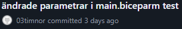

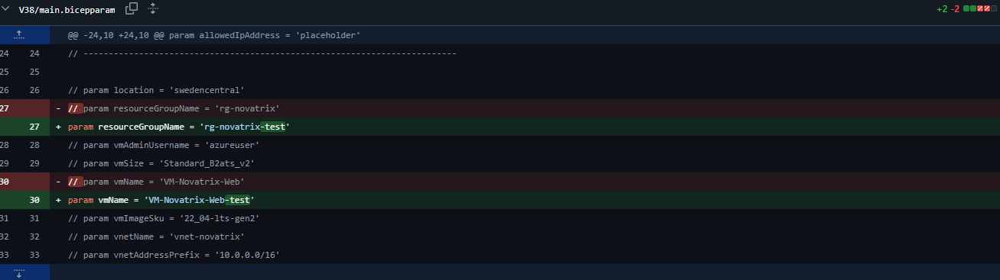

Här aktiveras två utav parametrarna i *main.biceparm* och får nya värden.
Man kan se hur scriptet har ändrats med hjälp av versionshanteringen i GitHub.

### *__4. Dokumentera__*

Scriptet (*main.bicep*) skapar upp hela miljön.

Man kör scriptet (*main.bicep*) via följande kommando i en *__bash__* terminal (man måste stå i samma mapp som alla script finns i):

```bash
az deployment sub create \
  --location swedencentral \
  --template-file main.bicep \
  --parameters main.bicepparam
```
Om man önskar att ändra någon parameter i scriptet som till exempel namn på resursgrupp eller vilken storlek VM skall vara så gör man det via *main.bicepparam* filen. Man tar bort *//* så att parametern inte längre är en kommentar och ändrar värdet inom *'* tecknen. Man sparar sedan *main.bicepparam* och kör *main.bicep* som vanligt. Vill man ändra tillbaka till standard värden så lägger man till *//* framför parametern igen och sparar *main.bicepparam*. *main.bicepparam* används automatiskt när man kör scriptet (*main.bicep*).

*resources.bicep* skapar alla resurser, och används automatiskt när man kör scriptet (*main.bicep*).

Script använder *cloud-init.yaml* för att konfigurera VM/webbserver,

Alla script hjälper till att göra miljön säkrare för förändringar. Då man enkelt kan ändra parametrarna och behöver inte göra ett helt nytt script. Man kan använda scriptet om man skall skapa en annan miljö som till exempel behöver en större VM storlek och andra namn. Man ändrar då parametrarna efter de behoven som finns, men använder samma script i grunden.

*__OBS!__* Efter att *Pay as you go* har aktiverats på *__Azure__* kontot fungerar inte längre VM storleken *Standard_B2ats_v2*. Det enklaste är att ändra detta i *main.bicepparam* filen, enligt beskrivning ovan.

Scripten har fått beteckningen "*main*" då dem skapar upp standardmiljön.
Om man vill göra nya script baserade på detta skulle en namnstandard kunna vara baserat på vilken vecka de är aktuella / skapade. Till exempel hade dennas veckas script blivit "*main-V38*" och nästa veckas "*main-V39*".

För att ansluta till Webbserver/VM kör man följande kod i en *__PowerShell__* terminal:

```powershell
az network bastion ssh `
  --name bastion-novatrix `
  --resource-group rg-novatrix `
  --target-resource-id (az vm show -g rg-novatrix -n VM-Novatrix-Web --query id -o tsv) `
  --auth-type ssh-key `
  --username azureuser `
  --ssh-key "$HOME/.ssh/id_rsa"
```

### *__5. Verifiering__*

Deployment via script lyckades och allt är konfigurerat:

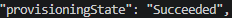

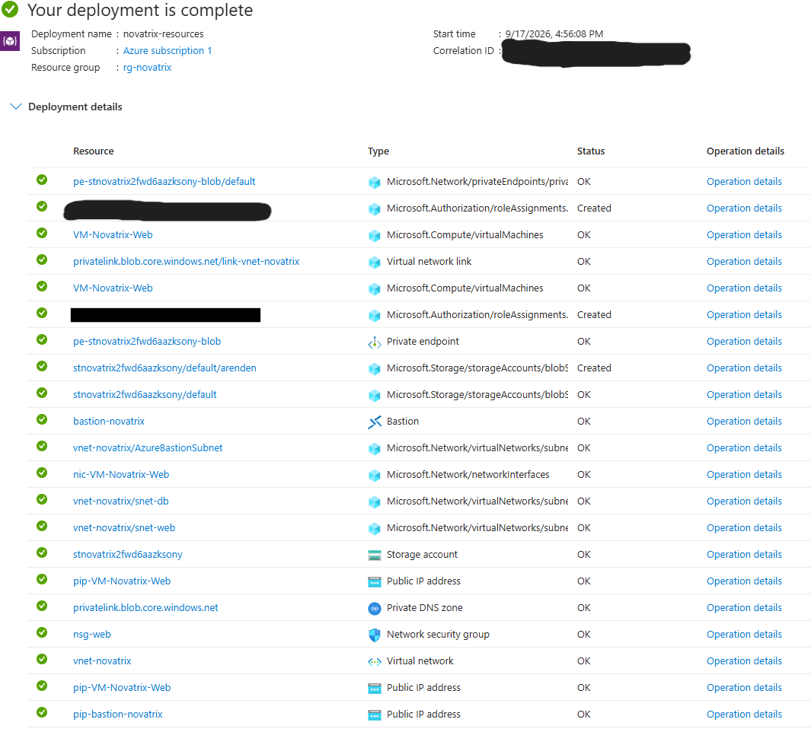

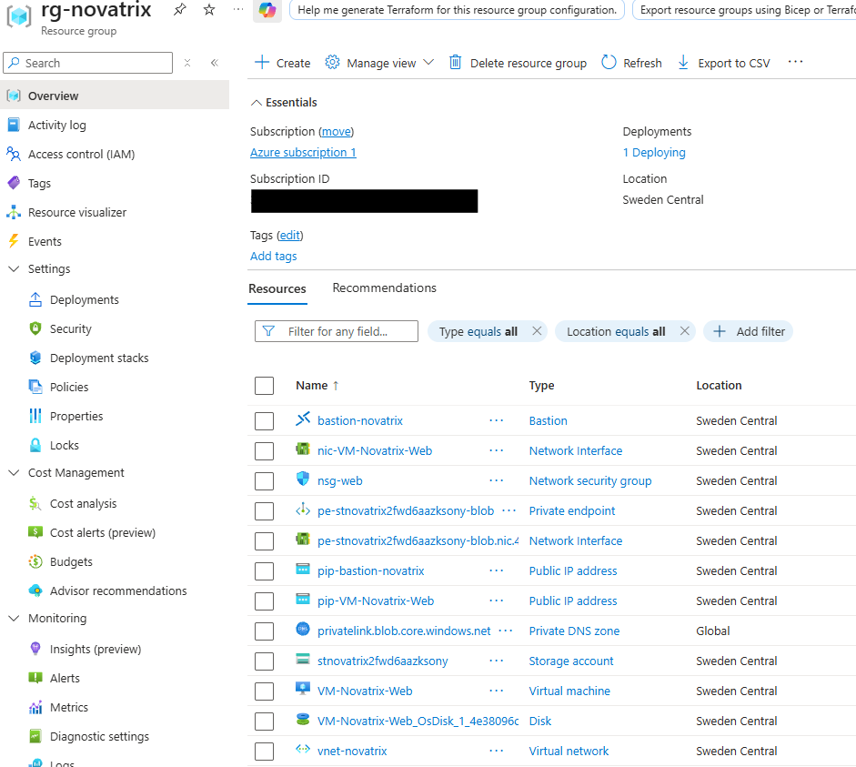

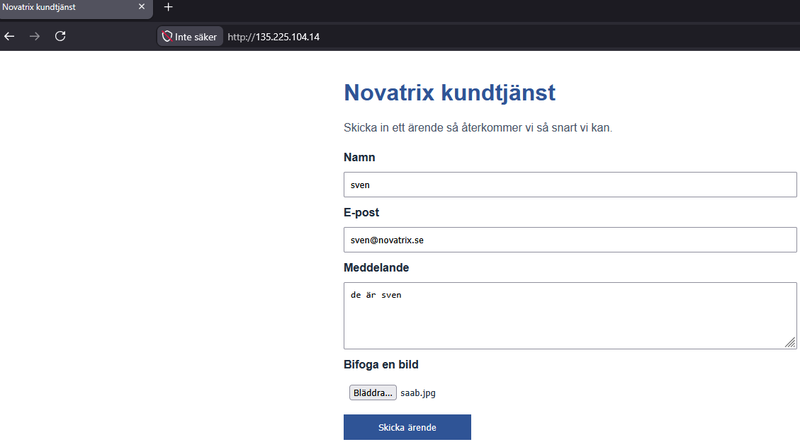

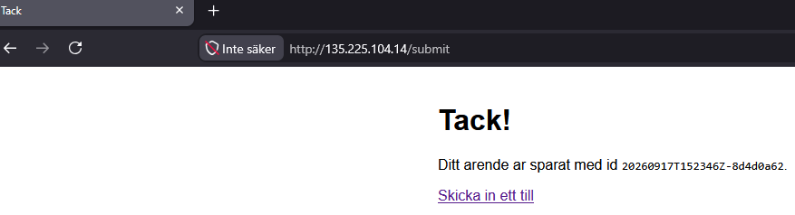

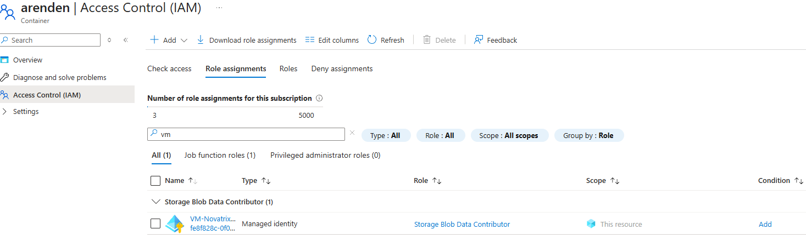

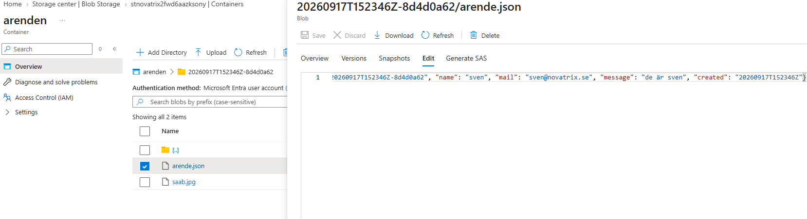

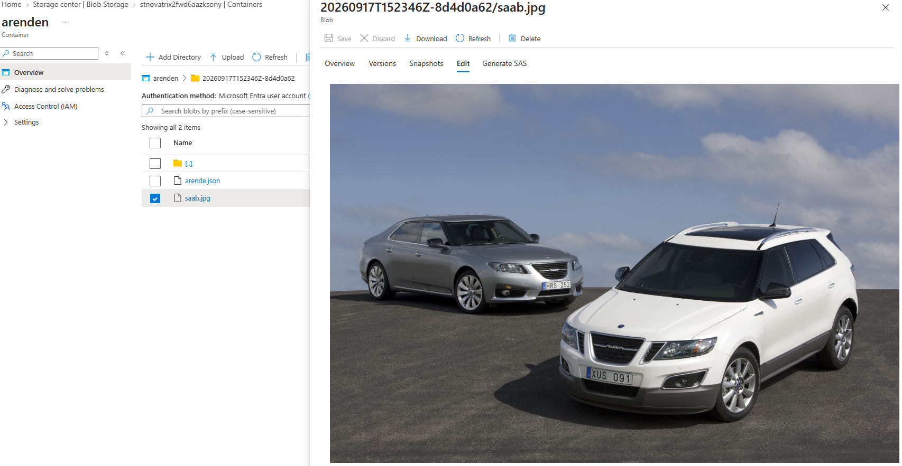

När man aktiverar och ändrar parametrar i *main.biceparm* så slår det igenom korrekt:

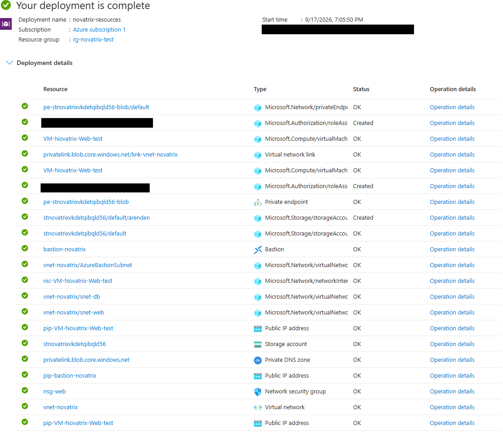