# __Automation och integration (Godkänt och Väl Godkänt)__

Repository: https://github.com/03timnor/Azure_MOV25

*Tim Noreliusson Lingestedt, 2026-09-27*

Veckans uppgift går ut på att bygga ett automatiserat arbetsflöde. När ett ärende skickas in via formuläret ska något hända i Microsoft 365. Det kopplar samman Azure-lösningen och M365 till en sammanhängande händelsekedja.

## *__1. Skapa upp miljön__*

Miljön skapas upp på samma sätt som i *__V38__* uppgiften. Dock är koden justerad något för att *__Power Automate__* triggern skall fungera ordentligt.

*main.bicep:*

```bicep
targetScope = 'subscription'

@description('Azure region for all resources')
param location string = 'swedencentral'

@description('Name of the resource group')
param resourceGroupName string = 'rg-novatrix'

@description('Admin username for the VM')
param vmAdminUsername string = 'azureuser'

@description('SSH public key to add to the VM for the admin user')
@secure()
param sshPublicKey string

@description('Object ID of the Azure AD identity that should get Storage Blob Data Contributor on the storage account (e.g. the output of "az ad signed-in-user show --query id -o tsv")')
param callerObjectId string

@description('Your public IP address, allowed through the storage account firewall. Leave empty to skip.')
param allowedIpAddress string = ''

@description('Size of the web server VM')
param vmSize string = 'Standard_B2ats_v2'

@description('Name of the virtual machine')
param vmName string = 'VM-Novatrix-Web'

@description('SKU of the OS image used for the VM')
param vmImageSku string = '22_04-lts-gen2'

@description('Name of the virtual network')
param vnetName string = 'vnet-novatrix'

@description('Address space of the virtual network')
param vnetAddressPrefix string = '10.0.0.0/16'

@description('Name of the web subnet')
param subnetWebName string = 'snet-web'

@description('Address prefix of the web subnet')
param subnetWebPrefix string = '10.0.1.0/24'

@description('Name of the database subnet')
param subnetDbName string = 'snet-db'

@description('Address prefix of the database subnet')
param subnetDbPrefix string = '10.0.2.0/24'

@description('Address prefix of the AzureBastionSubnet (the subnet name itself is fixed by Azure and cannot be changed)')
param subnetBastionPrefix string = '10.0.3.0/26'

@description('Name of the network security group protecting the web subnet')
param nsgWebName string = 'nsg-web'

@description('TCP port allowed inbound for HTTP')
param httpPort int = 80

@description('TCP port allowed inbound for HTTPS')
param httpsPort int = 443

@description('Name of the Azure Bastion host')
param bastionName string = 'bastion-novatrix'

@description('SKU of the Azure Bastion host')
param bastionSkuName string = 'Standard'

@description('Name of the Bastion public IP address')
param bastionPipName string = 'pip-bastion-novatrix'

@description('Prefix used to generate a globally unique storage account name (a random suffix is appended)')
param storageAccountNamePrefix string = 'stnovatrix'

@description('SKU of the storage account')
param storageAccountSku string = 'Standard_LRS'

@description('Name of the blob container used for support tickets')
param containerName string = 'arenden'

@description('Optional Power Automate HTTP trigger URL that receives each ticket. Leave empty to disable.')
param flowUrl string = ''

resource rg 'Microsoft.Resources/resourceGroups@2024-03-01' = {
  name: resourceGroupName
  location: location
}

module novatrix 'resources.bicep' = {
  name: 'novatrix-resources'
  scope: rg
  params: {
    location: location
    vmAdminUsername: vmAdminUsername
    sshPublicKey: sshPublicKey
    callerObjectId: callerObjectId
    allowedIpAddress: allowedIpAddress
    vmSize: vmSize
    vmName: vmName
    vmImageSku: vmImageSku
    vnetName: vnetName
    vnetAddressPrefix: vnetAddressPrefix
    subnetWebName: subnetWebName
    subnetWebPrefix: subnetWebPrefix
    subnetDbName: subnetDbName
    subnetDbPrefix: subnetDbPrefix
    subnetBastionPrefix: subnetBastionPrefix
    nsgWebName: nsgWebName
    httpPort: httpPort
    httpsPort: httpsPort
    bastionName: bastionName
    bastionSkuName: bastionSkuName
    bastionPipName: bastionPipName
    storageAccountNamePrefix: storageAccountNamePrefix
    storageAccountSku: storageAccountSku
    containerName: containerName
    flowUrl: flowUrl
  }
}

output vmPublicIp string = novatrix.outputs.vmPublicIp
output storageAccountName string = novatrix.outputs.storageAccountName
output bastionConnectCommand string = novatrix.outputs.bastionConnectCommand
```

*resources.bicep:*

```bicep
@description('Azure region for all resources')
param location string

@description('Admin username for the VM')
param vmAdminUsername string

@secure()
@description('SSH public key to add to the VM for the admin user')
param sshPublicKey string

@description('Object ID of the identity that should get data-plane access to the storage account')
param callerObjectId string

@description('Public IP address allowed through the storage account firewall')
param allowedIpAddress string = ''

@description('Size of the web server VM')
param vmSize string

@description('Name of the virtual machine')
param vmName string

@description('SKU of the OS image used for the VM')
param vmImageSku string

@description('Name of the virtual network')
param vnetName string

@description('Address space of the virtual network')
param vnetAddressPrefix string

@description('Name of the web subnet')
param subnetWebName string

@description('Address prefix of the web subnet')
param subnetWebPrefix string

@description('Name of the database subnet')
param subnetDbName string

@description('Address prefix of the database subnet')
param subnetDbPrefix string

@description('Address prefix of the AzureBastionSubnet')
param subnetBastionPrefix string

@description('Name of the network security group protecting the web subnet')
param nsgWebName string

@description('TCP port allowed inbound for HTTP')
param httpPort int

@description('TCP port allowed inbound for HTTPS')
param httpsPort int

@description('Name of the Azure Bastion host')
param bastionName string

@description('SKU of the Azure Bastion host')
param bastionSkuName string

@description('Name of the Bastion public IP address')
param bastionPipName string

@description('Prefix used to generate a globally unique storage account name')
param storageAccountNamePrefix string

@description('SKU of the storage account')
param storageAccountSku string

@description('Name of the blob container used for support tickets')
param containerName string

@description('Optional Power Automate HTTP trigger URL that receives each ticket. Leave empty to disable.')
param flowUrl string = ''

// Fixed subnet name required by Azure Bastion; cannot be renamed.
var subnetBastionName = 'AzureBastionSubnet'

// Globally unique storage account name derived from the resource group.
var storageAccountName = toLower('${storageAccountNamePrefix}${uniqueString(resourceGroup().id)}')

// Placeholder text expected inside cloud-init.yaml, replaced with the real
// generated storage account name before it's passed to the VM.
var cloudInitPlaceholder = '${storageAccountNamePrefix}XXXX'

// Placeholder text expected inside cloud-init.yaml for the Power Automate
// flow URL, replaced with the flowUrl parameter (or left empty if unset).
var flowUrlPlaceholder = '__FLOW_URL_PLACEHOLDER__'

// Built-in role definition ID for "Storage Blob Data Contributor".
var storageBlobDataContributorRoleId = subscriptionResourceId('Microsoft.Authorization/roleDefinitions', 'ba92f5b4-2d11-453d-a403-e96b0029c9fe')

// --------------------------------------------------------------------------
// Networking
// --------------------------------------------------------------------------
resource vnet 'Microsoft.Network/virtualNetworks@2023-11-01' = {
  name: vnetName
  location: location
  properties: {
    addressSpace: {
      addressPrefixes: [vnetAddressPrefix]
    }
  }
}

resource nsgWeb 'Microsoft.Network/networkSecurityGroups@2023-11-01' = {
  name: nsgWebName
  location: location
  properties: {
    securityRules: [
      {
        name: 'Allow-HTTP'
        properties: {
          priority: 100
          direction: 'Inbound'
          access: 'Allow'
          protocol: 'Tcp'
          sourceAddressPrefix: 'Internet'
          sourcePortRange: '*'
          destinationAddressPrefix: '*'
          destinationPortRange: string(httpPort)
        }
      }
      {
        name: 'Allow-HTTPS'
        properties: {
          priority: 150
          direction: 'Inbound'
          access: 'Allow'
          protocol: 'Tcp'
          sourceAddressPrefix: 'Internet'
          sourcePortRange: '*'
          destinationAddressPrefix: '*'
          destinationPortRange: string(httpsPort)
        }
      }
    ]
  }
}

resource subnetWeb 'Microsoft.Network/virtualNetworks/subnets@2023-11-01' = {
  parent: vnet
  name: subnetWebName
  properties: {
    addressPrefix: subnetWebPrefix
    networkSecurityGroup: { id: nsgWeb.id }
  }
}

resource subnetDb 'Microsoft.Network/virtualNetworks/subnets@2023-11-01' = {
  parent: vnet
  name: subnetDbName
  properties: {
    addressPrefix: subnetDbPrefix
    privateEndpointNetworkPolicies: 'Disabled'
  }
  dependsOn: [subnetWeb]
}

resource subnetBastion 'Microsoft.Network/virtualNetworks/subnets@2023-11-01' = {
  parent: vnet
  name: subnetBastionName
  properties: {
    addressPrefix: subnetBastionPrefix
  }
  dependsOn: [subnetDb]
}

// --------------------------------------------------------------------------
// Storage account + private endpoint
// --------------------------------------------------------------------------
resource storage 'Microsoft.Storage/storageAccounts@2023-01-01' = {
  name: storageAccountName
  location: location
  sku: { name: storageAccountSku }
  kind: 'StorageV2'
  properties: {
    minimumTlsVersion: 'TLS1_2'
    allowBlobPublicAccess: false
    allowSharedKeyAccess: false
    publicNetworkAccess: 'Enabled'
    networkAcls: {
      defaultAction: 'Deny'
      ipRules: empty(allowedIpAddress) ? [] : [
        {
          value: allowedIpAddress
          action: 'Allow'
        }
      ]
    }
  }
}

resource blobService 'Microsoft.Storage/storageAccounts/blobServices@2023-01-01' = {
  parent: storage
  name: 'default'
}

resource container 'Microsoft.Storage/storageAccounts/blobServices/containers@2023-01-01' = {
  parent: blobService
  name: containerName
}

resource privateDnsZone 'Microsoft.Network/privateDnsZones@2024-06-01' = {
  name: 'privatelink.blob.core.windows.net'
  location: 'global'
}

resource dnsZoneLink 'Microsoft.Network/privateDnsZones/virtualNetworkLinks@2024-06-01' = {
  parent: privateDnsZone
  name: 'link-${vnetName}'
  location: 'global'
  properties: {
    virtualNetwork: { id: vnet.id }
    registrationEnabled: false
  }
}

resource privateEndpoint 'Microsoft.Network/privateEndpoints@2023-11-01' = {
  name: 'pe-${storageAccountName}-blob'
  location: location
  properties: {
    subnet: { id: subnetDb.id }
    privateLinkServiceConnections: [
      {
        name: 'conn-pe-${storageAccountName}-blob'
        properties: {
          privateLinkServiceId: storage.id
          groupIds: ['blob']
        }
      }
    ]
  }
}

resource peDnsZoneGroup 'Microsoft.Network/privateEndpoints/privateDnsZoneGroups@2023-11-01' = {
  parent: privateEndpoint
  name: 'default'
  properties: {
    privateDnsZoneConfigs: [
      {
        name: 'blob'
        properties: { privateDnsZoneId: privateDnsZone.id }
      }
    ]
  }
}

// --------------------------------------------------------------------------
// Bastion
// --------------------------------------------------------------------------
resource bastionPip 'Microsoft.Network/publicIPAddresses@2023-11-01' = {
  name: bastionPipName
  location: location
  sku: { name: 'Standard' }
  properties: { publicIPAllocationMethod: 'Static' }
}

resource bastion 'Microsoft.Network/bastionHosts@2023-11-01' = {
  name: bastionName
  location: location
  sku: { name: bastionSkuName }
  properties: {
    enableTunneling: true
    ipConfigurations: [
      {
        name: 'ipconfig'
        properties: {
          subnet: { id: subnetBastion.id }
          publicIPAddress: { id: bastionPip.id }
        }
      }
    ]
  }
}

// --------------------------------------------------------------------------
// Web server VM
// --------------------------------------------------------------------------
resource vmPip 'Microsoft.Network/publicIPAddresses@2023-11-01' = {
  name: 'pip-${vmName}'
  location: location
  sku: { name: 'Standard' }
  properties: { publicIPAllocationMethod: 'Static' }
}

resource nic 'Microsoft.Network/networkInterfaces@2023-11-01' = {
  name: 'nic-${vmName}'
  location: location
  properties: {
    ipConfigurations: [
      {
        name: 'ipconfig1'
        properties: {
          subnet: { id: subnetWeb.id }
          publicIPAddress: { id: vmPip.id }
        }
      }
    ]
  }
}

// Requires cloud-init.yaml to be present next to this file. The placeholder
// text inside it (storageAccountNamePrefix + "XXXX") is replaced with the
// actual generated storage account name, and the FLOW_URL placeholder is
// replaced with the flowUrl parameter, before being passed to the VM.
var cloudInitContent = replace(replace(loadTextContent('cloud-init.yaml'), cloudInitPlaceholder, storageAccountName), flowUrlPlaceholder, flowUrl)

resource vm 'Microsoft.Compute/virtualMachines@2023-09-01' = {
  name: vmName
  location: location
  identity: {
    type: 'SystemAssigned'
  }
  properties: {
    hardwareProfile: { vmSize: vmSize }
    osProfile: {
      computerName: vmName
      adminUsername: vmAdminUsername
      customData: base64(cloudInitContent)
      linuxConfiguration: {
        disablePasswordAuthentication: true
        ssh: {
          publicKeys: [
            {
              path: '/home/${vmAdminUsername}/.ssh/authorized_keys'
              keyData: sshPublicKey
            }
          ]
        }
      }
    }
    storageProfile: {
      imageReference: {
        publisher: 'Canonical'
        offer: '0001-com-ubuntu-server-jammy'
        sku: vmImageSku
        version: 'latest'
      }
      osDisk: { createOption: 'FromImage' }
    }
    networkProfile: {
      networkInterfaces: [
        { id: nic.id }
      ]
    }
  }
}

// --------------------------------------------------------------------------
// Role assignments
// --------------------------------------------------------------------------
resource callerRoleAssignment 'Microsoft.Authorization/roleAssignments@2022-04-01' = {
  name: guid(storage.id, callerObjectId, storageBlobDataContributorRoleId)
  scope: storage
  properties: {
    roleDefinitionId: storageBlobDataContributorRoleId
    principalId: callerObjectId
    principalType: 'User'
  }
}

resource vmRoleAssignment 'Microsoft.Authorization/roleAssignments@2022-04-01' = {
  name: guid(container.id, vm.id, storageBlobDataContributorRoleId)
  scope: container
  properties: {
    roleDefinitionId: storageBlobDataContributorRoleId
    principalId: vm.identity.principalId
    principalType: 'ServicePrincipal'
  }
}

output vmPublicIp string = vmPip.properties.ipAddress
output storageAccountName string = storageAccountName
output bastionConnectCommand string = 'MSYS_NO_PATHCONV=1 az network bastion ssh --name ${bastionName} --resource-group ${resourceGroup().name} --target-resource-id ${vm.id} --auth-type ssh-key --username ${vmAdminUsername} --ssh-key ~/.ssh/id_rsa'
```

*main.biceparm:*

```bicep
using 'main.bicep'

// --------------------------------------------------------------------------
// Required — these have no default value in main.bicep and must be set here
// (or passed via --parameters at deploy time).
// --------------------------------------------------------------------------

// Your SSH public key, e.g. the contents of ~/.ssh/id_rsa.pub
param sshPublicKey = 'placeholder-for-your-ssh-public-key'

// Object ID of the identity that should get Storage Blob Data Contributor
// on the storage account, e.g.:
//   az ad signed-in-user show --query id -o tsv
param callerObjectId = 'placeholder-for-your-azure-ad-object-id'

// Your public IP address, allowed through the storage account firewall.
// Find it with: curl -s https://ifconfig.me
param allowedIpAddress = 'placeholder-for-your-public-ip-address'

// --------------------------------------------------------------------------
// Optional — everything below already has a default in main.bicep.
// Uncomment and change only the values you want to override for this
// environment; leave the rest to fall back to the defaults.
// --------------------------------------------------------------------------

// param location = 'swedencentral'
// param resourceGroupName = 'rg-novatrix'
// param vmAdminUsername = 'azureuser'
// param vmSize = 'Standard_B2ats_v2'
// param vmName = 'VM-Novatrix-Web'
// param vmImageSku = '22_04-lts-gen2'
// param vnetName = 'vnet-novatrix'
// param vnetAddressPrefix = '10.0.0.0/16'
// param subnetWebName = 'snet-web'
// param subnetWebPrefix = '10.0.1.0/24'
// param subnetDbName = 'snet-db'
// param subnetDbPrefix = '10.0.2.0/24'
// param subnetBastionPrefix = '10.0.3.0/26'
// param nsgWebName = 'nsg-web'
// param httpPort = 80
// param httpsPort = 443
// param bastionName = 'bastion-novatrix'
// param bastionSkuName = 'Standard'
// param bastionPipName = 'pip-bastion-novatrix'
// param storageAccountNamePrefix = 'stnovatrix'
// param storageAccountSku = 'Standard_LRS'
// param containerName = 'arenden'
param flowUrl = 'placeholder-for-your-flow-url'
```

*cloud-init.yaml:*

```yaml
#cloud-config
# V37 Utokad: web VM that serves the Novatrix ticket form AND writes each
# ticket to Blob Storage via the VM's system-assigned managed identity.
# Pure ASCII on purpose, so az --custom-data does not mangle it.
package_update: true

packages:
  - nginx
  - python3
  - python3-pip

write_files:
  - path: /opt/arendeapp/app.py
    owner: root:root
    permissions: '0644'
    content: |
      # -*- coding: ascii -*-
      # Novatrix arende backend (V37 Utokad).
      # Receives a support ticket from the web form and stores it in Blob Storage
      # using the web VM's system-assigned managed identity. No account key is used.
      #
      # Students change STORAGE_ACCOUNT below to their own globally unique account
      # name (the same account the provisioning script created). BLOB_LAYOUT and
      # FLOW_URL are optional and control what happens with the ticket next.

      import base64
      import json
      import mimetypes
      import uuid
      import urllib.request
      from datetime import datetime, timezone

      from flask import Flask, request, Response
      from azure.identity import DefaultAzureCredential
      from azure.storage.blob import BlobServiceClient, ContentSettings

      # --- Settings students may change -------------------------------------------
      # Your globally unique storage account name (no https, no .blob..., just name).
      STORAGE_ACCOUNT = "stnovatrixXXXX"
      # Container that receives the tickets (created by the provisioning script).
      CONTAINER = "arenden"
      # Where the ticket lands in the container:
      #   "root"   -> arende-<id>.json flat in the container root. Needed for the
      #               Power Automate Blob trigger, which only sees the root.
      #   "folder" -> <id>/arende.json in a folder per ticket. Tidier, but the
      #               Blob trigger does not see subfolders.
      BLOB_LAYOUT = "root"
      # Optional Power Automate HTTP trigger URL. Leave empty to skip. When set, the
      # app POSTs the ticket JSON to this URL right after writing the blob.
      FLOW_URL = "__FLOW_URL_PLACEHOLDER__"
      # ----------------------------------------------------------------------------

      ACCOUNT_URL = "https://{0}.blob.core.windows.net".format(STORAGE_ACCOUNT)

      app = Flask(__name__)

      # One credential and one client for the whole app.
      # DefaultAzureCredential automatically picks up the VM's system-assigned
      # managed identity through IMDS, so there is no secret anywhere in the code.
      _credential = DefaultAzureCredential()
      _blob_service = BlobServiceClient(account_url=ACCOUNT_URL, credential=_credential)


      def _container():
          return _blob_service.get_container_client(CONTAINER)


      def _blob_names(ticket_id, image_filename):
          # Returns (ticket_blob_name, image_blob_name) for the chosen layout.
          # image_blob_name is None when no image was attached.
          if BLOB_LAYOUT == "folder":
              ticket_name = "{0}/arende.json".format(ticket_id)
              image_name = "{0}/{1}".format(ticket_id, image_filename) if image_filename else None
          else:
              ticket_name = "arende-{0}.json".format(ticket_id)
              image_name = "{0}-{1}".format(ticket_id, image_filename) if image_filename else None
          return ticket_name, image_name


      def _notify_flow(payload):
          # If a flow URL is configured, POST the payload JSON to it. Wrapped in
          # try/except so a broken or missing flow never stops the ticket from
          # being saved. The form must always work even if the flow is down.
          if not FLOW_URL:
              return
          try:
              data = json.dumps(payload, ensure_ascii=False).encode("utf-8")
              req = urllib.request.Request(
                  FLOW_URL,
                  data=data,
                  headers={"Content-Type": "application/json"},
                  method="POST",
              )
              urllib.request.urlopen(req, timeout=10)
          except Exception:
              pass


      @app.post("/submit")
      def submit():
          # Read the fields from the form. The names here must match index.html.
          name = request.form.get("name", "").strip()
          mail = request.form.get("mail", "").strip()
          msg = request.form.get("msg", "").strip()
          image = request.files.get("bild")

          # A unique id per ticket: UTC timestamp plus a short random suffix.
          stamp = datetime.now(timezone.utc).strftime("%Y%m%dT%H%M%SZ")
          ticket_id = "{0}-{1}".format(stamp, uuid.uuid4().hex[:8])

          ticket = {
              "id": ticket_id,
              "name": name,
              "mail": mail,
              "message": msg,
              "created": stamp,
          }

          container = _container()
          image_filename = image.filename if (image is not None and image.filename) else None
          ticket_name, image_name = _blob_names(ticket_id, image_filename)
          ticket["image"] = image_name or ""

          # Read the image into memory once (if present) so it can both be
          # uploaded to blob storage AND embedded as base64 in the flow
          # payload below. image.stream can only be consumed once, so we
          # can't reuse it for both purposes.
          image_bytes = image.read() if image_filename else None
          image_content_type = None
          if image_bytes is not None:
              image_content_type = mimetypes.guess_type(image_filename)[0] or "application/octet-stream"

          # 1) Store the ticket itself as a JSON blob.
          container.upload_blob(
              name=ticket_name,
              data=json.dumps(ticket, ensure_ascii=False).encode("utf-8"),
              overwrite=True,
              content_settings=ContentSettings(content_type="application/json"),
          )

          # 2) Store the attached image next to it, if the user sent one.
          #    content_type is set so the blob renders correctly if opened
          #    directly (e.g. in a browser or Storage Explorer).
          if image_name is not None:
              container.upload_blob(
                  name=image_name,
                  data=image_bytes,
                  overwrite=True,
                  content_settings=ContentSettings(content_type=image_content_type),
              )

          # 3) Optionally notify a Power Automate HTTP flow. Never blocks the
          #    save. The flow can't reach into the storage account itself
          #    (it's locked down to the private endpoint + one allowlisted
          #    IP), so the image is embedded directly as base64 instead of
          #    sent as a link. Kept as a separate payload so the JSON stored
          #    in blob storage stays small (just the filename reference).
          flow_payload = dict(ticket)
          if image_bytes is not None:
              flow_payload["image_content_type"] = image_content_type
              flow_payload["image_base64"] = base64.b64encode(image_bytes).decode("ascii")
          else:
              flow_payload["image_content_type"] = ""
              flow_payload["image_base64"] = ""
          _notify_flow(flow_payload)

          # A plain confirmation page. ASCII only, so the file survives cloud-init.
          body = (
              "<!DOCTYPE html><html lang='sv'><head><meta charset='UTF-8'>"
              "<title>Tack</title></head>"
              "<body style='font-family:Arial;max-width:640px;margin:40px auto'>"
              "<h1>Tack!</h1>"
              "<p>Ditt arende ar sparat med id <code>{0}</code>.</p>"
              "<p><a href='/'>Skicka in ett till</a></p>"
              "</body></html>"
          ).format(ticket_id)
          return Response(body, mimetype="text/html")


      @app.get("/health")
      def health():
          # Handy for a quick check that the backend is up and reading its config.
          return {
              "status": "ok",
              "account": STORAGE_ACCOUNT,
              "container": CONTAINER,
              "blob_layout": BLOB_LAYOUT,
              "flow_configured": bool(FLOW_URL),
          }


      if __name__ == "__main__":
          # Bind to localhost only. nginx sits in front and proxies /submit to here.
          app.run(host="127.0.0.1", port=5000)


  - path: /var/www/html/index.html
    owner: root:root
    permissions: '0644'
    content: |
      <!DOCTYPE html>
      <html lang="sv">
      <head>
        <meta charset="UTF-8">
        <meta name="viewport" content="width=device-width, initial-scale=1.0">
        <title>Novatrix kundtj&auml;nst</title>
        <style>
          body { font-family: Arial, sans-serif; max-width: 640px; margin: 40px auto; padding: 0 16px; color: #1f2d3d; }
          h1 { color: #2f5496; }
          p { color: #4a5568; }
          form { display: grid; gap: 12px; margin-top: 24px; }
          label { font-weight: bold; }
          input, textarea { width: 100%; padding: 8px; box-sizing: border-box; }
          button { width: 180px; padding: 10px; background: #2f5496; color: #fff; border: none; cursor: pointer; }
        </style>
      </head>
      <body>
        <h1>Novatrix kundtj&auml;nst</h1>
        <p>Skicka in ett &auml;rende s&aring; &aring;terkommer vi s&aring; snart vi kan.</p>
        <!-- action points at the backend, method post, enctype so the file follows along -->
        <form action="/submit" method="post" enctype="multipart/form-data">
          <label for="name">Namn</label>
          <input type="text" id="name" name="name">

          <label for="mail">E-post</label>
          <input type="email" id="mail" name="mail">

          <label for="msg">Meddelande</label>
          <textarea id="msg" name="msg" rows="5"></textarea>

          <label for="bild">Bifoga en bild</label>
          <input type="file" id="bild" name="bild">

          <button type="submit">Skicka &auml;rende</button>
        </form>
      </body>
      </html>


  - path: /etc/nginx/sites-available/default
    owner: root:root
    permissions: '0644'
    content: |
      # nginx site for the Novatrix ticket form (V37 Utokad).
      # nginx serves the static page and reverse-proxies /submit to the Flask backend.
      server {
          listen 80 default_server;
          listen [::]:80 default_server;

          root /var/www/html;
          index index.html;

          # Allow a reasonably sized image upload (the browser posts the file here).
          client_max_body_size 10m;

          location / {
              try_files $uri $uri/ =404;
          }

          # The form posts here; hand it to the backend that owns the managed identity.
          location = /submit {
              proxy_pass http://127.0.0.1:5000/submit;
              proxy_set_header Host $host;
              proxy_set_header X-Real-IP $remote_addr;
          }
      }


  - path: /etc/systemd/system/arendeapp.service
    owner: root:root
    permissions: '0644'
    content: |
      # systemd unit for the Flask backend (V37 Utokad).
      # Keeps the ticket backend running and restarts it if it stops.
      [Unit]
      Description=Novatrix arende backend (Flask)
      After=network-online.target
      Wants=network-online.target

      [Service]
      WorkingDirectory=/opt/arendeapp
      ExecStart=/usr/bin/python3 /opt/arendeapp/app.py
      Restart=on-failure
      User=www-data

      [Install]
      WantedBy=multi-user.target


runcmd:
  # Install the Azure SDK bits the backend needs (system-wide).
  - pip3 install flask azure-identity azure-storage-blob || pip3 install --break-system-packages flask azure-identity azure-storage-blob
  # Start the ticket backend and make sure it comes back on reboot.
  - systemctl daemon-reload
  - systemctl enable --now arendeapp
  # (Re)load nginx so it serves the page and proxies /submit to the backend.
  - systemctl enable --now nginx
  - systemctl restart nginx
```

Man måste erätta alla "*placeholder*" med sin egen data för attb scripten skall fungera korrekt.

Script körs via följande kommando i *__bash__* terminal:

```bash
az deployment sub create \
  --location swedencentral \
  --template-file main.bicep \
  --parameters main.bicepparam \
```

## *__2. Skapa flöde__*

Flödet skapades via *__Power Automate__*.

Flöde i *__JSON__* format (*new_ticket.json*):

```json
{
    "name": "4e8be4ce-96c0-4d8b-ba3e-81a98bef82c3",
    "id": "/providers/Microsoft.Flow/flows/4e8be4ce-96c0-4d8b-ba3e-81a98bef82c3",
    "type": "Microsoft.Flow/flows",
    "properties": {
        "apiId": "/providers/Microsoft.PowerApps/apis/shared_logicflows",
        "displayName": "new_ticket",
        "definition": {
            "metadata": {
                "workflowEntityId": null,
                "processAdvisorMetadata": null,
                "flowChargedByPaygo": null,
                "flowclientsuspensionreason": "None",
                "flowclientsuspensiontime": null,
                "flowclientsuspensionreasondetails": null,
                "creator": {
                    "id": "792176cc-4652-426c-8111-d8b5858fc81c",
                    "type": "User",
                    "tenantId": "70d725da-332c-4f51-adef-7b254380e7a9"
                },
                "provisioningMethod": "FromDefinition",
                "failureAlertSubscription": true,
                "clientLastModifiedTime": "2026-09-27T14:30:37.9262748Z",
                "lastModifiedBy": "792176cc-4652-426c-8111-d8b5858fc81c",
                "connectionKeySavedTimeKey": "2026-09-27T14:30:37.9262748Z",
                "creationSource": "Portal",
                "modifiedSources": "Portal"
            },
            "$schema": "https://schema.management.azure.com/providers/Microsoft.Logic/schemas/2016-06-01/workflowdefinition.json#",
            "contentVersion": "1.0.0.0",
            "parameters": {
                "$authentication": {
                    "defaultValue": {},
                    "type": "SecureObject"
                },
                "$connections": {
                    "defaultValue": {},
                    "type": "Object"
                }
            },
            "triggers": {
                "manual": {
                    "metadata": {},
                    "type": "Request",
                    "kind": "Http",
                    "inputs": {
                        "schema": {
                            "type": "object",
                            "properties": {
                                "id": {
                                    "type": "string"
                                },
                                "name": {
                                    "type": "string"
                                },
                                "mail": {
                                    "type": "string"
                                },
                                "message": {
                                    "type": "string"
                                },
                                "created": {
                                    "type": "string"
                                },
                                "image": {
                                    "type": "string"
                                },
                                "image_content_type": {
                                    "type": "string"
                                },
                                "image_base64": {
                                    "type": "string"
                                }
                            }
                        },
                        "triggerAuthenticationType": "All"
                    }
                }
            },
            "actions": {
                "Condition": {
                    "actions": {
                        "Create_item_-_ticket_list_with_attachment": {
                            "type": "OpenApiConnection",
                            "inputs": {
                                "parameters": {
                                    "dataset": "https://realtim03gmail.sharepoint.com/sites/Ticket",
                                    "table": "7cfab6f1-7119-4d6b-a76a-6430b5bf5757",
                                    "item/Title": "@triggerBody()?['id']",
                                    "item/Beskrivning": "@triggerBody()?['message']",
                                    "item/Anm_x00e4_lare": "@triggerBody()?['name']",
                                    "item/Kontakt_x0028_e_x002d_post_x0029": "@triggerBody()?['mail']",
                                    "item/Status/Value": "Ohanterad"
                                },
                                "host": {
                                    "apiId": "/providers/Microsoft.PowerApps/apis/shared_sharepointonline",
                                    "connectionName": "shared_sharepointonline",
                                    "operationId": "PostItem"
                                },
                                "authentication": "@parameters('$authentication')"
                            }
                        },
                        "Send_an_email_-_employee_with_attachment": {
                            "runAfter": {
                                "Add_attachment": [
                                    "Succeeded"
                                ]
                            },
                            "type": "OpenApiConnection",
                            "inputs": {
                                "parameters": {
                                    "emailMessage/To": "ticket@realtim03gmail.onmicrosoft.com",
                                    "emailMessage/Subject": "Nytt ärende @{outputs('Create_item_-_ticket_list_with_attachment')?['body/Title']}",
                                    "emailMessage/Body": "<p class=\"editor-paragraph\">Nytt ärende har registrerats i ärendehanteringssystemet.<br><br><i><b><strong class=\"editor-text-bold editor-text-italic\">ID:</strong></b></i><br>@{outputs('Create_item_-_ticket_list_with_attachment')?['body/Title']}<br><i><b><strong class=\"editor-text-bold editor-text-italic\">Ärendets nuvarande status:</strong></b></i><br>@{outputs('Create_item_-_ticket_list_with_attachment')?['body/Status/Value']}<br><i><b><strong class=\"editor-text-bold editor-text-italic\">Beskrivning:</strong></b></i><br>@{outputs('Create_item_-_ticket_list_with_attachment')?['body/Beskrivning']}<br><i><b><strong class=\"editor-text-bold editor-text-italic\">Anmälare:</strong></b></i><br>@{outputs('Create_item_-_ticket_list_with_attachment')?['body/Anm_x00e4_lare']}<br><i><b><strong class=\"editor-text-bold editor-text-italic\">Kontakt (e-post):</strong></b></i></p><p class=\"editor-paragraph\">@{outputs('Create_item_-_ticket_list_with_attachment')?['body/Kontakt_x0028_e_x002d_post_x0029']}</p><p class=\"editor-paragraph\"><i><b><strong class=\"editor-text-bold editor-text-italic\">Ärendet </strong></b></i><i><b><strong class=\"editor-text-bold editor-text-italic\">registrerat:</strong></b></i><br>@{formatDateTime(convertFromUtc(concat(substring(triggerBody()?['created'],0,4),'-',substring(triggerBody()?['created'],4,2),'-',substring(triggerBody()?['created'],6,2),'T',substring(triggerBody()?['created'],9,2),':',substring(triggerBody()?['created'],11,2),':',substring(triggerBody()?['created'],13,2),'Z'), 'W. Europe Standard Time'), 'yyyy-MM-dd HH:mm:ss')}</p><br><p class=\"editor-paragraph\">Hantera ärendet så fort som möjligt.</p><p class=\"editor-paragraph\">Återkoppla till anmälare via e-postadressen som angavs i ärendet.</p>",
                                    "emailMessage/Attachments": [
                                        {
                                            "Name": "@triggerBody()?['image']",
                                            "ContentBytes": "@base64ToBinary(triggerBody()?['image_base64'])"
                                        }
                                    ],
                                    "emailMessage/Importance": "Normal"
                                },
                                "host": {
                                    "apiId": "/providers/Microsoft.PowerApps/apis/shared_office365",
                                    "connectionName": "shared_office365",
                                    "operationId": "SendEmailV2"
                                },
                                "authentication": "@parameters('$authentication')"
                            }
                        },
                        "Send_an_email_-_customer_with_attachment": {
                            "runAfter": {
                                "Send_an_email_-_employee_with_attachment": [
                                    "Succeeded"
                                ]
                            },
                            "type": "OpenApiConnection",
                            "inputs": {
                                "parameters": {
                                    "emailMessage/To": "@triggerBody()?['mail']",
                                    "emailMessage/Subject": "Ärende registerat @{outputs('Create_item_-_ticket_list_with_attachment')?['body/Title']}",
                                    "emailMessage/Body": "<p class=\"editor-paragraph\">Ditt ärende har nu registrerats i vårt ärendehanteringssystem.</p><br><p class=\"editor-paragraph\"><i><b><strong class=\"editor-text-bold editor-text-italic\">ID:</strong></b></i></p><p class=\"editor-paragraph\">@{outputs('Create_item_-_ticket_list_with_attachment')?['body/Title']}</p><p class=\"editor-paragraph\"><i><b><strong class=\"editor-text-bold editor-text-italic\">Ärendets nuvarande status:</strong></b></i></p><p class=\"editor-paragraph\">@{outputs('Create_item_-_ticket_list_with_attachment')?['body/Status/Value']}</p><p class=\"editor-paragraph\"><i><b><strong class=\"editor-text-bold editor-text-italic\">Beskrivning:</strong></b></i></p><p class=\"editor-paragraph\">@{outputs('Create_item_-_ticket_list_with_attachment')?['body/Beskrivning']}</p><p class=\"editor-paragraph\"><i><b><strong class=\"editor-text-bold editor-text-italic\">Anmälare:</strong></b></i></p><p class=\"editor-paragraph\">@{outputs('Create_item_-_ticket_list_with_attachment')?['body/Anm_x00e4_lare']}</p><p class=\"editor-paragraph\"><i><b><strong class=\"editor-text-bold editor-text-italic\">Kontakt (e-post):</strong></b></i></p><p class=\"editor-paragraph\">@{outputs('Create_item_-_ticket_list_with_attachment')?['body/Kontakt_x0028_e_x002d_post_x0029']}</p><p class=\"editor-paragraph\"><i><b><strong class=\"editor-text-bold editor-text-italic\">Ärendet registrerat:</strong></b></i><br>@{formatDateTime(convertFromUtc(concat(substring(triggerBody()?['created'],0,4),'-',substring(triggerBody()?['created'],4,2),'-',substring(triggerBody()?['created'],6,2),'T',substring(triggerBody()?['created'],9,2),':',substring(triggerBody()?['created'],11,2),':',substring(triggerBody()?['created'],13,2),'Z'), 'W. Europe Standard Time'), 'yyyy-MM-dd HH:mm:ss')}</p><br><p class=\"editor-paragraph\">Vi återkommer till den e-postadress som du angav som kontakt när ditt ärende är löst eller om vi behöver mer info.</p><br><p class=\"editor-paragraph\"><i><b><strong class=\"editor-text-bold editor-text-italic\">Med vänliga hälsningar</strong></b></i></p><p class=\"editor-paragraph\"><i><em class=\"editor-text-italic\">Novatrix</em></i></p><br>",
                                    "emailMessage/Attachments": [
                                        {
                                            "Name": "@triggerBody()?['image']",
                                            "ContentBytes": "@base64ToBinary(triggerBody()?['image_base64'])"
                                        }
                                    ],
                                    "emailMessage/Importance": "Normal"
                                },
                                "host": {
                                    "apiId": "/providers/Microsoft.PowerApps/apis/shared_office365",
                                    "connectionName": "shared_office365",
                                    "operationId": "SendEmailV2"
                                },
                                "authentication": "@parameters('$authentication')"
                            }
                        },
                        "Add_attachment": {
                            "runAfter": {
                                "Create_item_-_ticket_list_with_attachment": [
                                    "Succeeded"
                                ]
                            },
                            "type": "OpenApiConnection",
                            "inputs": {
                                "parameters": {
                                    "dataset": "https://realtim03gmail.sharepoint.com/sites/Ticket",
                                    "table": "7cfab6f1-7119-4d6b-a76a-6430b5bf5757",
                                    "itemId": "@outputs('Create_item_-_ticket_list_with_attachment')?['body/ID']",
                                    "displayName": "@triggerBody()?['image']",
                                    "body": "@base64ToBinary(triggerBody()?['image_base64'])"
                                },
                                "host": {
                                    "apiId": "/providers/Microsoft.PowerApps/apis/shared_sharepointonline",
                                    "connectionName": "shared_sharepointonline",
                                    "operationId": "CreateAttachment"
                                },
                                "authentication": "@parameters('$authentication')"
                            }
                        }
                    },
                    "runAfter": {},
                    "else": {
                        "actions": {
                            "Create_item_-_without_attachment": {
                                "type": "OpenApiConnection",
                                "inputs": {
                                    "parameters": {
                                        "dataset": "https://realtim03gmail.sharepoint.com/sites/Ticket",
                                        "table": "7cfab6f1-7119-4d6b-a76a-6430b5bf5757",
                                        "item/Title": "@triggerBody()?['id']",
                                        "item/Beskrivning": "@triggerBody()?['message']",
                                        "item/Anm_x00e4_lare": "@triggerBody()?['name']",
                                        "item/Kontakt_x0028_e_x002d_post_x0029": "@triggerBody()?['mail']",
                                        "item/Status/Value": "Ohanterad"
                                    },
                                    "host": {
                                        "apiId": "/providers/Microsoft.PowerApps/apis/shared_sharepointonline",
                                        "connectionName": "shared_sharepointonline",
                                        "operationId": "PostItem"
                                    },
                                    "authentication": "@parameters('$authentication')"
                                }
                            },
                            "Send_an_email_-_employee_without_attachment": {
                                "runAfter": {
                                    "Create_item_-_without_attachment": [
                                        "Succeeded"
                                    ]
                                },
                                "type": "OpenApiConnection",
                                "inputs": {
                                    "parameters": {
                                        "emailMessage/To": "ticket@realtim03gmail.onmicrosoft.com",
                                        "emailMessage/Subject": "Nytt ärende @{outputs('Create_item_-_without_attachment')?['body/Title']}",
                                        "emailMessage/Body": "<p class=\"editor-paragraph\">Nytt ärende har registrerats i ärendehanteringssystemet.<br><br><i><b><strong class=\"editor-text-bold editor-text-italic\">ID:</strong></b></i><br>@{outputs('Create_item_-_without_attachment')?['body/Title']}<br><i><b><strong class=\"editor-text-bold editor-text-italic\">Ärendets nuvarande status:</strong></b></i><br>@{outputs('Create_item_-_without_attachment')?['body/Status/Value']}<br><i><b><strong class=\"editor-text-bold editor-text-italic\">Beskrivning:</strong></b></i><br>@{outputs('Create_item_-_without_attachment')?['body/Beskrivning']}<br><i><b><strong class=\"editor-text-bold editor-text-italic\">Anmälare:</strong></b></i><br>@{outputs('Create_item_-_without_attachment')?['body/Anm_x00e4_lare']}<br><i><b><strong class=\"editor-text-bold editor-text-italic\">Kontakt (e-post):</strong></b></i><br>@{outputs('Create_item_-_without_attachment')?['body/Kontakt_x0028_e_x002d_post_x0029']}<br><i><b><strong class=\"editor-text-bold editor-text-italic\">Ärendet registrerat:</strong></b></i><br>@{formatDateTime(convertFromUtc(concat(substring(triggerBody()?['created'],0,4),'-',substring(triggerBody()?['created'],4,2),'-',substring(triggerBody()?['created'],6,2),'T',substring(triggerBody()?['created'],9,2),':',substring(triggerBody()?['created'],11,2),':',substring(triggerBody()?['created'],13,2),'Z'), 'W. Europe Standard Time'), 'yyyy-MM-dd HH:mm:ss')}<br><br>Hantera ärendet så fort som möjligt.<br>Återkoppla till anmälare via e-postadressen som angavs i ärendet.</p>",
                                        "emailMessage/Importance": "Normal"
                                    },
                                    "host": {
                                        "apiId": "/providers/Microsoft.PowerApps/apis/shared_office365",
                                        "connectionName": "shared_office365",
                                        "operationId": "SendEmailV2"
                                    },
                                    "authentication": "@parameters('$authentication')"
                                }
                            },
                            "Send_an_email_-_customer_without_attachment": {
                                "runAfter": {
                                    "Send_an_email_-_employee_without_attachment": [
                                        "Succeeded"
                                    ]
                                },
                                "type": "OpenApiConnection",
                                "inputs": {
                                    "parameters": {
                                        "emailMessage/To": "@triggerBody()?['mail']",
                                        "emailMessage/Subject": "Ärende registerat @{outputs('Create_item_-_without_attachment')?['body/Title']}",
                                        "emailMessage/Body": "<p class=\"editor-paragraph\">Ditt ärende har nu registrerats i vårt ärendehanteringssystem.<br><br><i><b><strong class=\"editor-text-bold editor-text-italic\">ID:</strong></b></i><br>@{outputs('Create_item_-_without_attachment')?['body/Title']}<br><i><b><strong class=\"editor-text-bold editor-text-italic\">Ärendets nuvarande status:</strong></b></i><br>@{outputs('Create_item_-_without_attachment')?['body/Status/Value']}<br><i><b><strong class=\"editor-text-bold editor-text-italic\">Beskrivning:</strong></b></i><br>@{outputs('Create_item_-_without_attachment')?['body/Beskrivning']}<br><i><b><strong class=\"editor-text-bold editor-text-italic\">Anmälare:</strong></b></i><br>@{outputs('Create_item_-_without_attachment')?['body/Anm_x00e4_lare']}<br><i><b><strong class=\"editor-text-bold editor-text-italic\">Kontakt (e-post):</strong></b></i><br>@{outputs('Create_item_-_without_attachment')?['body/Kontakt_x0028_e_x002d_post_x0029']}<br><i><b><strong class=\"editor-text-bold editor-text-italic\">Ärendet registrerat:</strong></b></i></p><p class=\"editor-paragraph\">@{formatDateTime(convertFromUtc(concat(substring(triggerBody()?['created'],0,4),'-',substring(triggerBody()?['created'],4,2),'-',substring(triggerBody()?['created'],6,2),'T',substring(triggerBody()?['created'],9,2),':',substring(triggerBody()?['created'],11,2),':',substring(triggerBody()?['created'],13,2),'Z'), 'W. Europe Standard Time'), 'yyyy-MM-dd HH:mm:ss')}</p><p class=\"editor-paragraph\"><br>Vi återkommer till den e-postadress som du angav som kontakt när ditt ärende är löst eller om vi behöver mer info.<br><br>Med vänliga hälsningar<br>Novatrix</p>",
                                        "emailMessage/Importance": "Normal"
                                    },
                                    "host": {
                                        "apiId": "/providers/Microsoft.PowerApps/apis/shared_office365",
                                        "connectionName": "shared_office365",
                                        "operationId": "SendEmailV2"
                                    },
                                    "authentication": "@parameters('$authentication')"
                                }
                            }
                        }
                    },
                    "expression": {
                        "and": [
                            {
                                "not": {
                                    "equals": [
                                        "@triggerBody()?['image_base64']",
                                        ""
                                    ]
                                }
                            }
                        ]
                    },
                    "type": "If"
                }
            },
            "outputs": {}
        },
        "connectionReferences": {
            "shared_sharepointonline": {
                "connectionName": "shared-sharepointonl-edc31114-848d-42c5-875e-d44bd34c7103",
                "source": "Embedded",
                "id": "/providers/Microsoft.PowerApps/apis/shared_sharepointonline",
                "tier": "NotSpecified",
                "apiName": "sharepointonline",
                "isProcessSimpleApiReferenceConversionAlreadyDone": false
            },
            "shared_office365": {
                "connectionName": "shared-office365-e6fba794-39c8-4e0d-bf7f-63475ebf813d",
                "source": "Embedded",
                "id": "/providers/Microsoft.PowerApps/apis/shared_office365",
                "tier": "NotSpecified",
                "apiName": "office365",
                "isProcessSimpleApiReferenceConversionAlreadyDone": false
            }
        },
        "flowFailureAlertSubscribed": false,
        "isManaged": false
    }
}
```

*__OBS!__* Flödet kunde inte sparas via lösningar, då databas behövdes. *__JSON__* datan exporterades via ZIP fil istället.

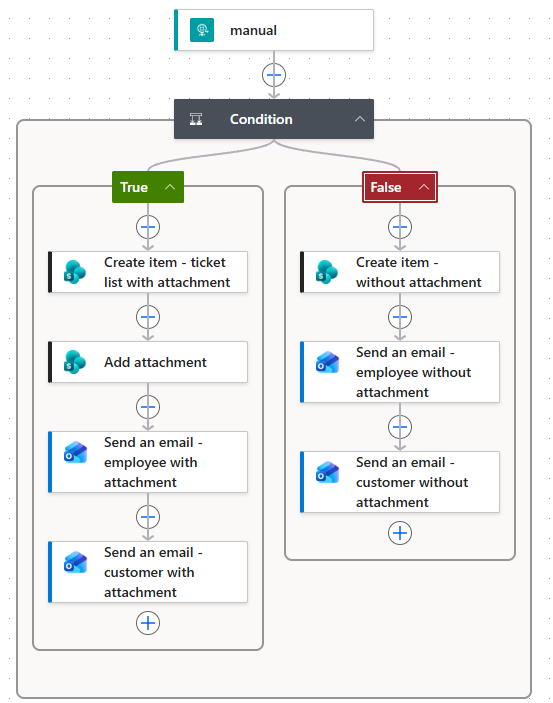

## *__3. Verifiering__*

Kedjan med en bifogad bild fungerar:

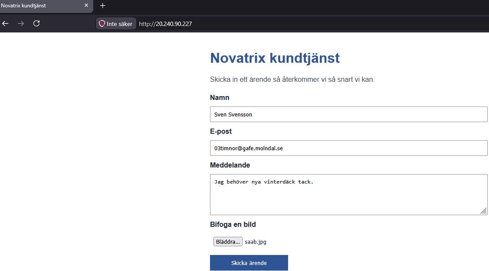

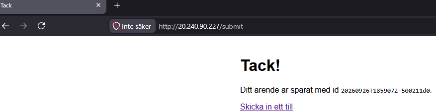

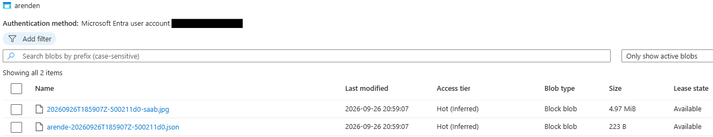

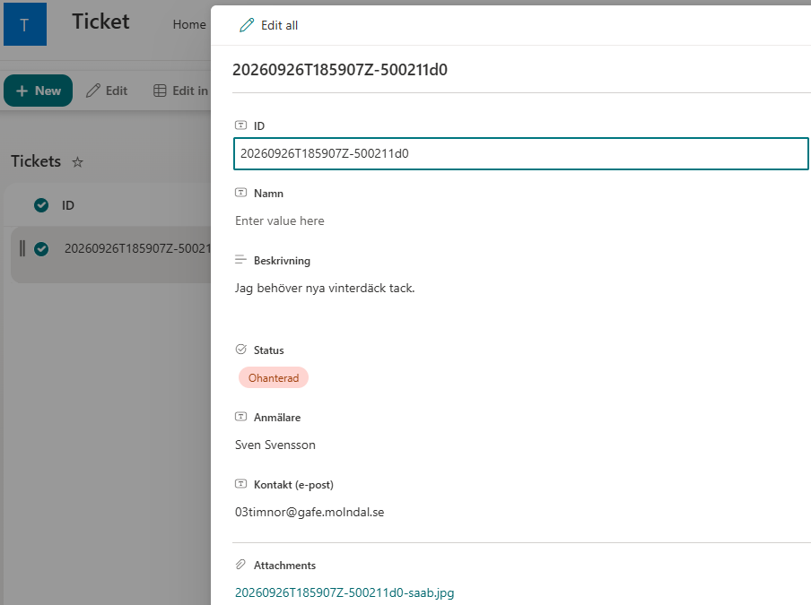

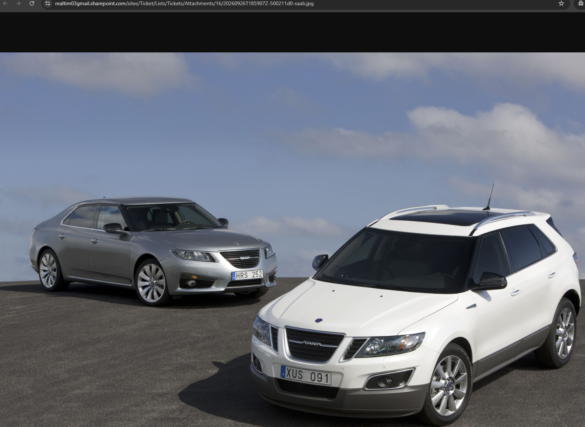

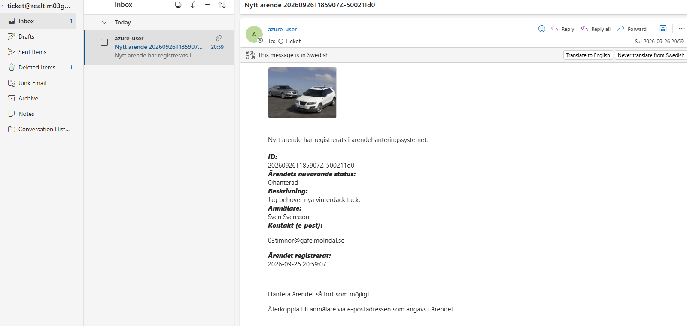

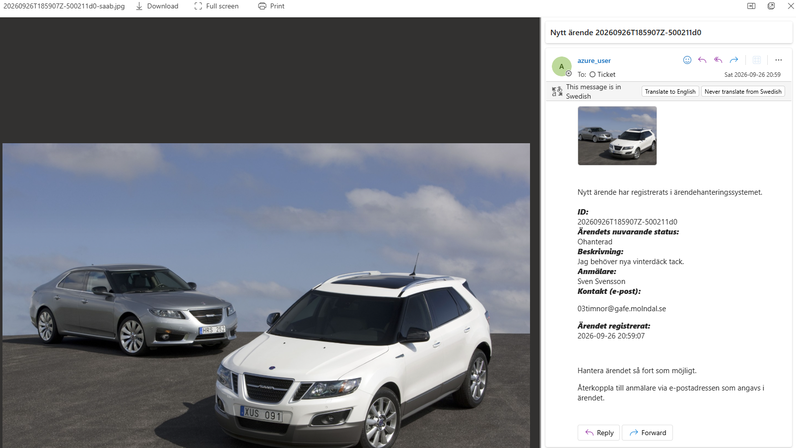

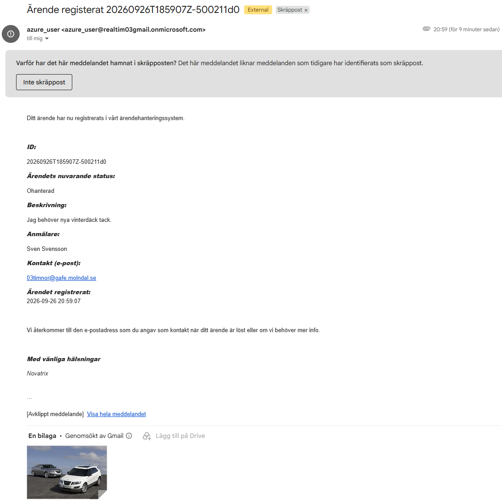

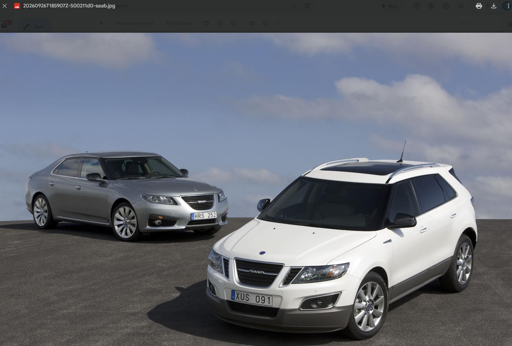

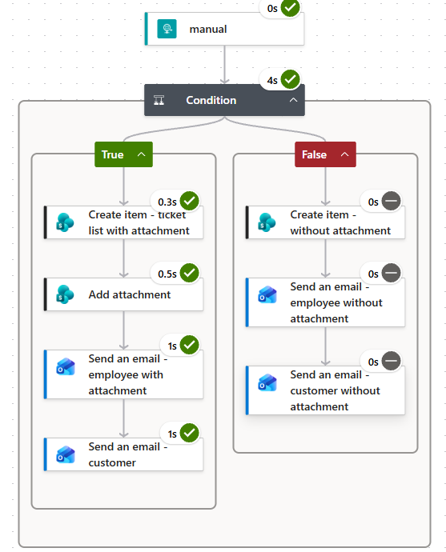

Kedjan utan en bifogad bild fungerar:

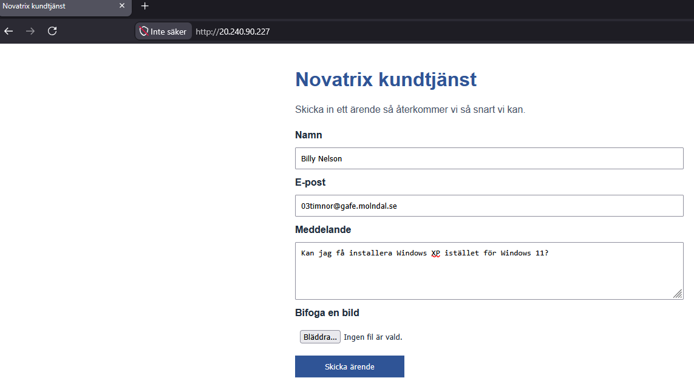


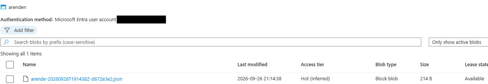

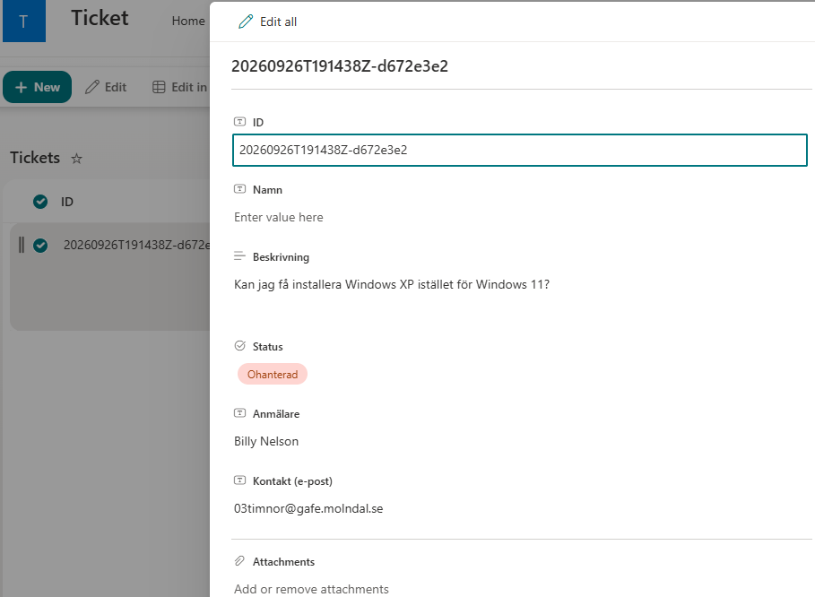

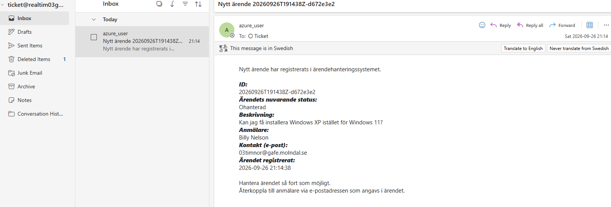

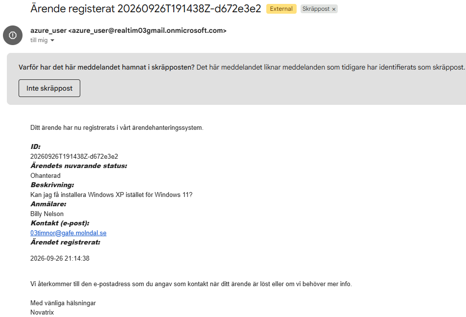

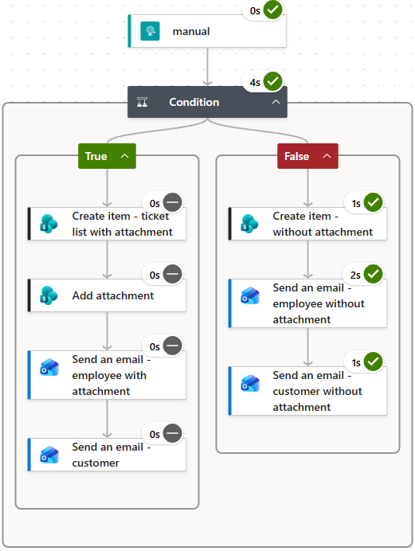

*__OBS!__* Efter att testerna utfördes upptäcktes att steg i flödet inte hade korrekt namn. Steget hette "*Send an email - customer*" men skulle hetat "*Send an email - customer with attachment*" Detta är nu justerat, och påverkar inte funktionaliteten. Se bild nedan:


## *__4. Dokumentation__*

När ett ärende skickas in via webbsidan så skickar den virtuella maskinens backend ärendets data till flödets HTTP-trigger, vilket gör att flödet startas. 

Därefter finns ett villkor: "__Datan i "*Image base64*" är inte tom__". Om detta är sant, allstå att ärendet innehåller bilddata så kommer flödet fortsätta i "*True*" grenen. Är det däremot inte bilddata i ärendet så kommer födet fortsätta i "*False*" grenen.

Vilkoret i bildformat:

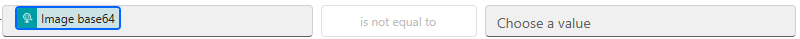

Båda grenarna är lika förutom att "*True*" grenen innehåller bilagor i sina steg och det har ej "*False*" grenen. Båda grenarna bygger på dynamisk data. Både från den initiala HTTP-triggern och *__SharePoint__* listans ärende/objekt som skapas i "*Create item*" steget i båda grenarna. Båda grenarna skapar ett ärende i *__SharePoint__* listan och skickar mail till kund och anställd.

Exempel på dynamiskt innehåll ifrån både HTTP-triggern och *__SharePoint__* listan:

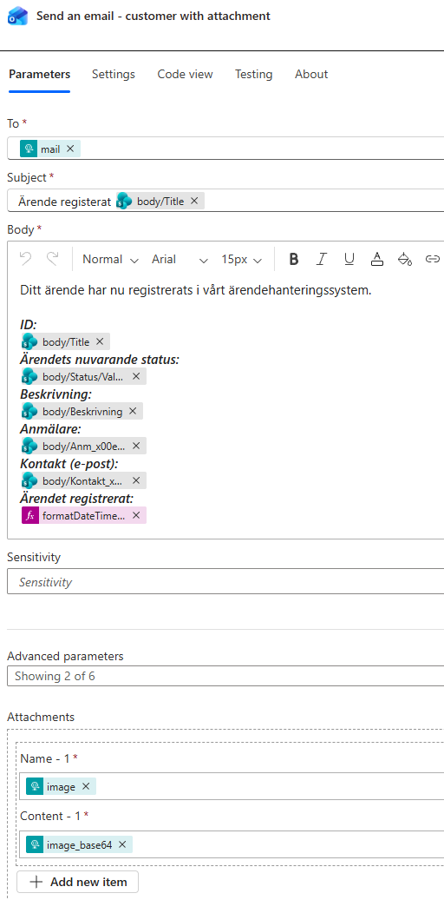

Här hämtas mailadress och bilddata direkt ifrån HTTP-triggern och allt annat från ärendet i *__SharePoint__* listan. Förutom en sak: "*Ärendet registrerat*" hämtas via en formel i *__Power Automate__* för att tiden skall visas korrekt.

Om man bara hade använt datan ifrån HTTP-triggern så hade man inte kunnat ha med steget för "*Ärendets nuvarande status*" då den datan skapas och endast finns i *__SharePoint__* ärendet/objektet.

Flödets design ser ut som det gör då det fyller de behov som finns i dagsläget. Det skapar ett ärende med relevant innehåll. Det skickar ut notifikationer till personal (till en delad bravlåda, så de vet att nytt ärende har skapats) och till kund (en bekräftelse på att deras ärende har tagits emot). Flödet kan även anpassa sig efter om det finns en bifogad bild eller inte.

Flödets design/steg och *__JSON__* kod finns i del 2.

Flödet skulle kunna utvecklas framöver om behov uppstår. Blir ärendeformuläret utökat på webbsidan för kunderna måste man anpassa mailen och skapade av objekt/ärende i *__SharePoint__* listan med nytt dynamiskt innehåll och ändra *__JSON__* schemat för HTTP triggern så det fortfarande passar.

Man kan även lägga till fler steg. Börjar företaget arbeta mer med *__Teams__* så skulle man kunna göra så att de anställda får en notifikation där med. 

## *__Hur VG delen har uppfyllts denna vecka__*

Flödet skickar ut notifikationer till anställda och kund (via *__Outlook__*) och sätter igång flera sammankopplade tjänster som hämtar data ifrån varandra (HTTP-trigger, *__SharePoint__* och *__Outlook__*). Designen har motiverats och förslag på utökningar har gjorts.