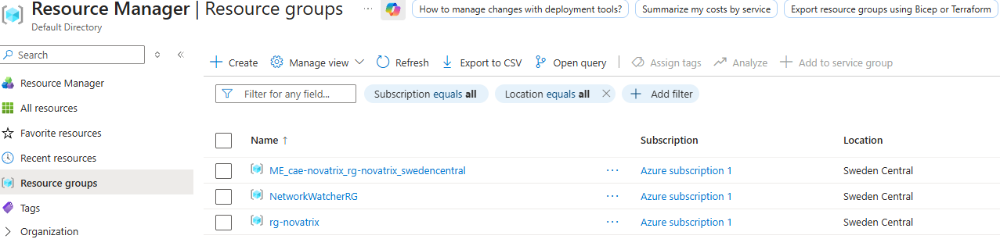
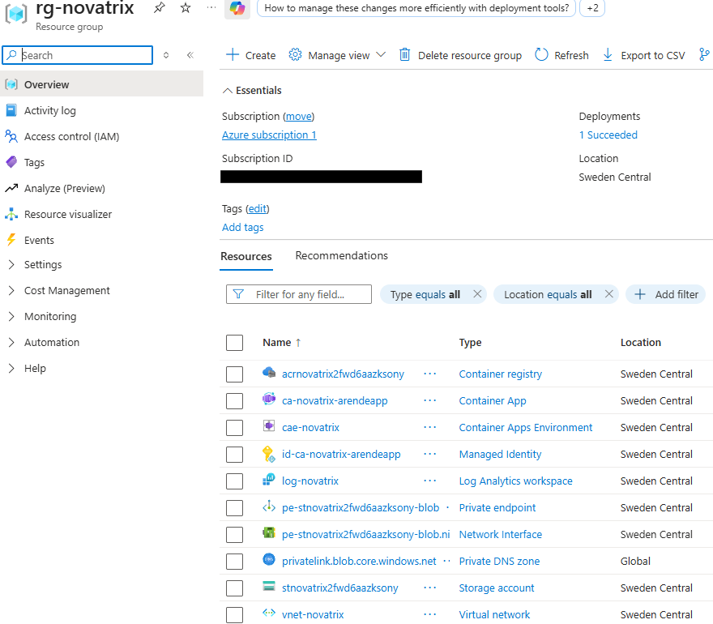
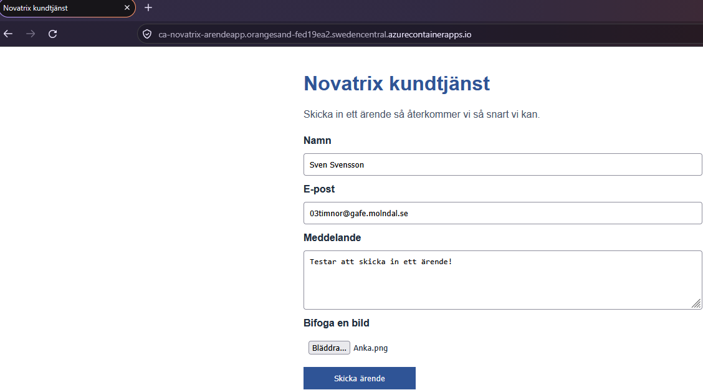
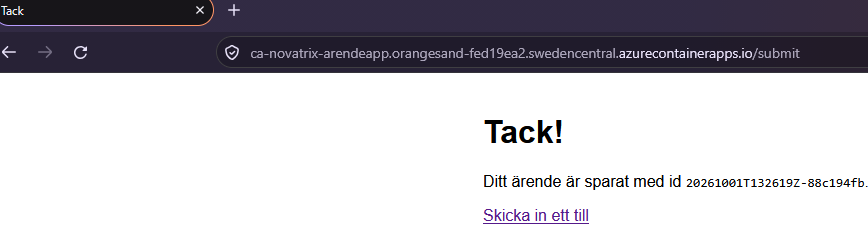
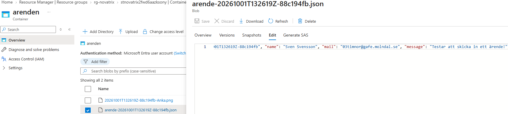
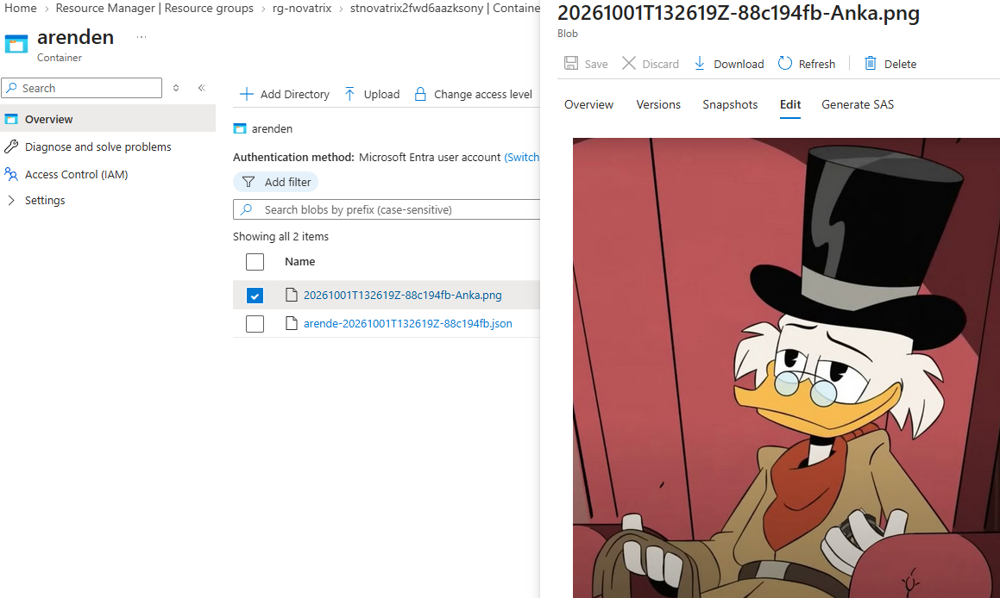
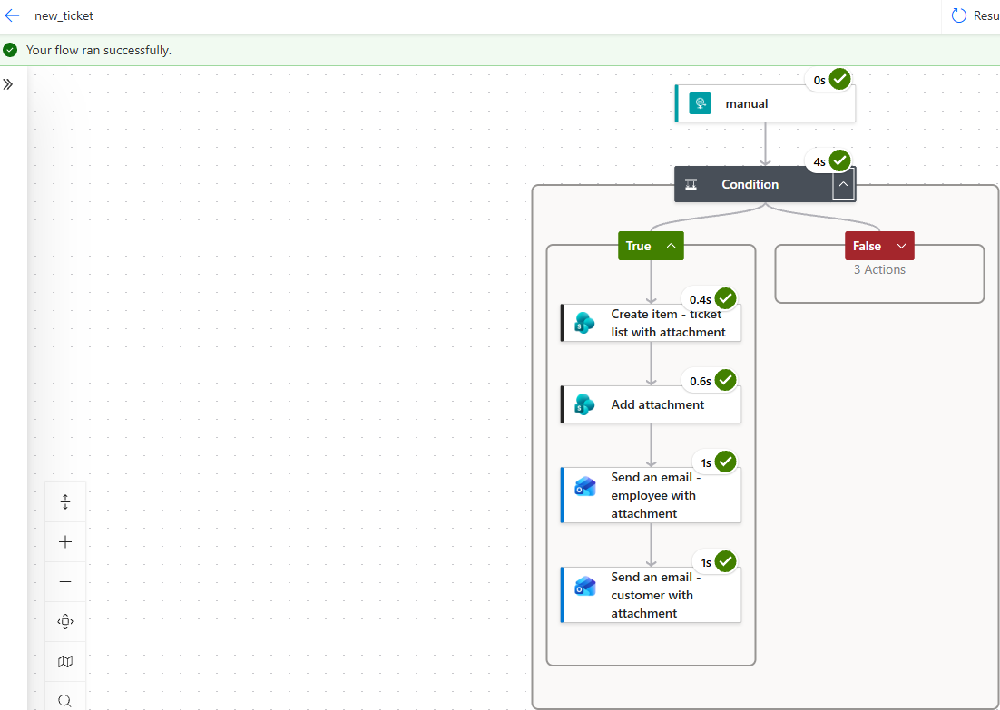
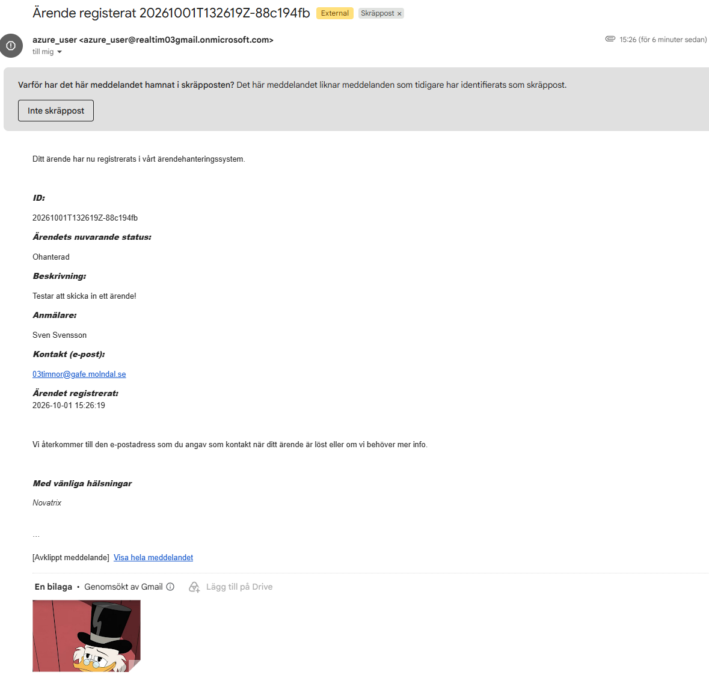

# __Virtualiseringsnivåer (Godkänt och Väl Godkänt)__

Repository: https://github.com/03timnor/Azure_MOV25

*Tim Noreliusson Lingestedt, 2026-10-02*

Veckans uppgift går ut på att det finns fler sätt att köra en applikation än en VM. Den här veckan ska man undersöka de olika virtualiseringsnivåerna, VM, containers och serverless, genom att köra en del av kundtjänsten på en alternativ nivå och jämföra dem.

## *__1. Jämför nivåerna__*

| | *__VM__* | *__Container__* | *__Serverless__* |
|---|---|---|---| 
| __Man levererar__ | Hela operativsystemet | Applikationen och dess beroenden | Bara källkod / funktionen |
| __Man ansvarar för__ | Operativsystems-patchar, säkerhet och konfiguration | Image och dess innehåll, plattformen sköter servrarna | Endast koden och dess inställningar |
| __Drift__ | Mest | Medel | Minst |
| __Kontroll__ | Mest | Medel | Minst |
| __Skalning__ | Manuell skalning eller via regler (exempelvis Scale Sets) | Automatisk skalning på en plattform som skalar (exempelvis AKS, Container Apps) | Direkt inbyggd automatisk skalning |
| __Kostnadsmodell__ | Kostnad per timme/sekund så länge den är i drift | Kostnad per sekund för CPU/RAM (Container Apps) eller för noderna (AKS) | Kostnad per körning |
| __Exempel i Azure__ | Virtual Machines | AKS, ACI och Container Apps | Azure Functions |

## *__2. Verifiering__*

Resursgrupp med innehåll skapas:





Hemsidan kan nås:



Hemsidan kan skicka ärenden till storage:







Flödet från *V39* fungerar fortfarande (exempel på ett steg, mail till kund):





## *__3. Dokumentation__*

Miljön skapas upp med *V40_main.bicep, V40_resources.bicep, V40_main.bicepparam, V40_deploy.sh, V40_app.py, V40_requirements.txt* och *Dockerfile*.

*V40_main.bicep:*

```bicep
targetScope = 'subscription'

@description('Azure region for all resources')
param location string = 'swedencentral'

@description('Name of the resource group')
param resourceGroupName string = 'rg-novatrix'

@description('Object ID of the Azure AD identity that should get Storage Blob Data Contributor on the storage account (az ad signed-in-user show --query id -o tsv)')
param callerObjectId string

@description('Your public IP address, allowed through the storage account firewall. Leave empty to skip.')
param allowedIpAddress string = ''

@description('Name of the virtual network')
param vnetName string = 'vnet-novatrix'

@description('Address space of the virtual network')
param vnetAddressPrefix string = '10.0.0.0/16'

@description('Name of the subnet that holds the storage private endpoint')
param subnetDbName string = 'snet-db'

@description('Address prefix of the private endpoint subnet')
param subnetDbPrefix string = '10.0.2.0/24'

@description('Name of the subnet used by the Container Apps environment')
param subnetAcaName string = 'snet-aca'

@description('Address prefix of the Container Apps subnet (workload profiles environment needs at least /27)')
param subnetAcaPrefix string = '10.0.4.0/26'

@description('Prefix used to generate a globally unique storage account name (a random suffix is appended)')
param storageAccountNamePrefix string = 'stnovatrix'

@description('SKU of the storage account')
param storageAccountSku string = 'Standard_LRS'

@description('Name of the blob container used for support tickets')
param containerName string = 'arenden'

@description('Prefix used to generate a globally unique container registry name')
param acrNamePrefix string = 'acrnovatrix'

@description('Name of the Container Apps environment')
param environmentName string = 'cae-novatrix'

@description('Name of the container app')
param appName string = 'ca-novatrix-arendeapp'

@description('Deploy the container app itself. Keep false on the first run (registry is still empty), true once the image is built.')
param deployApp bool = false

@description('Image name and tag inside the registry, e.g. arendeapp:v1')
param imageName string = 'arendeapp:v1'

@description('Optional Power Automate HTTP trigger URL that receives each ticket. Leave empty to disable.')
@secure()
param flowUrl string = ''

resource rg 'Microsoft.Resources/resourceGroups@2024-03-01' = {
  name: resourceGroupName
  location: location
}

module novatrix 'V40_resources.bicep' = {
  name: 'novatrix-resources'
  scope: rg
  params: {
    location: location
    callerObjectId: callerObjectId
    allowedIpAddress: allowedIpAddress
    vnetName: vnetName
    vnetAddressPrefix: vnetAddressPrefix
    subnetDbName: subnetDbName
    subnetDbPrefix: subnetDbPrefix
    subnetAcaName: subnetAcaName
    subnetAcaPrefix: subnetAcaPrefix
    storageAccountNamePrefix: storageAccountNamePrefix
    storageAccountSku: storageAccountSku
    containerName: containerName
    acrNamePrefix: acrNamePrefix
    environmentName: environmentName
    appName: appName
    deployApp: deployApp
    imageName: imageName
    flowUrl: flowUrl
  }
}

output storageAccountName string = novatrix.outputs.storageAccountName
output acrName string = novatrix.outputs.acrName
output appUrl string = novatrix.outputs.appUrl
```

*V40_resources.bicep:*

```bicep
@description('Azure region for all resources')
param location string

@description('Object ID of the identity that should get data-plane access to the storage account')
param callerObjectId string

@description('Public IP address allowed through the storage account firewall')
param allowedIpAddress string = ''

param vnetName string
param vnetAddressPrefix string
param subnetDbName string
param subnetDbPrefix string
param subnetAcaName string
param subnetAcaPrefix string
param storageAccountNamePrefix string
param storageAccountSku string
param containerName string
param acrNamePrefix string
param environmentName string
param appName string
param deployApp bool
param imageName string

@secure()
@description('Optional Power Automate HTTP trigger URL (contains a signature, so it is stored as a Container App secret)')
param flowUrl string = ''

@description('Where tickets land in the container: root or folder')
param blobLayout string = 'root'

@description('Port the app listens on inside the container')
param appPort int = 8000

// Globally unique names derived from the resource group.
var storageAccountName = toLower('${storageAccountNamePrefix}${uniqueString(resourceGroup().id)}')
var acrName = toLower('${acrNamePrefix}${uniqueString(resourceGroup().id)}')

// Built-in role definitions.
var storageBlobDataContributorRoleId = subscriptionResourceId('Microsoft.Authorization/roleDefinitions', 'ba92f5b4-2d11-453d-a403-e96b0029c9fe')
var acrPullRoleId = subscriptionResourceId('Microsoft.Authorization/roleDefinitions', '7f951dda-4ed3-4680-a7ca-43fe172d538d')

// Only add the flow secret / env var when a URL is actually provided
// (Container Apps rejects secrets with an empty value).
var flowSecrets = empty(flowUrl) ? [] : [
  {
    name: 'flow-url'
    value: flowUrl
  }
]
var flowEnv = empty(flowUrl) ? [] : [
  {
    name: 'FLOW_URL'
    secretRef: 'flow-url'
  }
]

// --------------------------------------------------------------------------
// Identity (used both to pull the image and to write to blob storage)
// --------------------------------------------------------------------------
resource identity 'Microsoft.ManagedIdentity/userAssignedIdentities@2023-01-31' = {
  name: 'id-${appName}'
  location: location
}

// --------------------------------------------------------------------------
// Networking
// --------------------------------------------------------------------------
resource vnet 'Microsoft.Network/virtualNetworks@2023-11-01' = {
  name: vnetName
  location: location
  properties: {
    addressSpace: {
      addressPrefixes: [vnetAddressPrefix]
    }
  }
}

resource subnetDb 'Microsoft.Network/virtualNetworks/subnets@2023-11-01' = {
  parent: vnet
  name: subnetDbName
  properties: {
    addressPrefix: subnetDbPrefix
    privateEndpointNetworkPolicies: 'Disabled'
  }
}

resource subnetAca 'Microsoft.Network/virtualNetworks/subnets@2023-11-01' = {
  parent: vnet
  name: subnetAcaName
  properties: {
    addressPrefix: subnetAcaPrefix
    delegations: [
      {
        name: 'aca-environments'
        properties: {
          serviceName: 'Microsoft.App/environments'
        }
      }
    ]
  }
  dependsOn: [subnetDb]
}

// --------------------------------------------------------------------------
// Storage account + private endpoint
// --------------------------------------------------------------------------
resource storage 'Microsoft.Storage/storageAccounts@2023-01-01' = {
  name: storageAccountName
  location: location
  sku: { name: storageAccountSku }
  kind: 'StorageV2'
  properties: {
    minimumTlsVersion: 'TLS1_2'
    allowBlobPublicAccess: false
    allowSharedKeyAccess: false
    publicNetworkAccess: 'Enabled'
    networkAcls: {
      defaultAction: 'Deny'
      ipRules: empty(allowedIpAddress) ? [] : [
        {
          value: allowedIpAddress
          action: 'Allow'
        }
      ]
    }
  }
}

resource blobService 'Microsoft.Storage/storageAccounts/blobServices@2023-01-01' = {
  parent: storage
  name: 'default'
}

resource container 'Microsoft.Storage/storageAccounts/blobServices/containers@2023-01-01' = {
  parent: blobService
  name: containerName
}

resource privateDnsZone 'Microsoft.Network/privateDnsZones@2024-06-01' = {
  name: 'privatelink.blob.core.windows.net'
  location: 'global'
}

resource dnsZoneLink 'Microsoft.Network/privateDnsZones/virtualNetworkLinks@2024-06-01' = {
  parent: privateDnsZone
  name: 'link-${vnetName}'
  location: 'global'
  properties: {
    virtualNetwork: { id: vnet.id }
    registrationEnabled: false
  }
}

resource privateEndpoint 'Microsoft.Network/privateEndpoints@2023-11-01' = {
  name: 'pe-${storageAccountName}-blob'
  location: location
  properties: {
    subnet: { id: subnetDb.id }
    privateLinkServiceConnections: [
      {
        name: 'conn-pe-${storageAccountName}-blob'
        properties: {
          privateLinkServiceId: storage.id
          groupIds: ['blob']
        }
      }
    ]
  }
}

resource peDnsZoneGroup 'Microsoft.Network/privateEndpoints/privateDnsZoneGroups@2023-11-01' = {
  parent: privateEndpoint
  name: 'default'
  properties: {
    privateDnsZoneConfigs: [
      {
        name: 'blob'
        properties: { privateDnsZoneId: privateDnsZone.id }
      }
    ]
  }
}

// --------------------------------------------------------------------------
// Container registry
// --------------------------------------------------------------------------
resource acr 'Microsoft.ContainerRegistry/registries@2023-07-01' = {
  name: acrName
  location: location
  sku: { name: 'Basic' }
  properties: {
    adminUserEnabled: false
  }
}

// --------------------------------------------------------------------------
// Role assignments
// --------------------------------------------------------------------------
resource callerRoleAssignment 'Microsoft.Authorization/roleAssignments@2022-04-01' = {
  name: guid(storage.id, callerObjectId, storageBlobDataContributorRoleId)
  scope: storage
  properties: {
    roleDefinitionId: storageBlobDataContributorRoleId
    principalId: callerObjectId
    principalType: 'User'
  }
}

resource appBlobRoleAssignment 'Microsoft.Authorization/roleAssignments@2022-04-01' = {
  name: guid(container.id, identity.id, storageBlobDataContributorRoleId)
  scope: container
  properties: {
    roleDefinitionId: storageBlobDataContributorRoleId
    principalId: identity.properties.principalId
    principalType: 'ServicePrincipal'
  }
}

resource appAcrRoleAssignment 'Microsoft.Authorization/roleAssignments@2022-04-01' = {
  name: guid(acr.id, identity.id, acrPullRoleId)
  scope: acr
  properties: {
    roleDefinitionId: acrPullRoleId
    principalId: identity.properties.principalId
    principalType: 'ServicePrincipal'
  }
}

// --------------------------------------------------------------------------
// Logs + Container Apps environment (inside the VNet)
// --------------------------------------------------------------------------
resource logs 'Microsoft.OperationalInsights/workspaces@2023-09-01' = {
  name: 'log-novatrix'
  location: location
  properties: {
    sku: { name: 'PerGB2018' }
    retentionInDays: 30
  }
}

resource env 'Microsoft.App/managedEnvironments@2024-03-01' = {
  name: environmentName
  location: location
  properties: {
    appLogsConfiguration: {
      destination: 'log-analytics'
      logAnalyticsConfiguration: {
        customerId: logs.properties.customerId
        sharedKey: logs.listKeys().primarySharedKey
      }
    }
    vnetConfiguration: {
      infrastructureSubnetId: subnetAca.id
      internal: false
    }
    workloadProfiles: [
      {
        name: 'Consumption'
        workloadProfileType: 'Consumption'
      }
    ]
    zoneRedundant: false
  }
}

// --------------------------------------------------------------------------
// The container app (created in the second deployment, once the image exists)
// --------------------------------------------------------------------------
resource app 'Microsoft.App/containerApps@2024-03-01' = if (deployApp) {
  name: appName
  location: location
  identity: {
    type: 'UserAssigned'
    userAssignedIdentities: {
      '${identity.id}': {}
    }
  }
  properties: {
    managedEnvironmentId: env.id
    workloadProfileName: 'Consumption'
    configuration: {
      ingress: {
        external: true
        targetPort: appPort
        transport: 'auto'
        allowInsecure: false
      }
      registries: [
        {
          server: acr.properties.loginServer
          identity: identity.id
        }
      ]
      secrets: flowSecrets
    }
    template: {
      containers: [
        {
          name: 'arendeapp'
          image: '${acr.properties.loginServer}/${imageName}'
          resources: {
            cpu: json('0.5')
            memory: '1Gi'
          }
          env: concat([
            {
              name: 'STORAGE_ACCOUNT'
              value: storageAccountName
            }
            {
              name: 'CONTAINER'
              value: containerName
            }
            {
              name: 'BLOB_LAYOUT'
              value: blobLayout
            }
            {
              name: 'AZURE_CLIENT_ID'
              value: identity.properties.clientId
            }
          ], flowEnv)
          probes: [
            {
              type: 'Liveness'
              httpGet: {
                path: '/health'
                port: appPort
              }
              initialDelaySeconds: 10
              periodSeconds: 30
            }
            {
              type: 'Readiness'
              httpGet: {
                path: '/health'
                port: appPort
              }
              periodSeconds: 10
            }
          ]
        }
      ]
      scale: {
        minReplicas: 1
        maxReplicas: 2
      }
    }
  }
  dependsOn: [
    appAcrRoleAssignment
    appBlobRoleAssignment
    peDnsZoneGroup
  ]
}

output storageAccountName string = storageAccountName
output acrName string = acr.name
output appUrl string = deployApp ? 'https://${app!.properties.configuration.ingress.fqdn}' : ''
```

*V40_main.bicepparam:*

```bicep
using 'V40_main.bicep'

// --------------------------------------------------------------------------
// Required - replace the placeholders with your own values.
// --------------------------------------------------------------------------

// Object ID of the identity that should get Storage Blob Data Contributor:
//   az ad signed-in-user show --query id -o tsv
param callerObjectId = 'placeholder'

// Your public IP, allowed through the storage firewall (curl -s https://ifconfig.me).
// Use '' to skip.
param allowedIpAddress = 'placeholder'

// Power Automate HTTP trigger URL. Use '' to disable the flow call.
param flowUrl = 'placeholder'

// --------------------------------------------------------------------------
// Controlled by V40_deploy.sh through environment variables - do not edit.
// --------------------------------------------------------------------------
param deployApp = readEnvironmentVariable('DEPLOY_APP', 'false') == 'true'
param imageName = readEnvironmentVariable('IMAGE_NAME', 'arendeapp:v1')

// --------------------------------------------------------------------------
// Optional - defaults live in V40_main.bicep. Uncomment to override.
// --------------------------------------------------------------------------
// param location = 'swedencentral'
// param resourceGroupName = 'rg-novatrix'
// param vnetName = 'vnet-novatrix'
// param vnetAddressPrefix = '10.0.0.0/16'
// param subnetDbPrefix = '10.0.2.0/24'
// param subnetAcaPrefix = '10.0.4.0/26'
// param storageAccountNamePrefix = 'stnovatrix'
// param containerName = 'arenden'
```
*__OBS!__* Man måste ändra "*placeholder*" till sin egen data för att scriptet skall fungera korrekt.

*V40_deploy.sh:*

```bash
#!/usr/bin/env bash
# Two-stage deployment: 1) infrastructure, 2) build the image, 3) create the app.
set -euo pipefail

LOCATION="swedencentral"
DEPLOYMENT="novatrix-main"
IMAGE="arendeapp:v1"      # bump the tag (v2, v3 ...) for new versions

# Resource providers required by Container Apps (no-op if already registered).
az provider register --namespace Microsoft.App --wait
az provider register --namespace Microsoft.OperationalInsights --wait

echo "== 1/3: infrastructure (without the app) =="
DEPLOY_APP=false IMAGE_NAME="$IMAGE" az deployment sub create \
  --name "$DEPLOYMENT" \
  --location "$LOCATION" \
  --template-file V40_main.bicep \
  --parameters V40_main.bicepparam

ACR=$(az deployment sub show --name "$DEPLOYMENT" --query properties.outputs.acrName.value -o tsv)

echo "== 2/3: building the image in $ACR =="
az acr build --registry "$ACR" --image "$IMAGE" ./app

echo "== 3/3: creating the container app =="
DEPLOY_APP=true IMAGE_NAME="$IMAGE" az deployment sub create \
  --name "$DEPLOYMENT" \
  --location "$LOCATION" \
  --template-file V40_main.bicep \
  --parameters V40_main.bicepparam

echo
echo "Done. App URL:"
az deployment sub show --name "$DEPLOYMENT" --query properties.outputs.appUrl.value -o tsv
```

*V40_app.py:*

```python
# Novatrix ticket app (container version).
# Serves the ticket form and handles POST /submit. Each ticket is stored in
# Blob Storage using a managed identity. No account key is used.
#
# Configuration comes from environment variables (set by Bicep):
#   STORAGE_ACCOUNT  Name of the storage account (required)
#   CONTAINER        Blob container name (default: arenden)
#   BLOB_LAYOUT      "root" or "folder" (default: root)
#   FLOW_URL         Optional Power Automate HTTP trigger URL (stored as a secret)
#   AZURE_CLIENT_ID  Client ID of the user-assigned managed identity

import base64
import json
import mimetypes
import os
import urllib.request
import uuid
from datetime import datetime, timezone

from azure.identity import DefaultAzureCredential
from azure.storage.blob import BlobServiceClient, ContentSettings
from flask import Flask, Response, request, send_from_directory

STORAGE_ACCOUNT = os.environ["STORAGE_ACCOUNT"]
CONTAINER = os.environ.get("CONTAINER", "arenden")
BLOB_LAYOUT = os.environ.get("BLOB_LAYOUT", "root")
FLOW_URL = os.environ.get("FLOW_URL", "")

ACCOUNT_URL = "https://{0}.blob.core.windows.net".format(STORAGE_ACCOUNT)
STATIC_DIR = os.path.join(os.path.dirname(os.path.abspath(__file__)), "static")

app = Flask(__name__, static_folder=None)
app.config["MAX_CONTENT_LENGTH"] = 10 * 1024 * 1024  # same limit nginx had (10 MB)

# One credential and one client for the whole app. DefaultAzureCredential finds
# the container's managed identity automatically (AZURE_CLIENT_ID selects which).
_credential = DefaultAzureCredential(
    managed_identity_client_id=os.environ.get("AZURE_CLIENT_ID")
)
_blob_service = BlobServiceClient(account_url=ACCOUNT_URL, credential=_credential)


def _container():
    return _blob_service.get_container_client(CONTAINER)


def _blob_names(ticket_id, image_filename):
    # Returns (ticket_blob_name, image_blob_name) for the chosen layout.
    # image_blob_name is None when no image was attached.
    if BLOB_LAYOUT == "folder":
        ticket_name = "{0}/arende.json".format(ticket_id)
        image_name = "{0}/{1}".format(ticket_id, image_filename) if image_filename else None
    else:
        ticket_name = "arende-{0}.json".format(ticket_id)
        image_name = "{0}-{1}".format(ticket_id, image_filename) if image_filename else None
    return ticket_name, image_name


def _notify_flow(payload):
    # POSTs the payload to Power Automate if a URL is configured. Errors are
    # deliberately swallowed (but logged): the form must keep working even if
    # the flow is down.
    if not FLOW_URL:
        return
    try:
        data = json.dumps(payload, ensure_ascii=False).encode("utf-8")
        req = urllib.request.Request(
            FLOW_URL,
            data=data,
            headers={"Content-Type": "application/json"},
            method="POST",
        )
        urllib.request.urlopen(req, timeout=10)
    except Exception:
        app.logger.exception("Could not send the ticket to Power Automate")


@app.get("/")
def index():
    return send_from_directory(STATIC_DIR, "V40_index.html")


@app.post("/submit")
def submit():
    # Field names must match the form in static/V40_index.html.
    name = request.form.get("name", "").strip()
    mail = request.form.get("mail", "").strip()
    msg = request.form.get("msg", "").strip()
    image = request.files.get("bild")

    # Unique ticket id: UTC timestamp plus a short random suffix.
    stamp = datetime.now(timezone.utc).strftime("%Y%m%dT%H%M%SZ")
    ticket_id = "{0}-{1}".format(stamp, uuid.uuid4().hex[:8])

    ticket = {
        "id": ticket_id,
        "name": name,
        "mail": mail,
        "message": msg,
        "created": stamp,
    }

    container = _container()
    image_filename = image.filename if (image is not None and image.filename) else None
    ticket_name, image_name = _blob_names(ticket_id, image_filename)
    ticket["image"] = image_name or ""

    # Read the image once: it is uploaded to blob storage and also embedded
    # (base64) in the flow payload below. The stream can only be consumed once.
    image_bytes = image.read() if image_filename else None
    image_content_type = None
    if image_bytes is not None:
        image_content_type = mimetypes.guess_type(image_filename)[0] or "application/octet-stream"

    # 1) Store the ticket itself as a JSON blob.
    container.upload_blob(
        name=ticket_name,
        data=json.dumps(ticket, ensure_ascii=False).encode("utf-8"),
        overwrite=True,
        content_settings=ContentSettings(content_type="application/json"),
    )

    # 2) Store the attached image next to it, if one was sent.
    if image_name is not None:
        container.upload_blob(
            name=image_name,
            data=image_bytes,
            overwrite=True,
            content_settings=ContentSettings(content_type=image_content_type),
        )

    # 3) Optionally notify Power Automate. The image is embedded as base64
    #    because the flow cannot reach the locked-down storage account.
    flow_payload = dict(ticket)
    if image_bytes is not None:
        flow_payload["image_content_type"] = image_content_type
        flow_payload["image_base64"] = base64.b64encode(image_bytes).decode("ascii")
    else:
        flow_payload["image_content_type"] = ""
        flow_payload["image_base64"] = ""
    _notify_flow(flow_payload)

    # Confirmation page (Swedish, part of the customer-facing website).
    body = (
        "<!DOCTYPE html><html lang='sv'><head><meta charset='UTF-8'>"
        "<title>Tack</title></head>"
        "<body style='font-family:Arial;max-width:640px;margin:40px auto'>"
        "<h1>Tack!</h1>"
        "<p>Ditt ärende är sparat med id <code>{0}</code>.</p>"
        "<p><a href='/'>Skicka in ett till</a></p>"
        "</body></html>"
    ).format(ticket_id)
    return Response(body, mimetype="text/html")


@app.get("/health")
def health():
    # Used by the Container Apps liveness/readiness probes.
    return {
        "status": "ok",
        "account": STORAGE_ACCOUNT,
        "container": CONTAINER,
        "blob_layout": BLOB_LAYOUT,
        "flow_configured": bool(FLOW_URL),
    }
```

*V40_requirements.txt:*

```
flask>=3.0,<4
gunicorn>=22.0
azure-identity>=1.17
azure-storage-blob>=12.20
```

*Dockerfile:*

```dockerfile
FROM python:3.12-slim

ENV PYTHONDONTWRITEBYTECODE=1 \
    PYTHONUNBUFFERED=1

WORKDIR /app

COPY V40_requirements.txt .
RUN pip install --no-cache-dir -r V40_requirements.txt

COPY V40_app.py .
COPY static ./static

# Run as a non-root user.
RUN useradd --create-home appuser
USER appuser

EXPOSE 8000

# gunicorn instead of Flask's development server. The Container Apps ingress
# terminates HTTPS and forwards traffic here on port 8000.
CMD ["gunicorn", "--bind", "0.0.0.0:8000", "--workers", "2", "--timeout", "60", "V40_app:app"]
```

För att starta allt så kör man följande kommando i en *__bash__* terminal:

```bash
chmod +x V40_deploy.sh
./V40_deploy.sh
```
*__OBS!__* Mappstruktur med alla script måste vara likadan som i mitt GitHub Repository för *V40* (förutom bilder och README).

*__OBS!__* Man kan få följande meddelande är man kör koden:

```
WARNING: Running pip as the 'root' user can result in broken permissions and conflicting behaviour with the system package manager, possibly rendering your system unusable. It is recommended to use a virtual environment instead: https://pip.pypa.io/warnings/venv. Use the --root-user-action option if you know what you are doing and want to suppress this warning.

[notice] A new release of pip is available: 25.0.1 -> 26.2.1
[notice] To update, run: pip install --upgrade pip
```
Detta är ingeting som påverkar funktionaliteten, detta är verifierat genom tester och kontroller.

## *__3. Motivering (VG)__*

## Varför *Container* och inte *VM*?

### *Minskad drift / underhåll*

Med en *VM* behöver operativsystemet patchas / uppdateras manuellt. Med en *Container* byter man image när något ändras, plattformen sköter servrarna. Detta sparar arbetskraft och pengar.

### *Konfiguration*

*cloud-init*  ersätts av en *Dockerfile* på cirka 22 rader. Det blir då lättare att versionshantera, återskapa och läsa. Bidrar till sparad tid, arbetskraft och pengar.

### *Tillgänglighet*

Förra lösningen hade en enda *VM* vilket innebar om den gick ner så gick allt ner. En *VM* kan göras mer tillgänglig med *Scale Sets*, lastbalanserare eller *Availability Zones* men det kräver mer konfiguration. *Container Apps* startar automatiskt om appen och har möjlighet att skala ut till fler repliker med mycket mindre arbete / konfiguration. Detta i sin tur leder till en mer robust och driftsäker miljö.

### *Bastion*

*Bastion* användes i den förra lösningen med *VM* för inloggning till *VM* på grund av att säkra miljön. *Bastion* behövs inte längre då det inte finns någon *VM* att logga in på. *Bastion* har en hög kostnad. Att använda *Container* lösningen tar bort denna kostnad och säkerheten påverkas ej negativt.

### *Kostnadsprincip*

En *VM* betalar man för varje timme den är i drift, även om den inte används. En *Container* betalar man för per använd sekund för *CPU* och *RAM* (till exempel *ACI* eller *Container Apps* med Consumption-profil) eller för antal noder (till exempel *AKS*). Lösningen för *V40* använder *Container Apps* med Consumption-profil. Denna lösning blir även billigare, främst för att *Bastion* försvinner.

### *Användningsområde*

Ingen tung resurskrävande applikation används. Den kräver heller inte att man har full kontroll på plattformen den körs på. Då passar *Container* bättre än *VM*. En *VM* blir lite "*overkill*" i detta fallet. Genom att använda *Container* som passar detta användningsområde bättre så sparar man dessutom exempelvis tid, arbetskraft och pengar.

## Varför *Container* och inte *Serverless (Functions)*?

### *Kod*

Att skriva om den befintliga miljön från de tidigare uppgifterna när *VM* användes till en *Container* lösning var enklare än att skriva om den till en *Serverless (Function)* lösning. Som *Serverless (Functions)* hade man behövt skriva om stora delar av koden till *Functions* programmeringsmodell eller lägga *Flask* ovanpå *Functions* med hjälp av *WsgiFunctionApp*. Att använda *Container* sparar därför tid, arbetskraft och därav även pengar.

### *Möjligheter att flytta*

En *Container* image kan flyttas mellan till exempel *Container Apps*, *AKS* eller *ACI*. Om man istället använder *Functions* så är den koden huvudsakligen bunden till *Functions*-värden. *Container* lösningen har därför en fördel här om man väljer att byta plattform eller om man vill köra appen på flera ställen.

### *Felsökningsmöjligheter*

Med kommandon som `az containerapp exec` så kan man felsöka inuti en *Container* genom att öppna en *Shell* i miljön. Man kan se till exempel DNS-svar mot endpoint, vilket kan vara en vanlig felkälla. *Serverless* har inte en lika direkt motsvarighet.

### *Användningsområde*

*Functions* är skapat främst för kod som körs när något händer, exempelvis en *HTTP*-request eller att en ny blob har skapats. Appen som används i denna miljö är mer än så. Appen består bland annat av ett formulär, backend och endpoint. En *Container* lösning kan hantera allt detta på samma gång. Därav passar det bättre.

## *En gemensam anledning*

*Container* är en mittpunkt mellan *VM* och *Serverless (Functions)*. En mittpunkt i bland annat kontroll och drift. Det är därför den bästa utgångspunkten att börja ifrån för att sedan utvärdera miljöns behov.

Man kan alltid planera för och försöka göra en hypotes vad man tror en mlijö kommer kräva eller kosta. Men man vet det aldrig säkert förrän man driftsatt miljön i praktiken. 

*Container* har därför en fördel då det är en mittpunkt mellan de två andra alternativen. Det gör det enklare att börja utvärdera och en logisk startpunkt.
